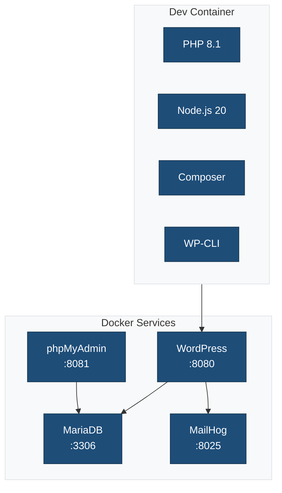

# Development Container

This directory contains configuration for VS Code Dev Containers, providing a consistent Docker-based development environment.

## Overview



## Quick Start

1. **Install Prerequisites:**
   - [Docker Desktop](https://www.docker.com/products/docker-desktop)
   - [VS Code](https://code.visualstudio.com/)
   - [Dev Containers extension](https://marketplace.visualstudio.com/items?itemName=ms-vscode-remote.remote-containers)

2. **Open in Container:**
   - Open this folder in VS Code
   - Click "Reopen in Container" when prompted
   - Wait for the container to build (first time only)

3. **Access Services:**
   - WordPress: <http://localhost:8080>
   - phpMyAdmin: <http://localhost:8081>
   - MailHog: <http://localhost:8025>

## Files

### `devcontainer.json`

VS Code Dev Container configuration:

- Node.js 20 and PHP 8.1 environments
- Recommended VS Code extensions
- Port forwarding configuration
- Post-create and post-start commands

### `docker-compose.yml`

Docker Compose services:

| Service | Port | Description |
|---------|------|-------------|
| `wordpress` | 8080 | WordPress with plugin mounted |
| `db` | 3306 | MariaDB database |
| `phpmyadmin` | 8081 | Database management UI |
| `mailhog` | 8025 | Email testing (SMTP: 1025) |

### `Dockerfile`

Custom container image with:

- PHP 8.1 with extensions (gd, mysqli, zip)
- Node.js 20 LTS
- Composer
- WP-CLI
- Development tools

## Usage

### Starting the Environment

```bash
# Using VS Code (recommended)
# Click "Reopen in Container" or run command:
# Remote-Containers: Reopen in Container

# Using Docker Compose directly
cd .devcontainer && docker-compose up -d
```

### WordPress CLI

```bash
# Access WP-CLI
wp --info

# Create admin user
wp user create admin admin@example.com --role=administrator --user_pass=admin

# Activate plugin/theme
wp plugin activate {{slug}}
wp theme activate {{theme_slug}}
```

### Database Access

```bash
# Connect to MySQL
mysql -h db -u wordpress -pwordpress wordpress

# Or use phpMyAdmin at http://localhost:8081
```

### Email Testing

All emails are captured by MailHog:

- SMTP: localhost:1025
- Web UI: <http://localhost:8025>

## Customization

### Adding PHP Extensions

Edit `Dockerfile`:

```dockerfile
RUN docker-php-ext-install -j$(nproc) your-extension
```

### Adding VS Code Extensions

Edit `devcontainer.json`:

```json
"customizations": {
    "vscode": {
        "extensions": [
            "your.extension-id"
        ]
    }
}
```

### Changing PHP/Node Versions

Edit `devcontainer.json` features:

```json
"features": {
    "ghcr.io/devcontainers/features/node:1": {
        "version": "20"
    },
    "ghcr.io/devcontainers/features/php:1": {
        "version": "8.2"
    }
}
```

## Troubleshooting

### Container Won't Start

```bash
# Rebuild container
docker-compose down -v
docker-compose build --no-cache
docker-compose up -d
```

### Database Connection Issues

```bash
# Check if MySQL is running
docker-compose ps

# Restart database
docker-compose restart db
```

### Permission Issues

```bash
# Fix file permissions
sudo chown -R $(whoami):$(whoami) .
```

## Related Documentation

- [VS Code Dev Containers](https://code.visualstudio.com/docs/devcontainers/containers)
- [Docker Compose](https://docs.docker.com/compose/)
- [WP-CLI Commands](https://developer.wordpress.org/cli/commands/)
