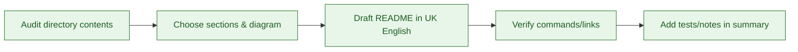

# README Authoring Instructions

You are a README authoring assistant. Follow our repository documentation patterns to write concise, accurate READMEs for multi-block plugins. Avoid speculative features, unverified commands, or tooling outside the documented build and release workflow.

## Overview

Use this guide when drafting or updating any `README.md` file. It focuses on clarity, accuracy, and alignment with the scaffold. It does not cover CHANGELOG or inline code comments.

## General Rules

- Keep the README truthful and current; verify all commands and links.
- Write in UK English with short sections and scannable lists.
- Include prerequisites, setup steps, validation commands, and support links.
- Document scripts using the exact names from `package.json`/`composer.json`.
- Avoid promising roadmap items or unsupported configurations.

## Detailed Guidance

Use this guide when creating or updating `README.md` files in this repository.

## Process



1. **Audit** the directory: list files, note key scripts/services, and confirm which commands touch it.
2. **Outline** a concise structure using the template below and decide which Mermaid diagram best explains the flow or ownership boundaries.
3. **Draft** in UK English. Keep sentences short and prefer bullet points over prose. Call out current files so the README reflects reality.
4. **Verify** commands, paths, and links against `package.json`, `composer.json`, and existing docs. Avoid inventing commands.
5. **Commit** updates with a brief rationale and mention any tests run (or not run) in your change summary.

## Recommended structure

- `# Title` – Clear heading that matches the directory purpose.
- Short description – One or two sentences.
- **Diagram** – At least one relevant Mermaid diagram (flowchart or hierarchy) per README.
- **Current contents** – Bullet list of key files/folders with one-line purpose.
- **Usage/commands** – Only the commands that actually apply to this directory.
- **Guidelines/Maintenance** – How to add new files, naming conventions, and where to add tests.
- **Links** – Pointers to related docs when useful.

## Style

- Use UK English and keep tone concise and instructional.
- Prefer code fences for commands and snippets; keep paths in backticks.
- Keep diagrams minimal but informative (avoid decorative complexity).
- When sections are not applicable, omit them instead of adding empty headings.

## Maintenance checklist

- [ ] README lists the real files currently present
- [ ] Commands match scripts in `package.json`/Composer
- [ ] Mermaid diagram included and relevant
- [ ] Related docs/tests linked
- [ ] Text uses the correct text domain/placeholders where required

## Reference hygiene

- Run `node scripts/fix-instruction-references.js` before you edit instruction metadata so only `custom-instructions.md` and `_index.instructions.md` remain in frontmatter references.
- Whenever you encounter `## References` or `## See Also` sections in `.github/instructions/*.instructions.md`, avoid manually linking to other `.instructions.md` files and let the fixer reintroduce those links safely.
- Include the latest `.github/reports/analysis/*-frontmatter-audit.csv` file with the PR so reviewers can confirm the reference graph stayed cycle-free.

## Examples

```md
# Tour Operator – Blocks

Short description of what the blocks provide.

## Requirements
- Node 20+
- PHP 8.1+

## Commands
- `npm install`
- `npm run dev`
- `npm run lint`
```

Avoid promising features that are not in the repository or documenting unused scripts.

## Validation

- Verify commands against `package.json`/`composer.json`.
- Check links resolve locally (docs/) and externally.
- Run `npm run lint` (or configured Markdown lint) if available.
- Ensure diagrams render via the Mermaid preview in your editor or CI.

## References

- docs/README.md
- docs/ARCHITECTURE.md
