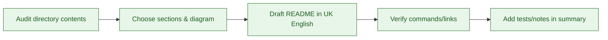

# README Authoring Instructions

Use this guide when creating or updating `README.md` files in this repository.

## Process

1. **Audit** the directory: list files, note key scripts/services, and confirm which commands touch it.
2. **Outline** a concise structure using the template below and decide which Mermaid diagram best explains the flow or ownership boundaries.
3. **Draft** in UK English. Keep sentences short and prefer bullet points over prose. Call out current files so the README reflects reality.
4. **Verify** commands, paths, and links against `package.json`, `composer.json`, and existing docs. Avoid inventing commands.
5. **Commit** updates with a brief rationale and mention any tests run (or not run) in your change summary.

## Recommended structure

- `# Title` – Clear heading that matches the directory purpose.
- Short description – One or two sentences.
- **Diagram** – At least one relevant Mermaid diagram (flowchart or hierarchy) per README.
- **Current contents** – Bullet list of key files/folders with one-line purpose.
- **Usage/commands** – Only the commands that actually apply to this directory.
- **Guidelines/Maintenance** – How to add new files, naming conventions, and where to add tests.
- **Links** – Pointers to related docs when useful.

## Style

- Use UK English and keep tone concise and instructional.
- Prefer code fences for commands and snippets; keep paths in backticks.
- Keep diagrams minimal but informative (avoid decorative complexity).
- When sections are not applicable, omit them instead of adding empty headings.

## Maintenance checklist

- [ ] README lists the real files currently present
- [ ] Commands match scripts in `package.json`/Composer
- [ ] Mermaid diagram included and relevant
- [ ] Related docs/tests linked
- [ ] Text uses the correct text domain/placeholders where required
