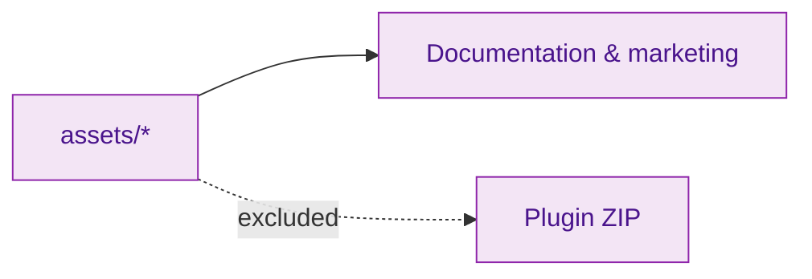

# Plugin Assets

Static assets used for documentation, demos, or marketing. These are **not bundled** into the distributed plugin.

## Flow

## Current contents

- Placeholder directory only (no tracked assets yet).

## Recommendations

- Use optimised SVG/PNG for logos and diagrams; prefer web-friendly sizes.
- Keep animated GIF/MP4 demos short and under version control if small; otherwise reference from external storage.
- For WordPress.org banners/icons, use `.wordpress-org/` instead.
