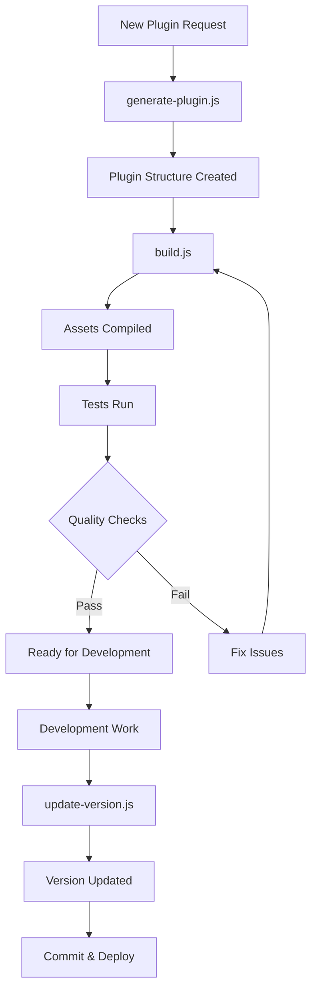

# Build Scripts & Utilities

This directory contains build scripts and utility tools for the multi-block plugin scaffold.

## Overview

The `bin/` directory provides command-line tools for:

- **Plugin generation** - Create new plugins from the scaffold template
- **Build automation** - Compile and bundle plugin assets
- **Version management** - Update version numbers across all files
- **Testing setup** - Install WordPress test environment
- **Quality assurance** - Lint and validate code

## Scripts

### `generate-plugin.js`

Interactive plugin generator that creates a new multi-block plugin from the scaffold.

**Usage:**

```bash
node bin/generate-plugin.js
```

**Features:**

- Interactive prompts for plugin metadata
- Custom post type configuration
- Taxonomy setup
- SCF field group generation
- Block configuration for multiple blocks
- Mustache template processing
- Validation and error handling

**See also:** [GENERATOR-SYSTEM.md](../docs/GENERATOR-SYSTEM.md)

### `build.js`

Build automation script for plugin compilation.

**Usage:**

```bash
node bin/build.js
```

**Features:**

- Installs npm and Composer dependencies
- Compiles JavaScript and CSS assets
- Runs linting and code quality checks
- Executes test suite
- Generates build summary

### `update-version.js`

Updates plugin version across all relevant files.

**Usage:**

```bash
node bin/update-version.js <version>
```

**Example:**

```bash
node bin/update-version.js 1.2.0
```

**Updates:**

- `package.json`
- `composer.json`
- Main plugin PHP file
- `block.json` files
- `README.md`
- `VERSION` file

### `install-wp-tests.sh`

Shell script to set up the WordPress PHPUnit test environment.

**Usage:**

```bash
bash bin/install-wp-tests.sh <db-name> <db-user> <db-pass> [db-host] [wp-version]
```

**Example:**

```bash
bash bin/install-wp-tests.sh wordpress_test root '' localhost latest
```

**Purpose:**

- Downloads WordPress test suite
- Sets up test database
- Configures PHPUnit environment
- Used by CI/CD workflows

## Workflow Integration



## Best Practices

### Plugin Generation

1. **Plan structure first** - Define CPTs, taxonomies, and field groups before generating
2. **Use consistent naming** - Follow WordPress naming conventions (lowercase, underscores)
3. **Review generated code** - Always review and customise generated files
4. **Test immediately** - Run `npm run build` and `npm test` after generation

### Version Management

1. **Semantic versioning** - Follow [semver](https://semver.org/) (MAJOR.MINOR.PATCH)
2. **Update changelog** - Document changes in CHANGELOG.md before updating version
3. **Test before versioning** - Ensure all tests pass before version bump
4. **Git tags** - Create git tags for releases: `git tag -a v1.2.0 -m "Version 1.2.0"`

### Build Process

1. **Clean builds** - Remove `build/` directory before production builds
2. **Dependency updates** - Keep dependencies current with `npm update` and `composer update`
3. **Lint before build** - Fix linting errors before committing
4. **Test coverage** - Maintain test coverage above 80%

## Troubleshooting

### Generation Fails

**Issue:** `generate-plugin.js` throws validation errors

**Solution:**

- Check plugin slug is valid (lowercase, alphanumeric, hyphens)
- Ensure all required fields are provided
- Verify custom post type and taxonomy names are unique
- Check field group JSON schema is valid

### Build Errors

**Issue:** `build.js` fails during compilation

**Solution:**

- Run `npm install` to ensure dependencies are current
- Check for JavaScript/CSS syntax errors
- Verify `webpack.config.cjs` is valid
- Clear `node_modules/` and reinstall if persistent

### Version Update Fails

**Issue:** `update-version.js` doesn't update all files

**Solution:**

- Ensure version format is valid (e.g., `1.2.0`)
- Check file permissions (must be writable)
- Verify all files exist (check for renamed/moved files)
- Review script output for specific errors

### Test Setup Issues

**Issue:** `install-wp-tests.sh` fails to download WordPress

**Solution:**

- Check internet connection
- Verify database credentials are correct
- Ensure MySQL/MariaDB is running
- Try specifying WordPress version explicitly

## Related Documentation

- [GENERATOR-SYSTEM.md](../docs/GENERATOR-SYSTEM.md) - Complete generator documentation
- [BUILD-PROCESS.md](../docs/BUILD-PROCESS.md) - Build system details
- [TESTING.md](../docs/TESTING.md) - Testing guidelines
- [API-REFERENCE.md](../docs/API-REFERENCE.md) - Plugin API documentation

## References

- [WordPress Plugin Handbook](https://developer.wordpress.org/plugins/)
- [@wordpress/scripts](https://developer.wordpress.org/block-editor/reference-guides/packages/packages-scripts/)
- [Mustache Templates](https://mustache.github.io/)
- [Semantic Versioning](https://semver.org/)
