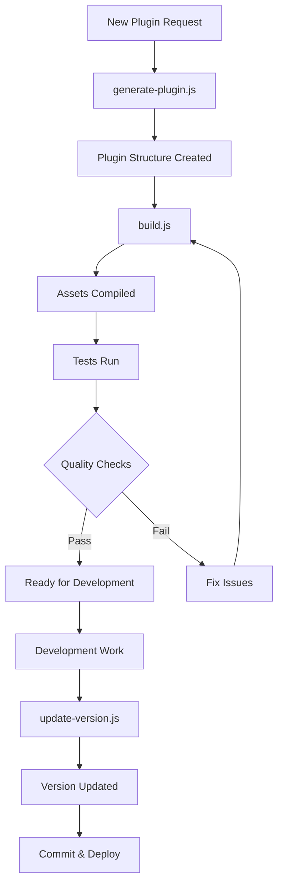

# Shell Scripts & System Utilities

This directory contains all **shell scripts** (`.sh` files) for system-level operations, environment setup, and CI/CD integration.

## Directory Purpose

**`bin/`** - Shell scripts (`.sh`) for:

- WordPress test environment setup
- System-level operations
- Package installation
- Database operations
- Deployment automation
- CI/CD integration

**Contrast with `scripts/`**:

- **`bin/`** → Shell scripts (`.sh`) - Bash/shell scripts
- **`scripts/`** → JavaScript files (`.js`) - Node.js scripts

---

## Scripts Overview

### `install-wp-tests.sh`

Shell script to set up the WordPress PHPUnit test environment.

### `install-wp-tests.sh`

Shell script to set up the WordPress PHPUnit test environment.

**Usage:**

```bash
bash bin/install-wp-tests.sh <db-name> <db-user> <db-pass> [db-host] [wp-version]
```

**Example:**

```bash
bash bin/install-wp-tests.sh wordpress_test root '' localhost latest
```

**Features:**

- Downloads WordPress test suite
- Sets up test database
- Configures PHPUnit environment
- Used by CI/CD workflows
- Supports multiple WordPress versions
- Database cleanup and recreation

**Purpose:**
Essential for running PHPUnit tests in WordPress plugin development. Creates the necessary test environment with WordPress core files and test database.

---

## Creating New Shell Scripts

### Standards

1. **Location**: Always create in `bin/` directory
2. **Extension**: Use `.sh` extension
3. **Shebang**: Include `#!/usr/bin/env bash` at top
4. **Executable**: Make executable with `chmod +x bin/script-name.sh`
5. **Comments**: Add usage comments and documentation
6. **Error Handling**: Include error checking with `set -e`
7. **Documentation**: Update this README with script details

### Template

```bash
#!/usr/bin/env bash
#
# Script Name: script-name.sh
# Description: Brief description of what the script does
#
# Usage: bash bin/script-name.sh [options]
# Example: bash bin/script-name.sh --verbose
#

# Exit on error
set -e

# Script variables
SCRIPT_DIR="$( cd "$( dirname "${BASH_SOURCE[0]}" )" && pwd )"
PROJECT_ROOT="$( cd "$SCRIPT_DIR/.." && pwd )"

# Functions
usage() {
    echo "Usage: $0 [options]"
    echo ""
    echo "Options:"
    echo "  --help     Show this help message"
    exit 1
}

# Main script logic
main() {
    echo "Script starting..."
    # Script logic here
    echo "Script completed successfully"
}

# Parse arguments
while [[ $# -gt 0 ]]; do
    case $1 in
        --help)
            usage
            ;;
        *)
            echo "Unknown option: $1"
            usage
            ;;
    esac
    shift
done

# Run main function
main
```

---

## AI Agent Guidelines

### When Creating Shell Scripts

**Shell Scripts (.sh)**:

- ✅ **DO**: Create in `bin/` directory
- ✅ **DO**: Include `#!/usr/bin/env bash` shebang
- ✅ **DO**: Add usage comments at top of file
- ✅ **DO**: Implement error handling with `set -e`
- ✅ **DO**: Make executable: `chmod +x bin/script-name.sh`
- ✅ **DO**: Update this README with documentation
- ✅ **DO**: Add example usage in comments
- ✅ **DO**: Include help/usage function

**JavaScript Files (.js)**:

- ✅ **DO**: Create in `scripts/` directory (NOT here)
- ✅ **DO**: See [scripts/README.md](../scripts/README.md) for JavaScript guidelines

### Never Do This

- ❌ Create `.js` files in `bin/` directory (use `scripts/` instead)
- ❌ Create `.sh` files in `scripts/` directory (use `bin/` instead)
- ❌ Forget to make shell scripts executable
- ❌ Skip adding shebang line
- ❌ Omit error handling
- ❌ Skip documentation updates

---

## Contrast: bin/ vs scripts/

### `bin/` Directory (This Directory)

**Contains:** Shell scripts (`.sh`)

**Purpose:**

- System-level operations
- Environment setup
- Package installation
- Database operations
- Deployment automation
- CI/CD integration

**Technology:** Bash, Shell

**Testing:** Manual testing or shell test frameworks

**Examples:**

- `install-wp-tests.sh` - WordPress test environment setup
- `deploy.sh` - Deployment automation
- `backup.sh` - Database backup

### `scripts/` Directory

**Contains:** JavaScript/Node.js files (`.js`)

**Purpose:**

- Build automation
- Development utilities
- Testing tools
- Version management
- Code generation

**Technology:** Node.js, JavaScript

**Testing:** Jest unit tests in `scripts/__tests__/`

**Examples:**

- `build.js` - Webpack build automation
- `update-version.js` - Version management
- `dry-run-test.js` - Template testing

**See:** [scripts/README.md](../scripts/README.md)

---

## Related Documentation

- **[scripts/README.md](../scripts/README.md)** - JavaScript scripts directory
- **[docs/TESTING.md](../docs/TESTING.md)** - Testing guidelines
- **[.github/workflows/](../.github/workflows/)** - CI/CD workflows that use these scripts
- **[.github/instructions/folder-structure.instructions.md](../.github/instructions/folder-structure.instructions.md)** - Repository organization

---

## Summary

✅ **Shell scripts (.sh)** → `bin/` directory
✅ **JavaScript files (.js)** → `scripts/` directory
✅ **All shell scripts** → Must be executable (`chmod +x`)
✅ **All shell scripts** → Must have shebang (`#!/usr/bin/env bash`)
✅ **Documentation** → Keep this README updated

**Last Updated:** 2025-12-09
**Scripts Count:** 1 shell script (`install-wp-tests.sh`)
**Location Rule:** System operations go here, Node.js scripts go to `scripts/`

Shell script to set up the WordPress PHPUnit test environment.

**Usage:**

```bash
bash bin/install-wp-tests.sh <db-name> <db-user> <db-pass> [db-host] [wp-version]
```

**Example:**

```bash
bash bin/install-wp-tests.sh wordpress_test root '' localhost latest
```

**Purpose:**

- Downloads WordPress test suite
- Sets up test database
- Configures PHPUnit environment
- Used by CI/CD workflows

## Workflow Integration



## Best Practices

### Plugin Generation

1. **Plan structure first** - Define CPTs, taxonomies, and field groups before generating
2. **Use consistent naming** - Follow WordPress naming conventions (lowercase, underscores)
3. **Review generated code** - Always review and customise generated files
4. **Test immediately** - Run `npm run build` and `npm test` after generation

### Version Management

1. **Semantic versioning** - Follow [semver](https://semver.org/) (MAJOR.MINOR.PATCH)
2. **Update changelog** - Document changes in CHANGELOG.md before updating version
3. **Test before versioning** - Ensure all tests pass before version bump
4. **Git tags** - Create git tags for releases: `git tag -a v1.2.0 -m "Version 1.2.0"`

### Build Process

1. **Clean builds** - Remove `build/` directory before production builds
2. **Dependency updates** - Keep dependencies current with `npm update` and `composer update`
3. **Lint before build** - Fix linting errors before committing
4. **Test coverage** - Maintain test coverage above 80%

## Troubleshooting

### Generation Fails

**Issue:** `generate-plugin.js` throws validation errors

**Solution:**

- Check plugin slug is valid (lowercase, alphanumeric, hyphens)
- Ensure all required fields are provided
- Verify custom post type and taxonomy names are unique
- Check field group JSON schema is valid

### Build Errors

**Issue:** `build.js` fails during compilation

**Solution:**

- Run `npm install` to ensure dependencies are current
- Check for JavaScript/CSS syntax errors
- Verify `webpack.config.cjs` is valid
- Clear `node_modules/` and reinstall if persistent

### Version Update Fails

**Issue:** `update-version.js` doesn't update all files

**Solution:**

- Ensure version format is valid (e.g., `1.2.0`)
- Check file permissions (must be writable)
- Verify all files exist (check for renamed/moved files)
- Review script output for specific errors

### Test Setup Issues

**Issue:** `install-wp-tests.sh` fails to download WordPress

**Solution:**

- Check internet connection
- Verify database credentials are correct
- Ensure MySQL/MariaDB is running
- Try specifying WordPress version explicitly

## Related Documentation

- [GENERATOR-SYSTEM.md](../docs/GENERATOR-SYSTEM.md) - Complete generator documentation
- [BUILD-PROCESS.md](../docs/BUILD-PROCESS.md) - Build system details
- [TESTING.md](../docs/TESTING.md) - Testing guidelines
- [API-REFERENCE.md](../docs/API-REFERENCE.md) - Plugin API documentation

## References

- [WordPress Plugin Handbook](https://developer.wordpress.org/plugins/)
- [@wordpress/scripts](https://developer.wordpress.org/block-editor/reference-guides/packages/packages-scripts/)
- [Mustache Templates](https://mustache.github.io/)
- [Semantic Versioning](https://semver.org/)
