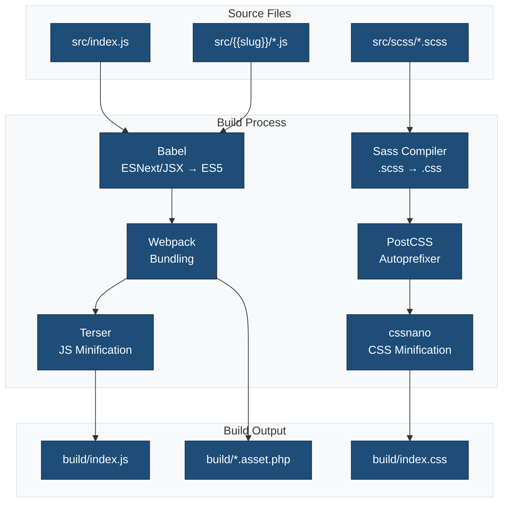
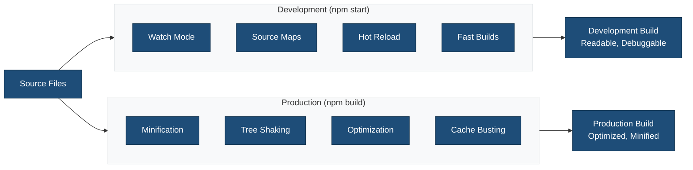

## Overview

This WordPress block plugin uses `@wordpress/scripts` (wp-scripts) for its build process. wp-scripts provides a standardized toolchain that handles all aspects of modern block development:

| Feature | Description | Tool |
|---------|-------------|------|
| **Compilation** | Converts ESNext and JSX into browser-compatible JavaScript | Babel |
| **Bundling** | Combines multiple files into optimized bundles | Webpack |
| **Code Linting** | Enforces JavaScript and CSS coding standards | ESLint, Stylelint |
| **Code Formatting** | Maintains consistent code style | Prettier |
| **Sass Compilation** | Converts .scss files to standard CSS | sass-loader |
| **Code Minification** | Reduces file sizes for production | Terser (JS), cssnano (CSS) |

For more details, see the official WordPress documentation:

- [Block Editor Handbook](https://developer.wordpress.org/block-editor/)
- [Get started with wp-scripts](https://developer.wordpress.org/block-editor/getting-started/devenv/get-started-with-wp-scripts/)

### Build Process Flow



## Prerequisites

- Node.js 18.0+ and npm 9.0+
- PHP 8.0+
- WordPress 6.4+

## Quick Start

```bash
# Install dependencies
npm install
composer install

# Start development mode with hot reload
npm run start

# Build for production
npm run build
```

## Build Scripts

### Development

```bash
npm run start
```

Starts webpack in development mode with:

- Hot module replacement (HMR)
- Source maps for debugging
- File watching for auto-rebuild
- Development-optimized bundles

### Production Build

```bash
npm run build
```

Creates optimized production assets:

- Minified JavaScript and CSS
- Optimized images and fonts
- Tree-shaking for smaller bundle sizes
- Cache-friendly filenames

```bash
npm run build:production
```

Same as `npm run build` but with explicit NODE_ENV=production flag.

### Development vs Production Flow



## Build Configuration

### Webpack Configuration (`webpack.config.cjs`)

The webpack config extends `@wordpress/scripts` defaults with custom settings:

**Entry Points:**

- `src/index.js` - Block registration entry point
- `src/{{slug}}/` - Individual block files (edit.js, save.js, etc.)
- `src/scss/style.scss` - Frontend and editor styles
- `src/scss/editor.scss` - Editor-only styles

**Output:**

- Directory: `build/`
- JavaScript: `build/index.js`
- CSS: `build/index.css`, `build/style-index.css`
- Assets: `build/*.asset.php`
- Block files: `build/{{slug}}/`

**Key Plugins:**

- `webpack-remove-empty-scripts` - Removes empty .js files from CSS-only entry points
- `@wordpress/dependency-extraction-webpack-plugin` - Extracts WordPress dependencies

**Path Aliases:**

- `@` → `src/` directory
- `@scss` → `src/scss/` directory

**Asset Handling:**

- SCSS compiled to CSS with PostCSS processing
- Automatic vendor prefixing
- CSS minification and optimization
- Block registration and metadata
- JSX compilation for React components

### Source Structure

```
src/
├── index.js                # Block registration entry point
├── scss/
│   ├── style.scss          # Frontend and editor styles
│   └── editor.scss         # Editor-only styles
└── {{slug}}/
    ├── block.json          # Block metadata
    ├── index.js            # Block registration
    ├── edit.js             # Edit component
    ├── save.js             # Save component
    ├── render.php          # Dynamic rendering (optional)
    ├── view.js             # Frontend JavaScript (optional)
    ├── style.scss          # Block-specific styles
    └── editor.scss         # Block-specific editor styles
```

### Build Output

```
build/
├── index.js                # Compiled block JavaScript
├── index.asset.php         # Dependency metadata and version
├── index.css               # Compiled block CSS (editor + frontend)
├── style-index.css         # Compiled frontend-only CSS
└── {{slug}}/               # Block-specific build output
    ├── block.json          # Copied block metadata
    ├── render.php          # Copied render file (if exists)
    └── *.asset.php         # Individual block assets
```

## Asset Loading

The plugin automatically loads compiled assets using `block.json` metadata:

### Block Registration ({{slug}}.php)

```php
/**
 * Register the block
 */
function {{namespace}}_register_block() {
    register_block_type( __DIR__ . '/build' );
}
add_action( 'init', '{{namespace}}_register_block' );
```

### Automatic Asset Enqueuing

WordPress automatically enqueues assets defined in `block.json`:

```json
{
  "editorScript": "file:./index.js",
  "editorStyle": "file:./index.css",
  "style": "file:./style-index.css",
  "viewScript": "file:./view.js"
}
```

## Internationalization (i18n)

### Generate Translation Template

```bash
npm run makepot
```

This creates `languages/{{slug}}.pot` file containing all translatable strings.

### Translation Setup

1. **Text Domain:** All strings use `{{slug}}` text domain (matches plugin slug)
2. **Load Translations:** Handled in `{{slug}}.php`:

   ```php
   load_plugin_textdomain(
       '{{slug}}',
       false,
       dirname( plugin_basename( __FILE__ ) ) . '/languages'
   );
   ```

3. **Translation Files:** Place `.po` and `.mo` files in `languages/` directory

### Using Translations in Code

**PHP:**

```php
<?php esc_html_e( 'Text to translate', '{{slug}}' ); ?>
<?php esc_html_x( 'Text', 'context', '{{slug}}' ); ?>
<?php printf( esc_html__( 'Hello %s', '{{slug}}' ), $name ); ?>
```

**JavaScript:**

```javascript
import { __ } from '@wordpress/i18n';

const text = __( 'Text to translate', '{{slug}}' );
```

**Block Components:**

```jsx
import { __ } from '@wordpress/i18n';

export default function Edit() {
    return (
        <div>
            <h2>{__( 'Block Title', '{{slug}}' )}</h2>
        </div>
    );
}
```

## Linting and Formatting

### JavaScript Linting

```bash
npm run lint:js          # Check JS files
npm run lint:js:fix      # Auto-fix JS issues
```

### CSS Linting

```bash
npm run lint:css         # Check CSS/SCSS files
npm run lint:css:fix     # Auto-fix CSS issues
```

### PHP Linting

```bash
npm run lint:php         # Check PHP files (via Composer)
npm run lint:php:fix     # Auto-fix PHP issues
```

### Format All Files

```bash
npm run format           # Format with Prettier
```

## Testing

```bash
npm run test             # Run all tests
npm run test:js          # JavaScript unit tests
npm run test:js:watch    # Watch mode
npm run test:php         # PHP unit tests
npm run test:e2e         # End-to-end tests
```

## WordPress Environment

### Local Development

```bash
npm run env:start        # Start WordPress environment
npm run env:stop         # Stop environment
npm run env:destroy      # Remove environment
```

Access at:

- Site: <http://localhost:8888>
- Admin: <http://localhost:8888/wp-admin>
- Username: `admin`
- Password: `password`

## Performance Optimization

### Code Splitting

Webpack automatically splits code into optimized chunks:

- Separate bundles for editor and frontend
- Vendor code split from theme code
- CSS extracted into separate files

### Asset Optimization

- **Images:** Compressed and optimized during build
- **Fonts:** Subsetting for smaller file sizes
- **CSS:** Minified, autoprefixed, and purged of unused styles
- **JavaScript:** Minified, tree-shaken, and bundled efficiently

### Caching

Asset files include version hashes for cache busting:

- `theme.asset.php` contains dependency info and version
- WordPress automatically handles cache invalidation

## Troubleshooting

### Build Fails

```bash
# Clear caches
rm -rf node_modules build
npm install
npm run build
```

### Hot Reload Not Working

1. Check webpack-dev-server is running (`npm run start`)
2. Verify proxy settings in `.wp-env.json`
3. Clear browser cache

### Translation Strings Not Showing

1. Regenerate POT file: `npm run makepot`
2. Ensure text domain matches plugin slug
3. Check `load_plugin_textdomain()` is called in `{{slug}}.php`
4. Verify `wp_set_script_translations()` is used for JavaScript

### Block Not Appearing in Editor

1. Verify plugin is activated
2. Check `register_block_type()` is called on `init` hook
3. Ensure `block.json` exists and is valid
4. Run `npm run build` to compile assets
5. Check browser console for JavaScript errors

### Asset 404 Errors

1. Verify build directory exists: `npm run build`
2. Check `register_block_type()` points to correct directory
3. Ensure `.asset.php` files are generated
4. Verify `block.json` file paths are correct

## References

- [WordPress Scripts Package](https://developer.wordpress.org/block-editor/reference-guides/packages/packages-scripts/)
- [Block Editor Handbook](https://developer.wordpress.org/block-editor/)
- [Block API Reference](https://developer.wordpress.org/block-editor/reference-guides/block-api/)
- [Block Metadata (block.json)](https://developer.wordpress.org/block-editor/reference-guides/block-api/block-metadata/)
- [WordPress Internationalization](https://developer.wordpress.org/plugins/internationalization/)
- [Create Block Tutorial](https://developer.wordpress.org/block-editor/getting-started/create-block/)

## Related Documentation

- [LINTING.md](./LINTING.md) - Code quality standards for JavaScript, CSS, and PHP
- [TESTING.md](./TESTING.md) - Testing strategies, dry-run system, and test logging
- [LOGGING.md](./LOGGING.md) - Comprehensive logging across builds and workflows
- [WORKFLOWS.md](./WORKFLOWS.md) - CI/CD automation with GitHub Actions
- [PERFORMANCE.md](./PERFORMANCE.md) - Performance monitoring and optimization
