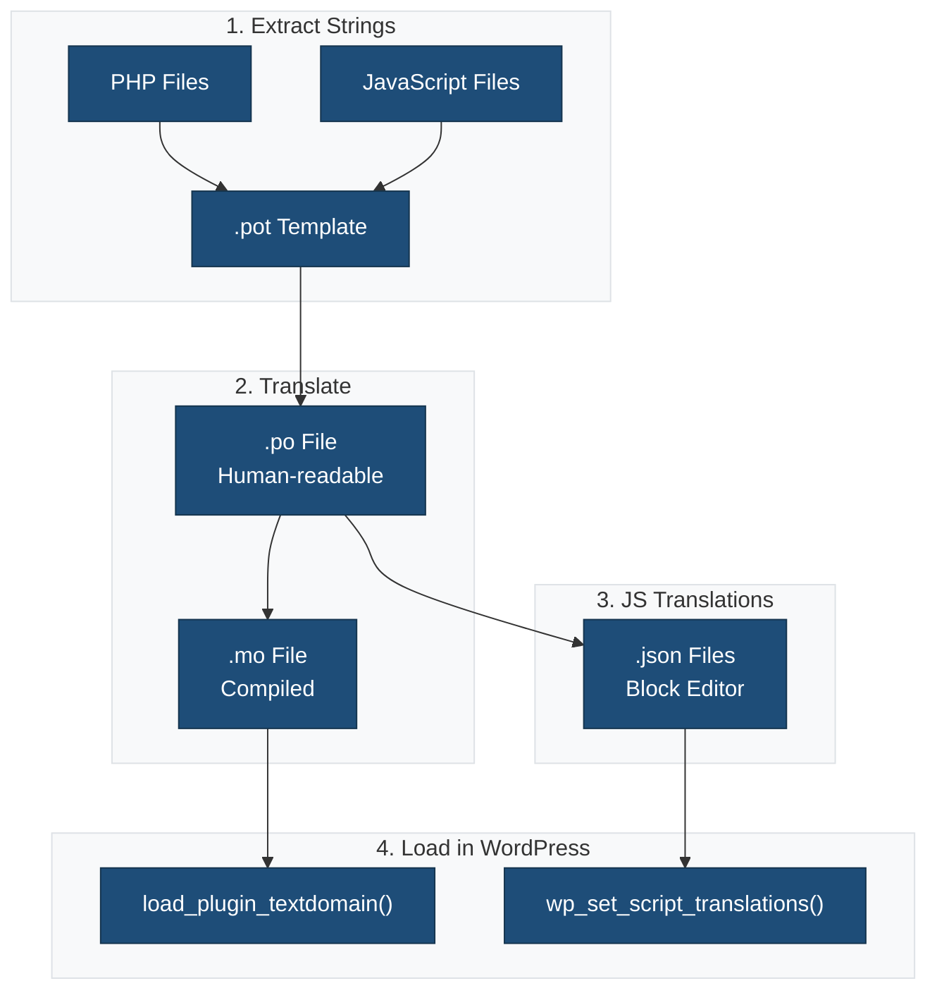

This plugin is fully internationalized and ready for translation into any language.

## Overview

The plugin follows WordPress internationalization best practices for both PHP and JavaScript code. All user-facing strings are wrapped in translation functions and can be translated without modifying the plugin code.

## Text Domain

The plugin's text domain is: `{{textdomain}}`

This text domain must match the plugin slug and is used in all translation functions.

## Translation Files Location

Translation files are stored in the `languages/` directory:

- **`.pot` files**: Template files for translators (generated from source code)
- **`.po` files**: Human-readable translation source files
- **`.mo` files**: Compiled translation files used by WordPress
- **`.json` files**: JavaScript translation files for the block editor

### Translation Workflow



## Generating Translation Files

### PHP Translation Files

Generate a POT file from PHP code:

```bash
npm run makepot:php
```

This creates `languages/{{slug}}.pot` containing all translatable strings from PHP files.

### JavaScript Translation Files

Generate a POT file from JavaScript code:

```bash
npm run build
```

The webpack build process automatically extracts JavaScript strings to `languages/{{slug}}-js.pot` using `@wordpress/babel-plugin-makepot`.

### Complete Translation Workflow

1. **Extract all strings** (PHP + JavaScript):

   ```bash
   npm run makepot
   ```

2. **Generate JSON files** for JavaScript translations:

   ```bash
   npm run makejson
   ```

3. **Complete workflow** (extract + generate JSON):

   ```bash
   npm run i18n
   ```

## PHP Translation Functions

### Basic Translation

```php
// Translate and return
__( 'Hello World', '{{textdomain}}' );

// Translate and echo
_e( 'Hello World', '{{textdomain}}' );
```

### Translation with Context

Use when the same word has different meanings:

```php
_x( 'Block', 'noun', '{{textdomain}}' );
_x( 'Block', 'verb', '{{textdomain}}' );
```

### Pluralization

```php
$count = 5;
printf(
 _n( '%d item', '%d items', $count, '{{textdomain}}' ),
 number_format_i18n( $count )
);
```

### Translation with Variables

```php
// Single variable
printf(
 /* translators: %s: user name */
 __( 'Welcome, %s!', '{{textdomain}}' ),
 $user_name
);

// Multiple variables (use numbered placeholders)
printf(
 /* translators: 1: block name, 2: author name */
 __( '%1$s by %2$s', '{{textdomain}}' ),
 $block_name,
 $author_name
);
```

### Escape and Translate

Always escape output for security:

```php
// For HTML content
esc_html__( 'Hello World', '{{textdomain}}' );
esc_html_e( 'Hello World', '{{textdomain}}' );

// For HTML attributes
esc_attr__( 'Hello World', '{{textdomain}}' );
esc_attr_e( 'Hello World', '{{textdomain}}' );
```

## JavaScript Translation Functions

### Import i18n

```javascript
import { __ } from '@wordpress/i18n';
```

### Basic Translation

```javascript
// Translate and return
__( 'Hello World', '{{textdomain}}' );

// With context
_x( 'Block', 'noun', '{{textdomain}}' );

// Pluralization
_n( '%d item', '%d items', count, '{{textdomain}}' );

// With context and plural
_nx( '%d block', '%d blocks', count, 'blocks count', '{{textdomain}}' );
```

### Using in React/JSX

```javascript
import { __ } from '@wordpress/i18n';

function MyComponent() {
 return (
  <div>
   <h2>{ __( 'Block Settings', '{{textdomain}}' ) }</h2>
   <p>{ __( 'Configure your block options here.', '{{textdomain}}' ) }</p>
  </div>
 );
}
```

### Translation with Variables

```javascript
import { sprintf, __ } from '@wordpress/i18n';

// Single variable
sprintf(
 /* translators: %s: block name */
 __( 'Configure %s', '{{textdomain}}' ),
 blockName
);

// Multiple variables
sprintf(
 /* translators: 1: block name, 2: author name */
 __( '%1$s by %2$s', '{{textdomain}}' ),
 blockName,
 authorName
);
```

## Translation Loading

### PHP Translations

PHP translations are automatically loaded by WordPress from:

1. `wp-content/languages/plugins/{{slug}}-{locale}.mo`
2. `wp-content/plugins/{{slug}}/languages/{{slug}}-{locale}.mo`

The plugin loads translations in the main plugin file:

```php
load_plugin_textdomain(
 '{{textdomain}}',
 false,
 dirname( plugin_basename( __FILE__ ) ) . '/languages'
);
```

### JavaScript Translations

JavaScript translations are loaded using `wp_set_script_translations()`:

```php
wp_set_script_translations(
 '{{slug}}-editor',
 '{{textdomain}}',
 plugin_dir_path( __FILE__ ) . 'languages'
);
```

WordPress looks for JSON files in the format:

- `{{slug}}-{locale}-{hash}.json`

The hash is automatically generated from the JavaScript file.

## Translation Workflow for Translators

1. **Get the POT file**: Download `{{slug}}.pot` from the `languages/` directory

2. **Create a PO file**: Use a translation tool like [Poedit](https://poedit.net/) to create a `.po` file for your language (e.g., `{{slug}}-es_ES.po`)

3. **Translate strings**: Add translations for all strings in the PO file

4. **Compile MO file**: Generate the `.mo` file (usually done automatically by translation tools)

5. **Generate JSON files**: For JavaScript translations, run:

   ```bash
   wp i18n make-json languages/{{slug}}-es_ES.po --no-purge
   ```

6. **Install translations**: Place the `.mo` and `.json` files in the `languages/` directory

## WordPress.org Translation

If the plugin is hosted on WordPress.org, translations can be contributed through:

- [translate.wordpress.org](https://translate.wordpress.org/)

WordPress.org automatically:

- Manages translations through GlotPress
- Generates and serves `.mo` and `.json` files
- Updates translations via language packs

No need to include translation files in the plugin for WordPress.org hosted plugins.

## Best Practices

### DO

✅ Use translation functions for all user-facing strings
✅ Add translator comments for context
✅ Use numbered placeholders for multiple variables
✅ Keep text domain consistent throughout
✅ Use proper escaping functions
✅ Test with long translations (German text can be 30% longer)

### DON'T

❌ Concatenate translated strings
❌ Use variables for text domain
❌ Put HTML in translatable strings when possible
❌ Use translation functions for empty strings
❌ Skip translator comments for placeholders

### Examples

**Bad:**

```php
// Don't concatenate strings
echo __( 'Configure ', '{{textdomain}}' ) . $block_name;

// Don't put HTML in strings
__( '<strong>Bold text</strong>', '{{textdomain}}' );
```

**Good:**

```php
// Use placeholders
printf(
 /* translators: %s: block name */
 __( 'Configure %s', '{{textdomain}}' ),
 $block_name
);

// Separate HTML from translatable text
echo '<strong>' . esc_html__( 'Bold text', '{{textdomain}}' ) . '</strong>';
```

## Block-Specific Considerations

### Block Metadata (block.json)

The `title` and `description` in `block.json` are automatically translatable:

```json
{
 "title": "My Block",
 "description": "A custom block"
}
```

WordPress automatically wraps these in translation functions when registering the block.

### Block Categories

Custom block categories should be translatable:

```php
register_block_category(
 '{{slug}}-blocks',
 array(
  'title' => __( '{{name}} Blocks', '{{textdomain}}' ),
 )
);
```

### Block Patterns

Block pattern titles and descriptions should be translatable:

```php
register_block_pattern(
 '{{slug}}/my-pattern',
 array(
  'title'       => __( 'My Pattern', '{{textdomain}}' ),
  'description' => __( 'Pattern description', '{{textdomain}}' ),
  'content'     => '<!-- wp:paragraph --><p>' . esc_html__( 'Content', '{{textdomain}}' ) . '</p><!-- /wp:paragraph -->',
 )
);
```

## Testing Translations

### With Locale Switcher

1. Install a translation testing plugin like [WP-CLI Language Command](https://github.com/wp-cli/language-command)
2. Switch to a test locale
3. Verify all strings are translated

### With Test Translation

Create a test translation to identify untranslated strings:

```bash
npm run makepot
# Use Poedit to create a test translation where all strings = "XXX"
```

## Tools and Resources

- **WP-CLI i18n**: Command-line tools for generating translations

  ```bash
  wp i18n make-pot . languages/{{slug}}.pot
  wp i18n make-json languages/
  ```

- **Poedit**: Desktop application for editing PO files
  - Website: <https://poedit.net/>

- **@wordpress/i18n**: JavaScript internationalization package
  - Docs: <https://developer.wordpress.org/block-editor/reference-guides/packages/packages-i18n/>

- **@wordpress/babel-plugin-makepot**: Extracts translatable strings from JavaScript
  - Docs: <https://developer.wordpress.org/block-editor/reference-guides/packages/packages-babel-plugin-makepot/>

## Additional Resources

- [Plugin Handbook: How to Internationalize Your Plugin](https://developer.wordpress.org/plugins/internationalization/how-to-internationalize-your-plugin/)
- [Block Editor Handbook: Internationalization](https://developer.wordpress.org/block-editor/how-to-guides/internationalization/)
- [Common APIs: Internationalization](https://developer.wordpress.org/apis/internationalization/)
- [WordPress Coding Standards: I18n](https://developer.wordpress.org/coding-standards/wordpress-coding-standards/php/#internationalization)

## Support

For translation issues or questions, please refer to:

- [Plugin Documentation]({{docs_url}})
- [Support Forum]({{support_url}})
- [GitHub Issues]({{github_url}}/issues)
- [translate.wordpress.org](https://translate.wordpress.org/) (for WordPress.org hosted plugins)
