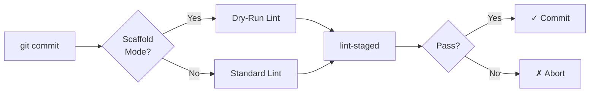

Comprehensive guide to AI agents for the Multi-Block Plugin Scaffold.

## Overview & Purpose

This file documents the AI agent system for the Multi-Block Plugin Scaffold. Agents automate development tasks, maintain code quality, assist with plugin generation, and integrate with CI/CD workflows.

**Important**: This file is `docs/AGENTS-OVERVIEW.md` and documents the agent system. The root-level `AGENTS.md` file contains global AI rules and coding standards for the entire organisation. See [Root AGENTS.md](../AGENTS.md) for org-wide rules.

## Related Files

- **[Root AGENTS.md](../AGENTS.md)** - Global AI rules, coding standards, and org-wide principles
- **Agent specifications** - Located in `.github/agents/` directory
- **[.github/custom-instructions.md](../.github/custom-instructions.md)** - AI/Copilot instructions for this plugin
- **[.github/prompts/prompts.md](../.github/prompts/prompts.md)** - Prompt templates for consistent output
- **[WORKFLOWS.md](./WORKFLOWS.md)** - GitHub Actions CI/CD workflows that use agents
- **[GENERATE-PLUGIN.md](./GENERATE-PLUGIN.md)** - Complete plugin generation guide

## Agent Architecture

The scaffold uses three types of agents:

1. **Generator Agents** - Create new plugins from templates
2. **Development Agents** - Assist with ongoing development
3. **Automation Agents** - Handle CI/CD and quality checks

All agents follow the specifications in `.github/agents/` and integrate with the build system, Git hooks, and GitHub Actions workflows.

## Available Agents

### 1. Scaffold Generator Agent

**Spec**: `.github/agents/scaffold-generator.agent.md`
**Implementation**: `.github/agents/scaffold-generator.agent.js`
**Type**: Generator Agent

**Purpose**: Comprehensive interactive agent that collects requirements and generates WordPress multi-block plugins with custom post types, taxonomies, and SCF fields.

**Discovery Process**:

- Stage 1: Plugin Identity (name, slug, author)
- Stage 2: Custom Post Type Configuration (CPT features, supports, archive)
- Stage 3: Taxonomies (hierarchical/non-hierarchical, singular/plural names)
- Stage 4: Custom Fields (SCF field types, repeaters, flexible content)
- Stage 5: Blocks (card, collection, slider, featured, single)
- Stage 6: Templates & Patterns (single, archive, block patterns)
- Stage 7: Version & Requirements (WordPress/PHP versions, license)

**Features**:

- Multi-stage interactive conversation
- Validates configuration at each stage
- Generates complete plugin structure
- Creates SCF field groups in JSON format
- Sets up block templates and patterns
- Configures custom post types and taxonomies
- Applies mustache template system

**Usage**:

```bash
# Interactive mode
node .github/agents/scaffold-generator.agent.js

# JSON input mode
echo '{"slug":"tour-operator","name":"Tour Operator"}' | node .github/agents/scaffold-generator.agent.js --json

# Validation mode
node .github/agents/scaffold-generator.agent.js --validate '{"slug":"test"}'

# Schema output
node .github/agents/scaffold-generator.agent.js --schema
```

**Or invoke via AI**:

- "Generate a multi-block plugin"
- "Create a CPT plugin from scaffold"
- Use the prompt: `@workspace /generate-plugin`

**Output**: Complete WordPress plugin in `output-plugin/` directory

**Related Files**:

- **Prompt**: `.github/prompts/generate-plugin.prompt.md` - Interactive prompt template
- **Instructions**: `.github/instructions/generate-plugin.instructions.md` - Mustache template rules
- **Documentation**: `docs/GENERATE-PLUGIN.md` - Complete generation guide

### 2. Development Assistant Agent

**Spec**: `.github/agents/development-assistant.agent.md`
**Type**: Development Agent

**Purpose**: Context-aware AI assistant that adapts to different development modes for ongoing plugin development.

**Development Modes**:

1. **WordPress Development Mode** - PHP and WordPress-specific work
   - WordPress coding standards
   - Security and sanitisation
   - Hook and filter patterns

2. **Block Development Mode** - Gutenberg block APIs
   - Block.json configuration
   - React and modern JavaScript
   - Block editor UX patterns
   - WordPress block design system

3. **Post Type Mode** - CPT and taxonomy development
   - CPT registration patterns
   - REST API integration
   - Block template configuration
   - Label arrays and configurations

4. **Fields Mode** - SCF/ACF field configuration
   - Field group registration
   - Repeater and flexible content
   - Block Bindings API integration

5. **Testing Mode** - Comprehensive test coverage
   - Jest tests for JavaScript
   - PHPUnit tests for PHP
   - Playwright E2E tests

6. **Security Audit Mode** - Security best practices
7. **Performance Optimisation Mode** - Speed and efficiency
8. **Accessibility Mode** - WCAG 2.1 AA compliance

**Quick Commands**:

- `help blocks` - Block authoring assistance
- `help cpt` - Custom post type guidance
- `help fields` - SCF field configuration
- `help styles` - Styling and block.json
- `help js` - JavaScript functionality
- `help testing` - Testing strategies
- `help build` - Build process help

**Usage**: Agent automatically activates based on file context. Switch modes explicitly:

- "Switch to block development mode"
- "Switch to post type mode"
- "Switch to testing mode"

**Example Requests**:

- "Create a collection block with grid layout"
- "Add a slider repeater field"
- "Configure block bindings for custom fields"
- "Set up taxonomy filtering for collection block"
- "Help me configure the collection block query"

### 3. General Automation Agent

**Script**: `.github/agents/agent-script.js`
**Workflow**: `.github/workflows/agent-workflow.yml`
**Type**: Automation Agent

**Purpose**: Template for custom automation agents. Demonstrates file listing, environment variables, and artifact upload for GitHub Actions.

**Features**:

- File system operations
- Environment variable handling
- GitHub Actions integration
- Artifact upload
- Dry-run mode support

**Usage**:

```bash
# Local execution
node .github/agents/agent-script.js --example

# GitHub Actions
# Triggered by workflow: .github/workflows/agent-workflow.yml
```

**Environment Variables**:

- `DRY_RUN` (default: `false`)
- `VERBOSE` (default: `false`)
- `GITHUB_TOKEN` (for GitHub API operations)

**Use Case**: Template for creating new automation agents for custom workflows.

## Agent Integration

### Git Hooks (Husky)

Agents integrate with pre-commit hooks:

**File**: `.husky/pre-commit`

**Features**:

- Auto-detects scaffold vs generated plugin mode
- Uses dry-run testing for scaffold templates
- Runs linting and formatting
- Validates mustache variables

**Flow**:



**Scaffold Mode Detection**:

```bash
if grep -q "{{slug}}" package.json; then
  npm run dry-run:lint
else
  npm run lint
fi
```

### GitHub Actions Workflows

Agents are used in these workflows:

1. **Code Quality** (`.github/workflows/code-quality.yml`)
   - Linting, formatting, static analysis
   - Uses agents for validation

2. **CI/CD** (`.github/workflows/ci-cd.yml`)
   - Build, test, deploy
   - Runs agents in test matrix

3. **Internationalization** (`.github/workflows/i18n.yml`)
   - POT file generation
   - Translation updates

4. **Performance** (`.github/workflows/performance.yml`)
   - Lighthouse CI
   - Performance budgets

5. **Security** (`.github/workflows/security.yml`)
   - Dependency scanning
   - SAST analysis

See **[README.md](./README.md)** for documentation index.

### Build System Integration

Agents integrate with the build system:

**Webpack** (`webpack.config.js`):

- Asset compilation
- Block registration
- SCSS processing
- JavaScript bundling

**Build Scripts** (`bin/`):

- `bin/build.js` - Main build coordination
- `bin/update-version.js` - Version management
- `bin/dry-run-test.js` - Template testing
- `bin/dry-run-config.js` - Mustache variable substitution

### Dry-Run Testing System

Special agent for testing scaffold templates:

**Purpose**: Test templates with mustache variables during development without generating full plugins.

**Files**:

- `bin/dry-run-config.js` - Configuration and variable substitution
- `bin/dry-run-test.js` - Test runner with backup/restore

**Usage**:

```bash
# Lint with variable substitution
npm run dry-run:lint

# Test with variable substitution
npm run dry-run:test

# Run all checks
npm run dry-run:all
```

**How It Works**:

1. Backs up template files
2. Substitutes mustache variables with test values
3. Runs linting/testing
4. Restores original files
5. Reports results

**Test Values** (from `dry-run-config.js`):

```javascript
{
  slug: 'test-plugin',
  name: 'Test Plugin',
  namespace: 'test_plugin',
  textdomain: 'test-plugin',
  // ... 30+ more variables
}
```

See `docs/DRY-RUN-TESTING.md` for complete dry-run documentation.

## Summary

✅ **Three Main Agents**:

1. **Scaffold Generator** - Interactive plugin creation with CPT, taxonomies, and fields
2. **Development Assistant** - Context-aware help with multiple dev modes
3. **Automation Agent** - Template for custom CI/CD automation

✅ **Key Features**:

- Multi-stage plugin generation
- Dry-run testing for templates
- Git hook integration
- GitHub Actions workflows
- Mustache template system
- SCF field generation

✅ **Benefits**:

- **Automated Quality** - Agents maintain code standards
- **Consistent Workflow** - Same process for all developers
- **Error Prevention** - Catch issues before production
- **Time Savings** - Automate repetitive tasks
- **Documentation** - Keep docs synchronized with code

See **[README.md](./README.md)** for complete documentation.
