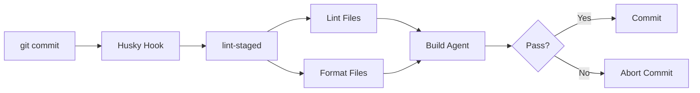
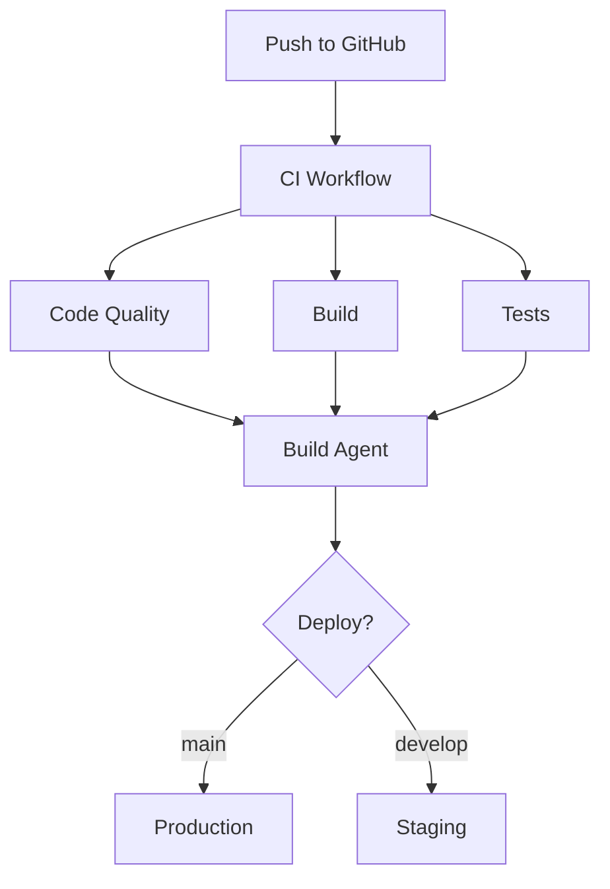

# AI Agents Guide

Overview of AI agents available for the {{name}} block plugin scaffold.

## Overview

This theme includes AI agents that automate development tasks, maintain code quality, and assist with common workflows. Agents are configured in the `.github/agents/` directory.

## Available Agents

### Development Assistant

**Location**: `.github/agents/development-assistant.agent.md`

**Purpose**: Context-aware AI assistant that adapts to different development modes:

- **Build Mode**: Assists with build configuration, webpack, and compilation
- **Debug Mode**: Helps troubleshoot errors and issues
- **Documentation Mode**: Creates and updates documentation
- **Testing Mode**: Assists with writing and running tests

**Usage**: Agent automatically activates based on file context and user intent.

### Build Agent

**Location**: `.github/agents/wp-block-build.agent.md` and `wp-block-build.agent.js`

**Purpose**: Automates the build process for block themes:

- Compiles JavaScript and CSS
- Validates theme.json
- Generates asset manifests
- Runs linting and formatting
- Creates production-ready builds

**Usage**:

```bash
# Triggered automatically on:
- Git commits (via Husky pre-commit hook)
- GitHub Actions workflows
- npm run build command
```

**Features**:

- Mustache variable replacement in templates
- JSON validation for theme.json
- PHP syntax checking
- Asset optimization
- Version bumping

### Scaffold Generator

**Location**: `.github/agents/` (generator system)

**Purpose**: Creates new themes from this scaffold:

- Replaces template variables ({{name}}, {{textdomain}}, etc.)
- Validates required files
- Updates package.json and composer.json
- Generates initial documentation

**Usage**: See [GENERATE-THEME.md](./GENERATE-THEME.md) for complete guide.

## Agent Workflows

### Pre-commit Hook

Agents run automatically before commits:



### CI/CD Pipeline

Agents integrate with GitHub Actions:



## Using Agents

### In Development

Agents assist automatically during development:

1. **File Creation**: Suggests structure and boilerplate
2. **Code Editing**: Provides WordPress-specific guidance
3. **Error Resolution**: Helps debug build and runtime errors
4. **Documentation**: Keeps docs synchronized with code

### In Code Review

Agents help maintain quality:

- Lint violations are caught before commit
- Build errors prevent bad commits
- Tests run automatically on PR
- Documentation gaps are identified

### In Deployment

Agents ensure production-ready code:

- Only production files are packaged
- Assets are optimized and minified
- Version numbers are updated
- Change logs are maintained

## Agent Configuration

### Customizing Build Agent

Edit `.github/agents/wp-block-build.agent.js`:

```javascript
module.exports = {
  // Validation rules
  validate: {
    themeJson: true,
    phpSyntax: true,
    requiredFiles: ['style.css', 'theme.json']
  },

  // Build steps
  build: {
    compile: true,
    minify: true,
    optimize: true
  },

  // Output options
  output: {
    verbose: false,
    summary: true
  }
};
```

### Adding Custom Agents

1. Create agent spec in `.github/agents/your-agent.agent.md`
2. Implement agent logic in `.github/agents/your-agent.agent.js`
3. Register agent in `.github/agents/agent.md` (main index)
4. Update workflows to use agent

Example agent structure:

```markdown
# Agent Name

## Purpose
What the agent does

## Triggers
When the agent runs

## Actions
Steps the agent performs

## Configuration
How to configure the agent

## Examples
Usage examples
```

## Best Practices

### 1. Let Agents Handle Repetitive Tasks

✅ **Good**: Let build agent handle linting, formatting, validation  
❌ **Bad**: Manually run each tool before commit

### 2. Review Agent Output

Always review what agents change:

```bash
git diff  # Check agent changes before committing
```

### 3. Configure Agents for Your Workflow

Customize agents in `.github/agents/` to match your team's needs.

### 4. Keep Agents Updated

```bash
# Update agent dependencies
npm run packages-update
```

## Troubleshooting

### Agent Not Running

**Problem**: Pre-commit hook doesn't run

**Solution**:

```bash
npm run prepare  # Reinstall Husky hooks
```

### Agent Failing

**Problem**: Build agent fails on commit

**Solution**:

1. Check error message in terminal
2. Fix reported issues
3. Retry commit

**Common Issues**:

- Linting errors: `npm run lint:fix`
- Build errors: `npm run build`
- Test failures: `npm run test`

### Agent Too Strict

**Problem**: Agent blocks legitimate commits

**Solution**: Adjust agent configuration in `.github/agents/` or temporarily bypass:

```bash
git commit --no-verify  # Skip hooks (use sparingly)
```

## Integration with Tools

### VS Code

Agents integrate with VS Code via:

- **Task Runner**: Run agents via Tasks menu
- **Terminal**: Agent output in integrated terminal
- **Problems Panel**: Errors from agents appear here

### GitHub Actions

See [WORKFLOWS.md](./WORKFLOWS.md) for how agents integrate with CI/CD.

### Husky & lint-staged

Pre-commit hooks configured in:

- `.husky/pre-commit`: Hook script
- `package.json`: lint-staged configuration

```json
{
  "lint-staged": {
    "*.js": ["eslint --fix", "prettier --write"],
    "*.scss": ["stylelint --fix", "prettier --write"],
    "*.php": ["composer run lint:fix"]
  }
}
```

## Resources

- [Main Agent Index](../.github/agents/agent.md) - Complete agent directory
- [GitHub Actions](https://docs.github.com/en/actions) - CI/CD documentation
- [Husky](https://typicode.github.io/husky/) - Git hooks documentation
- [lint-staged](https://github.com/okonet/lint-staged) - Pre-commit linting

## Summary

✅ **Automated Quality** - Agents maintain code standards  
✅ **Consistent Workflow** - Same process for all developers  
✅ **Error Prevention** - Catch issues before they reach production  
✅ **Time Savings** - Automate repetitive tasks

For CI/CD workflows, see [WORKFLOWS.md](./WORKFLOWS.md).  
For testing documentation, see [TESTING.md](./TESTING.md).
