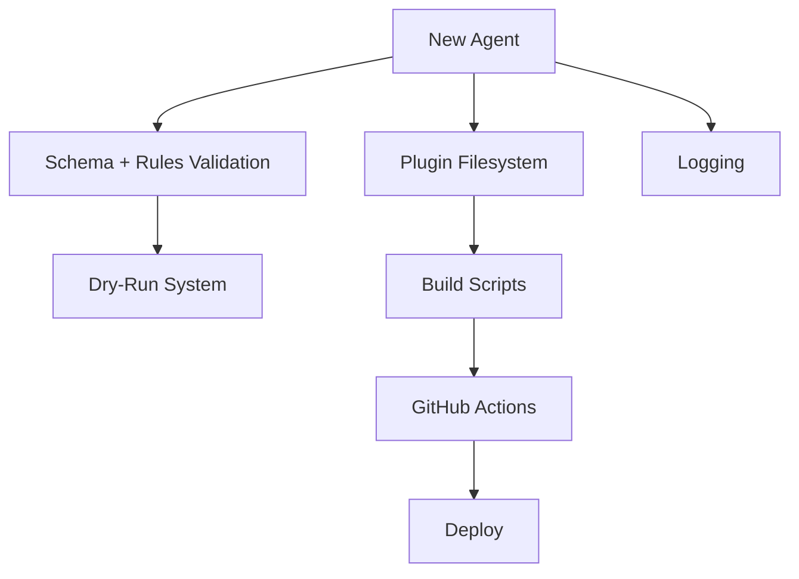
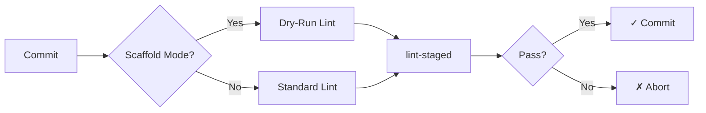
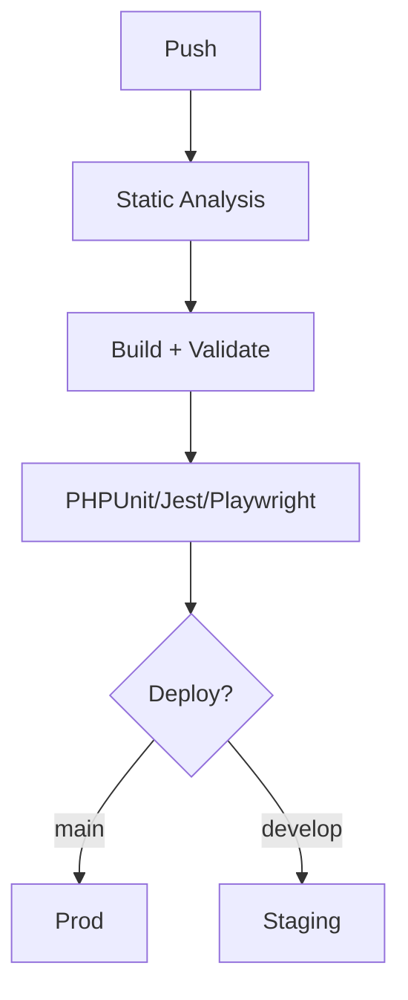
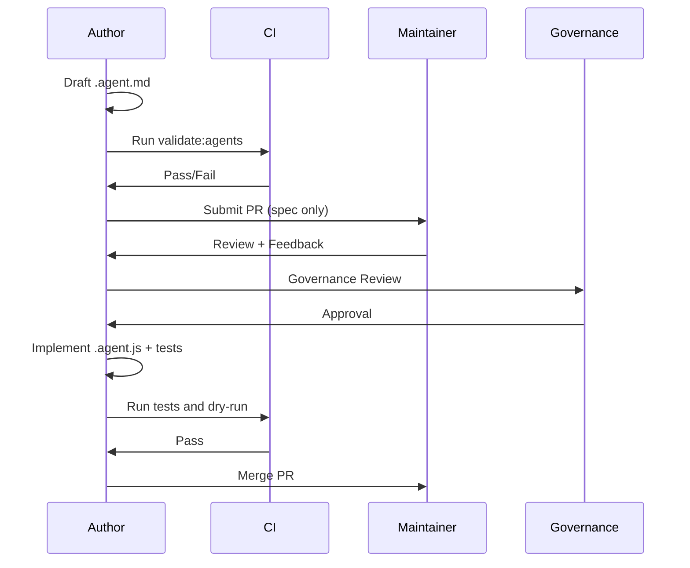

# AGENT_CREATION.md

**Human Governance for Creating New AI Agents in the Multi-Block Plugin Scaffold**

This document explains how humans plan, draft, evaluate, and publish new agent specifications for the **Multi-Block Plugin Scaffold**.

It sits above the detailed “Authoring Guide” and focuses on:

- responsible, safe creation of new agents
- plugin-scaffold-specific constraints
- predictable integration into CI/CD, code generation, and dry-run workflows
- avoiding overlap with powerful existing agents (Generator, Dev Assistant, Automation Agent)

This governance ensures all agents behave deterministically, safely, and in alignment with the scaffold’s architecture.

---

# 1. Understanding the Existing Agent System

Before creating a new agent, you must understand what already exists.

## 1.1 Multi-Block Agent Ecosystem

### **1. Scaffold Generator Agent**

- Drives full plugin generation
- Handles CPTs, taxonomies, SCF fields, block templates
- Performs multi-stage discovery
- Validates using Ajv2020
- Mustache-based templating engine
- Fully tested (104 tests)

### **2. Development Assistant Agent**

Context-aware development assistant with modes:

- WordPress Development
- Block Development
- Post Type Mode
- Fields Mode
- Testing Mode
- Security Mode
- Accessibility Mode
- Performance Mode

### **3. General Automation Agent**

Template agent for CI/CD, file operations, validation checks, and GitHub Actions automation.

---

## 1.2 Mermaid Overview of the Multi-Block Agent Architecture

```mermaid
flowchart LR
    User[Developer] --> DevAssistant[Development Assistant]
    User --> Generator[Scaffold Generator]
    CI[GitHub Actions] --> Automation[Automation Agent]

    Generator --> Output1[Generated Multi-Block Plugin]
    DevAssistant --> Output2[Contextual Dev Guidance]
    Automation --> Output3[CI/CD Validation + Artifact Work]

    Generator -.-> Builds[Build System]
    DevAssistant -.-> Codebase
    Automation -.-> Repo[Repository State]
````

---

# 2. When You Should Create a New Agent

Create a new agent only when **all** the following apply:

- The workflow is **automatable**, **deterministic**, and **repeatable**
- The Scaffold Generator or Dev Assistant cannot reasonably absorb the behaviour
- The task benefits significantly from schema-based validation, dry-run testing, or AI orchestration
- You can define strict, safe guardrails
- The workflow is **plugin-scaffold-specific** and not organisation-wide
- A maintainer can own its lifecycle

**Do NOT create** a new agent when:

- The behaviour fits naturally into a new Dev Assistant mode
- It overlaps with plugin generation logic
- It touches build system internals without review
- Its effects are not fully reversible
- The rules cannot be described unambiguously

---

## 2.1 Mermaid: Should This Be a New Multi-Block Agent?

```mermaid
flowchart TD
    A([New Workflow Identified]) --> B{Is behaviour deterministic?}
    B -->|No| Stop1[Stop – Not suitable]
    B -->|Yes| C{Does Scaffold Generator<br/>already cover this?}
    C -->|Yes| Stop2[Extend generator]
    C -->|No| D{Does Dev Assistant<br/>cover (or could it)?}
    D -->|Yes| Stop3[Add new mode instead]
    D -->|No| E{Safe guardrails possible?}
    E -->|No| Stop4[Needs redesign]
    E -->|Yes| StartSpec([Begin Spec Draft])
```

---

# 3. Multi-Block Pre-Creation Checklist (Human)

Before writing a spec:

- [ ] Confirm no overlap with **Generator Agent** behaviour
- [ ] Confirm no overlap with **Development Assistant modes**
- [ ] Define which files/folders the agent may modify (CPT JSON, SCF schema, block directories, etc.)
- [ ] Ensure compatibility with **mustache templates**
- [ ] List allowed tools:

  - Ajv schema validation
  - File-system operations
  - GitHub API
  - Linting / prettifying
- [ ] Document failure/recovery behaviour
- [ ] Design logging + observability expectations
- [ ] Identify *test cases* needed to guarantee safety
- [ ] Confirm a maintainer owns and approves the agent lifecycle

---

# 4. Required Spec Structure

All new agents must follow the canonical structure defined in:

`template.agent.md`

Your `.agent.md` MUST include:

- Role & Scope
- Responsibilities & Capabilities
- Allowed Tools
- Input Specification
- Output Specification
- Guardrails (critical for plugin generation!)
- Failure & Rollback Strategy
- Test Tasks (including dry-run validation)
- Observability & Logging
- Changelog

---

# 5. Writing Clear Multi-Block Behaviour

Because the scaffold generates entire WordPress plugins, agent responsibilities must be **precise and minimal**.

### 5.1 Deterministic Behaviour

Examples:

- “If a CPT config is missing `label`, abort with error.”
- “If SCF field group fails schema validation, do not write the file.”

### 5.2 Mustache & Template Rules

Agents **must never**:

- break the mustache template syntax
- introduce template variables not defined in `dry-run-config.js`
- generate inconsistent casing (PascalCase, camelCase, etc.)
- produce files outside the scaffold’s governed directories

### 5.3 Schema-Driven Behaviour

Agents must use Ajv / JSON Schema where applicable.

### 5.4 Safe File Writing

Agents must:

- write only after validation
- back up files before mutation
- support dry-run mode
- log all outputs

---

# 6. Integration With Existing Multi-Block Systems

New agents must not break:

- CPT registration structure
- SCF field group formatting
- block.json rules
- plugin root metadata
- versioning system
- dry-run testing
- Webpack build steps

## 6.1 Mermaid: Integration Architecture



---

# 7. Multi-Block Plugin Agent Workflows

## 7.1 Pre-Commit (Husky) Integration

Agents operate during the commit pipeline:



## 7.2 CI/CD Integration



---

# 8. Good Use Cases for New Agents

## ✔ Good Candidates

- **SCF Field Group Auditor**
  Ensures structural, naming, and schema correctness.

- **Block.json Validator**
  Ensures required fields and consistency across blocks.

- **Plugin Documentation Generator**
  Generates README sections, CPT tables, or block inventories.

- **Translation Keys Validator**
  Ensures textdomains match plugin slug and no stray keys exist.

- **Pattern/Template Structure Auditor**
  Validates template hierarchies for custom post types.

## ❌ Bad Candidates

- Anything modifying multi-repo workflows (belongs in `.github`)
- CI/CD orchestration changes (organisation-wide)
- Build system restructuring (requires Build Agent ownership)
- Plugin generator duplication
- Fully “creative” features (must remain deterministic)

---

# 9. Safety & Guardrails (Multi-Block Specific)

Agents **must**:

- validate all config (CPT, SCF, taxonomy, block.json) before writing
- handle Ajv errors gracefully
- never delete or overwrite developer files without backup
- avoid touching `package.json`, `composer.json`, or version files unless explicitly authorised
- never modify mustache templates without dry-run testing
- log all operations (file writes, warnings, errors)

Rollback strategies must include:

- backup/restore
- revert on failure
- fail-fast behaviour
- meaningful human-readable errors

---

# 10. Agent Creation Workflow (Spec → Implementation)

## Mermaid: Full Agent Lifecycle



---

# 11. Testing Requirements

Each new agent must provide:

- **Normal path test** (valid config → valid output)
- **Edge case test** (missing keys, invalid schema)
- **Failure path test** (agent must abort safely)
- **Dry-run test**
- **Output formatting test**
- **File mutation tests**

SCF, CPT, taxonomy, and block.json validators MUST use **Ajv**.

---

# 12. Quick Start

```bash
cp .github/agents/template.agent.md .github/agents/my-agent.agent.md
```

Then:

1. Fill out spec sections
2. Write guardrails (critical)
3. Validate frontmatter
4. Add to `.github/agents/agent.md`
5. Implement `.agent.js`
6. Write tests
7. Run dry-run & CI
8. Submit PR

---

# 13. Summary

Creating a new agent for the Multi-Block Plugin Scaffold requires:

✔ Strong determinism
✔ Explicit guardrails
✔ Clear file boundaries
✔ Schema-first validation
✔ Non-overlapping responsibilities
✔ Compatibility with Generator, Dev Assistant, and Automation agents
✔ Full test coverage

Following this governance ensures LightSpeed maintains a **safe, scalable, and highly automated** plugin development ecosystem.

---
