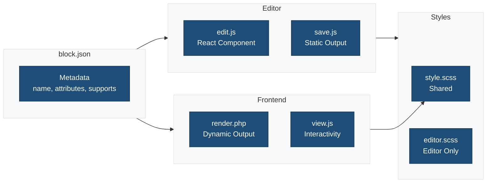
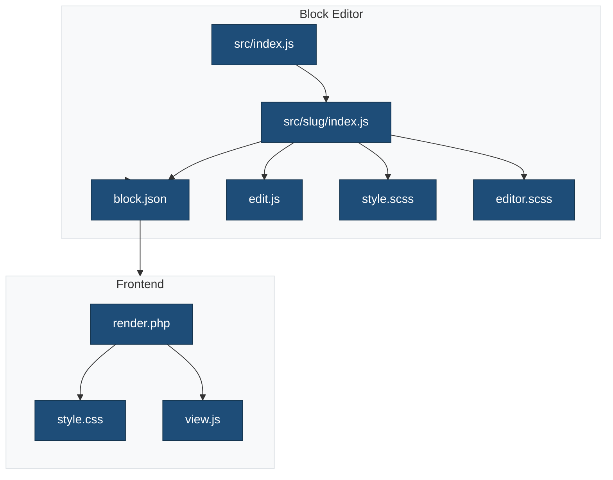

This document explains the complete `src/` folder structure for the {{name}} block plugin scaffold, based on [WordPress Block Editor Tutorial](https://developer.wordpress.org/block-editor/getting-started/tutorial/).

## Directory Overview

### Block Architecture



```
src/
├── index.js                    # Main entry point - registers all blocks
├── {{slug}}/                   # Block-specific directory
│   ├── block.json             # Block metadata and configuration
│   ├── edit.js                # Editor component (React)
│   ├── save.js                # Save function for static rendering
│   ├── index.js               # Block registration
│   ├── render.php             # Server-side rendering (dynamic)
│   ├── style.scss             # Frontend & editor styles
│   ├── editor.scss            # Editor-only styles (block-specific)
│   └── view.js                # Frontend JavaScript (optional)
└── scss/                      # Global styles directory
    ├── editor.scss            # Global editor-only styles
    └── style.scss             # Global frontend-only styles
```

## File Purposes

### Root Level

#### `src/index.js`

**Purpose:** Main entry point that imports and registers all blocks in the plugin.

**When to use:**

- Required for every block plugin
- Import each block's `index.js` here
- For multiple blocks, add additional imports

**Mustache placeholders:**

- `{{name}}` - Plugin name in comments
- `{{namespace}}` - Package namespace
- `{{slug}}` - Block slug in import path

```javascript
// Example: Adding a second block
import './{{slug}}/index.js';
import './another-block/index.js';
```

### Block Directory (`src/{{slug}}/`)

#### `block.json`

**Purpose:** Block metadata, attributes, and configuration (Block Type Metadata)

**When to use:**

- Required for every block
- Define block attributes, supports, scripts, and styles
- Single source of truth for block configuration

**Mustache placeholders:**

- `{{namespace}}` - Block namespace
- `{{slug}}` - Block slug/identifier
- `{{name}}` - Display name
- `{{description}}` - Block description
- `{{version}}` - Block version
- `{{textdomain}}` - Translation text domain

**Key properties:**

- `apiVersion`: Block API version (3 for latest)
- `name`: Unique block identifier (`{{namespace}}/{{slug}}`)
- `attributes`: Block data schema
- `supports`: WordPress features (color, typography, spacing, etc.)
- `editorScript`: Editor JavaScript file
- `editorStyle`: Editor-only CSS file
- `style`: Frontend and editor CSS file
- `render`: PHP render callback file
- `viewScript`: Frontend-only JavaScript file (optional)

#### `edit.js`

**Purpose:** React component that defines the block's appearance and behavior in the editor

**When to use:**

- Required for every block
- Controls editor UI, user interactions, and Inspector Controls
- Uses `useBlockProps()` for block wrapper
- Imports WordPress components and editor utilities

**Mustache placeholders:**

- `{{textdomain}}` - Translation text domain in `__()` functions
- `{{namespace}}` - CSS class names
- `{{slug}}` - CSS class names

**Key imports:**

- `@wordpress/i18n` - Translation functions (`__()`)
- `@wordpress/block-editor` - Editor components (`useBlockProps`, `InspectorControls`, etc.)
- `@wordpress/components` - UI components (`PanelBody`, `TextControl`, etc.)

#### `save.js`

**Purpose:** Defines static HTML output saved to the database

**When to use:**

- Required for statically rendered blocks
- Optional for purely dynamic blocks (can return `null`)
- Uses `useBlockProps.save()` for block wrapper
- Must match `render.php` output or block validation errors occur

**Mustache placeholders:**

- `{{namespace}}` - CSS class names
- `{{slug}}` - CSS class names

**Important notes:**

- Output must be deterministic (no dynamic data like dates)
- For dynamic content, use attributes and `render.php`
- Changes to `save()` output require block deprecation strategy

#### `index.js`

**Purpose:** Registers the block with WordPress using `registerBlockType()`

**When to use:**

- Required for every block
- Imports `edit.js`, `save.js`, and `block.json`
- Can add custom icon, transforms, or other registration options

**Mustache placeholders:** None (imports handle placeholders)

**Key features:**

- Imports `./style.scss` for webpack processing
- Registers block with metadata from `block.json`
- Can override block.json properties if needed

#### `render.php`

**Purpose:** Server-side dynamic rendering (PHP callback)

**When to use:**

- Required for dynamic blocks
- Renders block on frontend using PHP
- Accesses `$attributes`, `$content`, and `$block` variables
- Use `get_block_wrapper_attributes()` for wrapper

**Mustache placeholders:**

- `{{name}}` - Block name in comments
- `{{namespace}}` - Function names and CSS classes
- `{{slug}}` - Function names and CSS classes (with snake_case transform)
- `{{version}}` - Version in @since tag

**Key functions:**

- `get_block_wrapper_attributes()` - Outputs wrapper attributes
- `wp_kses_post()` - Sanitizes HTML content
- `esc_attr()`, `esc_html()` - Escapes output

**Function naming convention:**

```php
function {{namespace}}_{{slug|snakeCase}}_render_callback( $attributes, $content, $block ) {
    // Render logic
}
```

#### `style.scss`

**Purpose:** Styles applied to both frontend and editor

**When to use:**

- Required for every block with custom styling
- Shared styles between editor and frontend
- Use BEM methodology for class names
- Imported in `index.js` for webpack processing

**Mustache placeholders:**

- `{{name}}` - Block name in comments
- `{{namespace}}` - CSS class names
- `{{slug}}` - CSS class names

**Class naming convention:**

```scss
.wp-block-{{namespace}}-{{slug}} {
    &__element {
        // Element styles
    }

    &--modifier {
        // Modifier styles
    }
}
```

#### `editor.scss` (Block-specific)

**Purpose:** Editor-only styles for this specific block

**When to use:**

- Optional - only if block needs editor-specific styling
- Styles for selected state, hover state, placeholders
- Block-specific editor UI customizations

**Mustache placeholders:**

- `{{name}}` - Block name in comments
- `{{namespace}}` - CSS class names and package
- `{{slug}}` - CSS class names
- `{{version}}` - Version in @since tag

**Common use cases:**

- `.is-selected` state styling
- `.is-hovered` state styling
- `.is-multi-selected` state styling
- Placeholder text styling

#### `view.js` (Optional)

**Purpose:** Frontend-only JavaScript (not loaded in editor)

**When to use:**

- Optional - only if block needs frontend interactivity
- Interactive features, animations, event handlers
- Client-side functionality not needed in editor

**Mustache placeholders:**

- `{{name}}` - Block name in comments
- `{{namespace}}` - Function names and CSS selectors (with pascalCase transform)
- `{{slug}}` - Function names and CSS selectors (with pascalCase transform)
- `{{version}}` - Version in @since tag

**Best practices:**

- Check DOM ready state before executing
- Use vanilla JavaScript or minimal dependencies
- Target block elements with `querySelector()`
- Handle edge cases (no blocks found)

**Function naming convention:**

```javascript
function init{{namespace|pascalCase}}{{slug|pascalCase}}Block() {
    // Frontend logic
}
```

### Global Styles Directory (`src/scss/`)

#### `editor.scss` (Global)

**Purpose:** Global editor-only styles applied to all blocks

**When to use:**

- Optional - for plugin-wide editor styling
- Shared editor UI styles across multiple blocks
- Custom editor-wide CSS variables or utilities

**Mustache placeholders:**

- `{{name}}` - Plugin name in comments
- `{{namespace}}` - CSS class names

**Common use cases:**

- Editor-wide custom properties
- Shared component styling
- Plugin-specific editor UI elements

#### `style.scss` (Global)

**Purpose:** Global frontend-only styles

**When to use:**

- Optional - for plugin-wide frontend styling
- Styles that should NOT appear in editor
- Theme-like frontend enhancements

**Mustache placeholders:**

- `{{name}}` - Plugin name in comments
- `{{namespace}}` - CSS class names

**Common use cases:**

- Frontend animations and transitions
- Print-specific styles
- Mobile responsiveness
- Frontend-only hover effects

## File Loading Order

### Block Loading Flow



### In Editor

1. `src/index.js` - Loads and registers blocks
2. `src/{{slug}}/index.js` - Registers individual block
3. `src/{{slug}}/style.scss` - Shared styles
4. `src/{{slug}}/editor.scss` - Editor-only styles
5. `src/scss/editor.scss` - Global editor styles
6. `src/{{slug}}/edit.js` - Editor component renders

### On Frontend

1. `src/{{slug}}/style.scss` - Shared styles
2. `src/scss/style.scss` - Global frontend styles
3. `src/{{slug}}/render.php` - Generates HTML (dynamic blocks)
4. `src/{{slug}}/view.js` - Frontend JavaScript executes

## No Separate `js` Folder Needed

Based on the [WordPress Block Editor Tutorial](https://developer.wordpress.org/block-editor/getting-started/tutorial/), **there should NOT be a separate `js` folder** in the `src` directory.

**Why?**

- WordPress uses a block-centric file organization
- All block-specific files go in `src/{{slug}}/`
- JavaScript files are co-located with their related block files
- This follows WordPress best practices and conventions

**Incorrect structure:**

```
src/
├── js/              ❌ NOT RECOMMENDED
│   └── theme.js
└── {{slug}}/
```

**Correct structure:**

```
src/
├── {{slug}}/        ✅ RECOMMENDED
│   ├── edit.js
│   ├── save.js
│   ├── view.js
│   └── index.js
└── index.js
```

## When to Add More Files

### Additional Blocks

Create a new directory for each block:

```
src/
├── {{slug}}/
├── another-block/
│   ├── block.json
│   ├── edit.js
│   ├── save.js
│   └── ...
└── index.js  (import both blocks)
```

### Block Variations

Add to `index.js` in block directory:

```javascript
registerBlockVariation( '{{namespace}}/{{slug}}', {
    name: 'variation-name',
    title: 'Variation Title',
    // ...
});
```

### Block Transforms

Add to `index.js` registration:

```javascript
registerBlockType( metadata.name, {
    edit: Edit,
    save: Save,
    transforms: {
        from: [ /* ... */ ],
        to: [ /* ... */ ],
    },
});
```

### Shared Components

Create a `components/` directory if needed:

```
src/
├── components/
│   ├── CustomComponent.js
│   └── shared-utils.js
├── {{slug}}/
└── index.js
```

## Build Process

All files in `src/` are processed by `@wordpress/scripts`:

1. **JavaScript files** - Transpiled with Babel, bundled with Webpack
2. **SCSS files** - Compiled to CSS, auto-prefixed, minified
3. **PHP files** - Copied to build directory as-is
4. **JSON files** - Copied to build directory as-is

**Build commands:**

- `npm run start` - Development mode with hot reload
- `npm run build` - Production build with optimization

**Output directory:**

```
build/
├── index.js
├── {{slug}}/
│   ├── block.json
│   ├── index.js
│   ├── style-index.css
│   ├── editor.css
│   ├── view.js
│   └── render.php
└── scss/
    ├── editor.css
    └── style.css
```

## Best Practices

1. **Always use mustache placeholders** in all files for template generation
2. **Follow WordPress coding standards** for PHP, JavaScript, and CSS
3. **Use BEM methodology** for CSS class names
4. **Include JSDoc comments** for JavaScript functions
5. **Include PHPDoc comments** for PHP functions
6. **Sanitize all input** in PHP render callbacks
7. **Escape all output** in PHP render callbacks
8. **Use WordPress i18n functions** for all user-facing text
9. **Test blocks in both editor and frontend**
10. **Keep styles scoped** to block classes to avoid conflicts

## Related Documentation

- [WordPress Block Editor Tutorial](https://developer.wordpress.org/block-editor/getting-started/tutorial/)
- [File Structure of a Block](https://developer.wordpress.org/block-editor/getting-started/fundamentals/file-structure-of-a-block/)
- [Block Metadata (block.json)](https://developer.wordpress.org/block-editor/getting-started/fundamentals/block-json/)
- [Static vs Dynamic Rendering](https://developer.wordpress.org/block-editor/getting-started/fundamentals/static-dynamic-rendering/)
- [Block Wrapper](https://developer.wordpress.org/block-editor/getting-started/fundamentals/block-wrapper/)

## See Also

- [Instructions for Agents](../.github/instructions/instructions.md)
- [Custom Instructions](../.github/custom-instructions.md)
- [Development Guide](../DEVELOPMENT.md)
