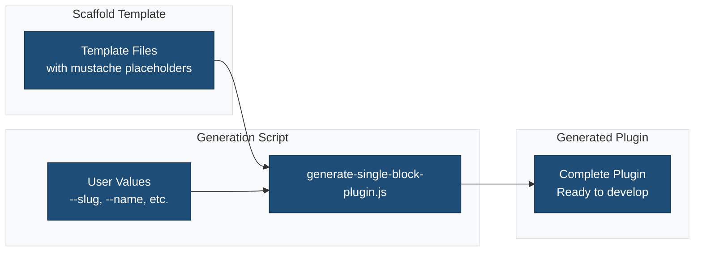
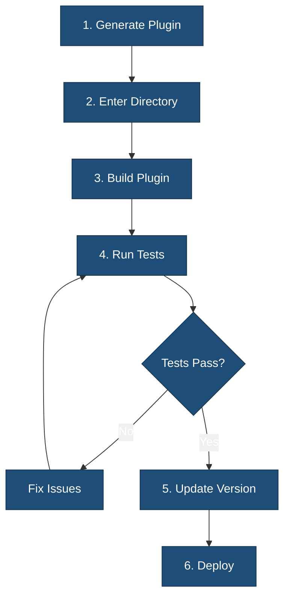

# Single Block Plugin Generation & Build Scripts

This document explains how to use the scripts in the `bin/` directory to generate, build, and test a new single block plugin from this scaffold.

## Overview

The `bin/` directory contains utility scripts for:

- Generating a new single block plugin from the scaffold with custom metadata
- Building the plugin for production
- Running all tests and static analysis
- Updating the plugin version across all files
- Setting up the WordPress PHPUnit test environment

### Plugin Generation Flow



## Scripts

### 1. `generate-single-block-plugin.js`

Generates a new plugin by copying the scaffold and replacing all mustache placeholders with your provided values.

**Usage:**

```sh
node bin/generate-single-block-plugin.js --slug my-block --name "My Block" --description "Description here" --author "Your Name" --author_uri "https://yourdomain.com" --version "1.0.0"
```

- The generated plugin will be placed in an `output-plugin/` directory in your current working directory.
- All placeholders like `{{slug}}`, `{{name}}`, etc., will be replaced with your values.
- You can safely edit the generated plugin independently of the scaffold.

**Arguments:**

- `--slug` (required): Plugin slug (e.g., `my-block`)
- `--name`: Plugin display name
- `--description`: Plugin description
- `--author`: Author name
- `--author_uri`: Author website
- `--version`: Plugin version

### 2. `build.sh`

Builds the plugin, installs dependencies, lints, and runs tests.

**Usage:**

```sh
bin/build.sh
```

- Installs Node.js and Composer dependencies
- Builds plugin assets
- Runs linting and tests
- Outputs a summary and next steps

### 3. `test.sh`

Runs all plugin tests (JS, PHP, E2E) and static analysis.

**Usage:**

```sh
bin/test.sh
```

- Installs dependencies if needed
- Runs JavaScript and PHP unit tests
- Runs PHP static analysis and linting
- Runs E2E tests if `wp-env` is available

### 4. `update-version.js`

Updates the plugin version across all relevant files.

**Usage:**

```sh
node bin/update-version.js <new-version>
```

- Updates `package.json`, `composer.json`, main plugin file, block.json, and README.md
- Prints a summary and next steps

### 5. `install-wp-tests.sh`

Shell script to set up the WordPress PHPUnit test environment. Used internally for CI and local test setup.

**Usage:**

```sh
bin/install-wp-tests.sh <wp-version> <db-name> <db-user> <db-pass> [db-host]
```

- Downloads and configures the WordPress test suite for PHP unit testing.

## Workflow Example

### Complete Development Workflow



1. Generate a new plugin:

   ```sh
   node bin/generate-single-block-plugin.js --slug my-block --name "My Block" --description "A custom block" --author "Jane Doe"
   ```

2. Enter the generated plugin directory:

   ```sh
   cd output-plugin
   ```

3. Build the plugin:

   ```sh
   bin/build.sh
   ```

4. Run all tests:

   ```sh
   bin/test.sh
   ```

5. Update the version:

   ```sh
   node bin/update-version.js 1.2.0
   ```

## Notes

- The `build.sh` and `test.sh` scripts expect a valid `package.json` and `composer.json` in the plugin root.
- The `generate-single-block-plugin.js` script will not overwrite an existing `output-plugin/` directory.
- For advanced usage, see comments in each script.

---

For more details, see the inline documentation in each script in the `bin/` directory.
