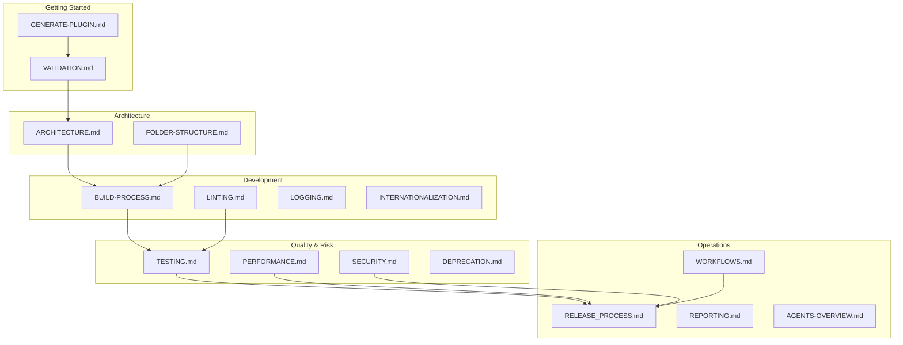

# Documentation Index

This directory contains the working documentation for the {{name}} multi-block plugin scaffold: how to generate a plugin, how the stack is wired, and how to ship it safely.

## Map

## Quick start

1. **Generate** – Follow `GENERATE-PLUGIN.md` to create a plugin (template or generator mode).
2. **Validate** – Run checks in `VALIDATION.md` to ensure placeholders and schemas are correct.
3. **Build** – Use `BUILD-PROCESS.md` for the wp-scripts build pipeline and asset outputs.
4. **Test** – See `TESTING.md` for the unit/E2E coverage and commands.
5. **Release** – Follow `RELEASE_PROCESS.md` for packaging and sign-off.

## Document index

### Getting started
- `GENERATE-PLUGIN.md` – Generator usage and config examples
- `VALIDATION.md` – Mustache and schema validation steps
- `FOLDER-STRUCTURE.md` – Orientation for the scaffold layout

### Architecture & Development
- `ARCHITECTURE.md` – PHP service wiring and block pipeline
- `BUILD-PROCESS.md` – webpack/wp-scripts build details
- `INTERNATIONALIZATION.md` – i18n workflow
- `LINTING.md` – Code quality rules and tools
- `LOGGING.md` – Logging and debugging guidance

### Quality & Risk
- `TESTING.md` – Testing strategy (JS, PHP, Playwright)
- `PERFORMANCE.md` – Lighthouse and bundle size limits
- `SECURITY.md` – Security expectations and checks
- `DEPRECATION.md` – Deprecation workflow for blocks and APIs

### Operations & Governance
- `RELEASE_PROCESS.md` – Release checklist and automation
- `WORKFLOWS.md` – GitHub Actions and CI overview
- `REPORTING.md` – Status and metrics reporting
- `AGENTS-OVERVIEW.md` – AI agent specs
- `GOVERNANCE.md` – Decision-making model

## Conventions

- Use UK English throughout the docs.
- Keep command examples aligned with `package.json` scripts.
- Add a concise Mermaid diagram when a flow benefits from visualising (builds, releases, validation).
- When adding new docs, link them here and in any relevant parent document.
