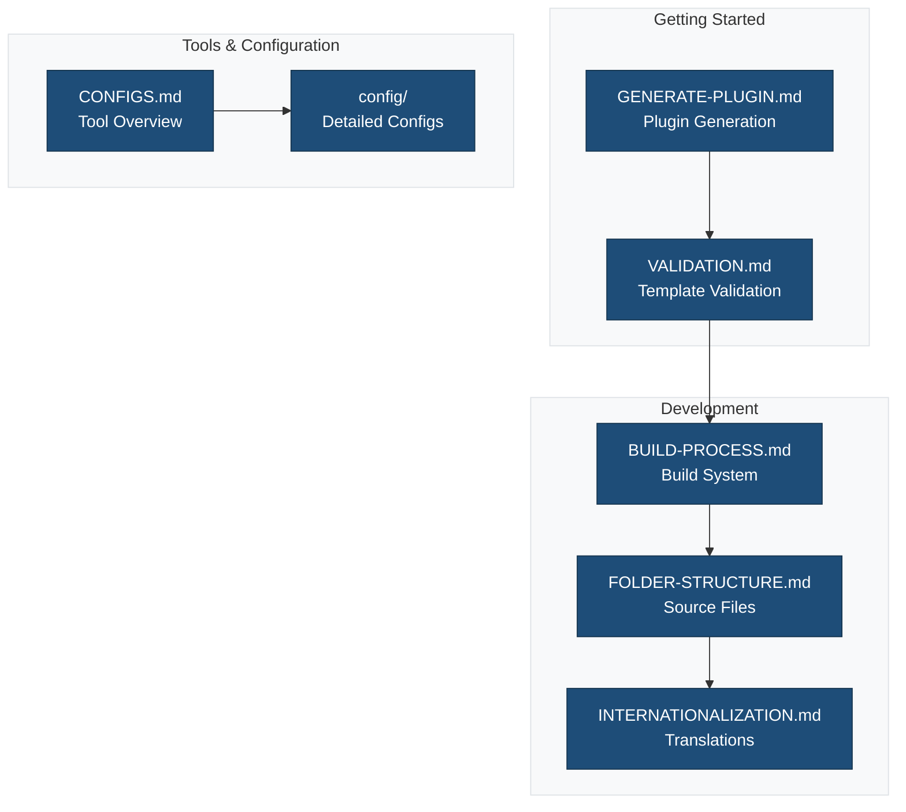
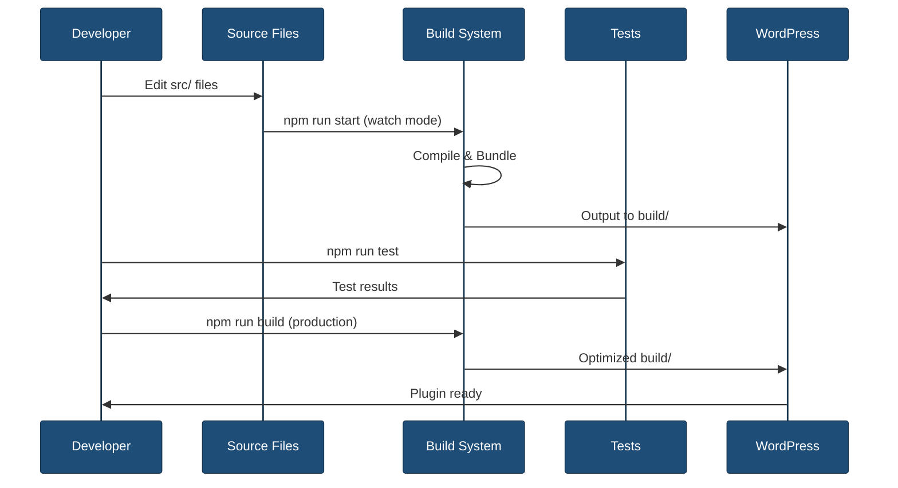
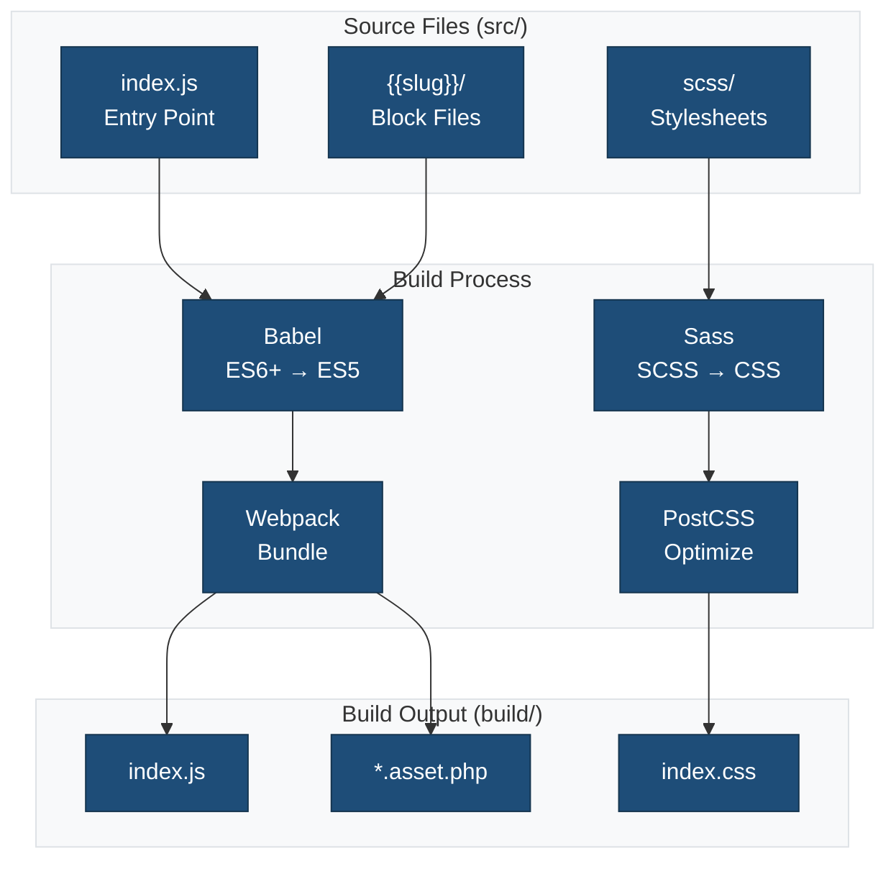
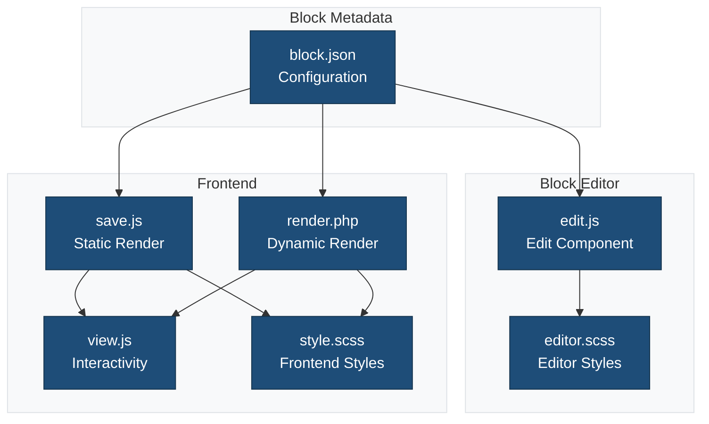
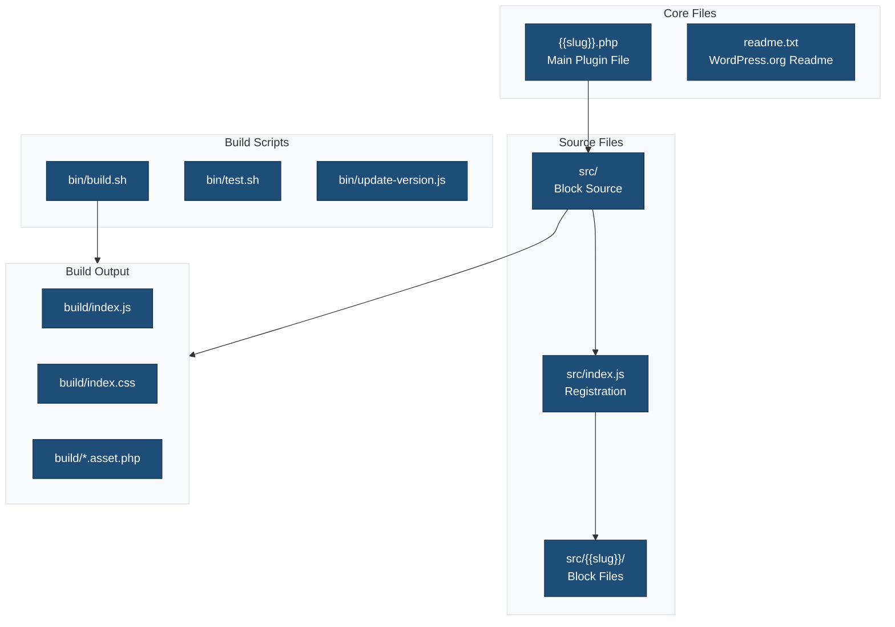

Comprehensive documentation for the {{name}} single block plugin scaffold.

## Overview



## Quick Start

New to this scaffold? Start here:

1. 📖 [Plugin Generation Guide](./GENERATE-PLUGIN.md) - How to create a plugin from this scaffold
2. 🎯 [Setup Summary](./SETUP-SUMMARY.md) - Overview of what's configured
3. ✅ [Template Validation](./VALIDATION.md) - Valid mustache templates
4. 🏗️ [Build Process](./BUILD-PROCESS.md) - Understanding the build system
5. 📚 [API Reference](./API_REFERENCE.md) - Complete API documentation

## Documentation Structure

### Getting Started

| Document | Description |
|----------|-------------|
| [GENERATE-PLUGIN.md](./GENERATE-PLUGIN.md) | Complete guide to generating a plugin from this scaffold |
| [SETUP-SUMMARY.md](./SETUP-SUMMARY.md) | Overview of completed setup tasks and configurations |
| [VALIDATION.md](./VALIDATION.md) | Validation report for mustache templates used in the scaffold |

### Development Guides

| Document | Description |
|----------|-------------|
| [BUILD-PROCESS.md](./BUILD-PROCESS.md) | Complete build process documentation with webpack, Babel, and asset compilation |
| [FOLDER-STRUCTURE.md](./FOLDER-STRUCTURE.md) | Source directory structure and block file organization |
| [INTERNATIONALIZATION.md](./INTERNATIONALIZATION.md) | Translation and localization guide for blocks |

### wp-scripts Documentation

Detailed documentation for `@wordpress/scripts` build system:

| Document | Description |
|----------|-------------|
| [WP-SCRIPTS-SUMMARY.md](./WP-SCRIPTS-SUMMARY.md) | Overview of wp-scripts configuration and features |
| [WP-SCRIPTS-CONFIGURATION.md](./WP-SCRIPTS-CONFIGURATION.md) | Complete configuration guide for wp-scripts |
| [WP-SCRIPTS-QUICK-REFERENCE.md](./WP-SCRIPTS-QUICK-REFERENCE.md) | Quick reference for common commands and patterns |

### Tool Configuration

| Document | Description |
|----------|-------------|
| [CONFIGS.md](./CONFIGS.md) | Overview of all development tools and their purposes |
| [config/](./config/) | Detailed configuration guides for individual tools |

### Security & Best Practices

| Document | Description |
|----------|-------------|
| [SECURITY-NONCE.md](./SECURITY-NONCE.md) | Nonce utilities for secure AJAX and form handling |
| [SECURITY-HEADERS.md](./SECURITY-HEADERS.md) | Security headers and content security policies |
| [DEPRECATION.md](./DEPRECATION.md) | Deprecation workflow for functions and hooks |
| [DB-MIGRATION.md](./DB-MIGRATION.md) | Database migration system documentation |

### Performance & Quality

| Document | Description |
|----------|-------------|
| [PERFORMANCE.md](./PERFORMANCE.md) | Performance monitoring with Lighthouse CI and bundle analysis |
| [API_REFERENCE.md](./API_REFERENCE.md) | Complete API reference for PHP and JavaScript |

## Configuration Files

The `config/` directory contains detailed documentation for each tool:

```mermaid
%%{init: {'theme': 'base', 'themeVariables': { 'primaryColor': '#1e4d78', 'primaryTextColor': '#ffffff', 'primaryBorderColor': '#15354f', 'lineColor': '#333333', 'secondaryColor': '#f0f0f0', 'tertiaryColor': '#e8e8e8', 'background': '#ffffff', 'mainBkg': '#1e4d78', 'textColor': '#333333', 'nodeBorder': '#15354f', 'clusterBkg': '#f8f9fa', 'clusterBorder': '#dee2e6', 'titleColor': '#333333'}}}%%
flowchart LR
    subgraph Build["Build Tools"]
        Webpack["webpack.md"]
        Babel["babel.md"]
        PostCSS["postcss.md"]
    end

    subgraph Quality["Code Quality"]
        ESLint["eslint.md"]
        Stylelint["stylelint.md"]
        Prettier["prettier.md"]
        NPMLint["npm-package-json-lint.md"]
    end

    subgraph Testing["Testing Tools"]
        Jest["jest.md"]
        Playwright["playwright.md"]
    end

    Build --> Quality
    Quality --> Testing
```



### Available Configuration Guides

- [babel.md](./config/babel.md) - Babel transpilation configuration
- [eslint.md](./config/eslint.md) - JavaScript linting rules
- [jest.md](./config/jest.md) - JavaScript testing configuration
- [npm-package-json-lint.md](./config/npm-package-json-lint.md) - Package.json validation
- [playwright.md](./config/playwright.md) - End-to-end testing setup
- [postcss.md](./config/postcss.md) - CSS processing and optimization
- [prettier.md](./config/prettier.md) - Code formatting rules
- [stylelint.md](./config/stylelint.md) - CSS/SCSS linting configuration
- [webpack.md](./config/webpack.md) - Module bundling configuration

## Common Tasks

### Development Workflow

```bash
# Install dependencies
npm install

# Start development server with watch mode
npm run start

# Build for production
npm run build
```

### Code Quality

```bash
# Lint JavaScript
npm run lint:js

# Lint CSS/SCSS
npm run lint:css

# Lint PHP
npm run lint:php

# Format all files
npm run format

# Run all linters
npm run lint
```

### Testing

```bash
# Run all tests
npm run test

# JavaScript unit tests
npm run test:js

# End-to-end tests
npm run test:e2e

# PHP tests
npm run test:php
```

### Internationalization

```bash
# Generate .pot file for translations
npm run makepot

# Generate JSON translations for JavaScript
npm run make-json
```

## Development Flow



## Build System Architecture



## Block Architecture



## Plugin Structure



## Prerequisites

- **Node.js**: 18.0+ and npm 9.0+
- **PHP**: 8.0+
- **WordPress**: 6.0+
- **Composer**: 2.0+ (for PHP dependencies)

## Support Resources

### Official WordPress Documentation

- [Block Editor Handbook](https://developer.wordpress.org/block-editor/)
- [Plugin Developer Handbook](https://developer.wordpress.org/plugins/)
- [Block API Reference](https://developer.wordpress.org/block-editor/reference-guides/block-api/)
- [@wordpress/scripts Documentation](https://developer.wordpress.org/block-editor/reference-guides/packages/packages-scripts/)

### WordPress Packages

- [@wordpress/scripts](https://www.npmjs.com/package/@wordpress/scripts)
- [@wordpress/blocks](https://www.npmjs.com/package/@wordpress/blocks)
- [@wordpress/block-editor](https://www.npmjs.com/package/@wordpress/block-editor)
- [@wordpress/components](https://www.npmjs.com/package/@wordpress/components)

## Block Development Resources

### Key Concepts

- **block.json**: Block metadata and configuration
- **edit.js**: Block editor interface (React component)
- **save.js**: Static HTML output (or null for dynamic blocks)
- **render.php**: Server-side dynamic rendering
- **view.js**: Frontend JavaScript for interactivity

### WordPress Block Editor

- [Block Tutorial](https://developer.wordpress.org/block-editor/getting-started/tutorial/)
- [Create a Block Tutorial](https://developer.wordpress.org/block-editor/getting-started/create-block/)
- [Block Attributes](https://developer.wordpress.org/block-editor/reference-guides/block-api/block-attributes/)
- [Block Supports](https://developer.wordpress.org/block-editor/reference-guides/block-api/block-supports/)

## Contributing

When contributing to this scaffold:

1. Follow WordPress coding standards
2. Update relevant documentation
3. Test with the generation script
4. Validate all mustache templates
5. Ensure all linters pass
6. Update version numbers appropriately

## License

This scaffold is licensed under {{license}}. Generated plugins inherit this license unless modified.

## Related Documentation

- **[inc/README.md](../inc/README.md)** - PHP class files documentation
- **[src/README.md](../src/README.md)** - Source files documentation
- **[tests/README.md](../tests/README.md)** - Testing documentation
- **[bin/README.md](../bin/README.md)** - Build script documentation
