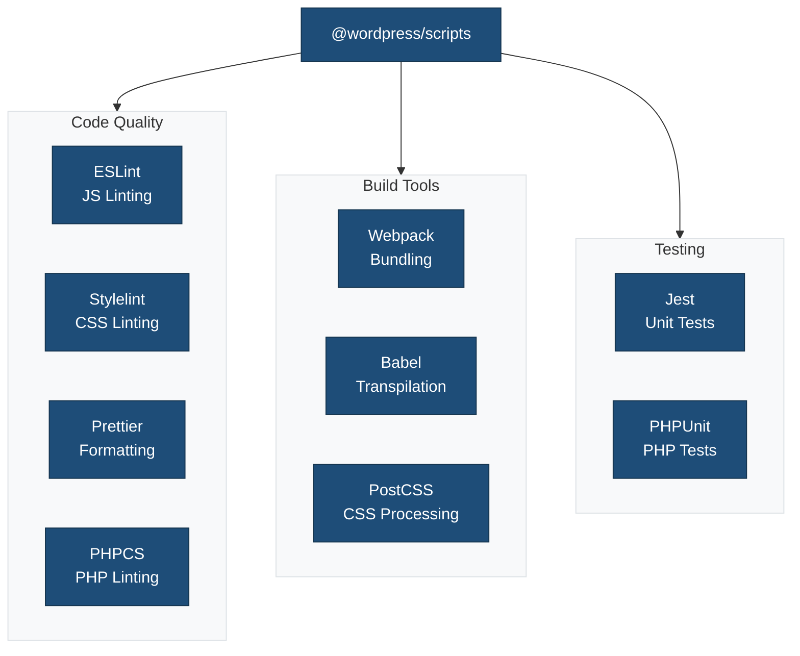
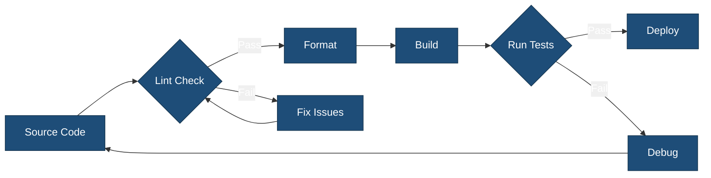

# Tool Configuration Overview

This document provides an overview of all the tools used in the {{name}} single block plugin scaffold, why we use them, and where to find detailed documentation for each.

## Why Use Multiple Tools?

Building a modern WordPress block plugin requires a sophisticated toolchain to ensure code quality, maintainability, browser compatibility, and adherence to WordPress standards. Each tool serves a specific purpose in our development workflow:

### Code Quality & Consistency

We use linters and formatters to maintain consistent, high-quality code that follows WordPress block development and coding standards. This ensures all team members write code in the same style and helps catch common errors before they reach production.

### Build & Optimization

Modern JavaScript (JSX, ESNext) and CSS features used in block development need to be transpiled and bundled for browser compatibility. Build tools handle this transformation while optimizing block assets for faster page loads.

### Testing & Reliability

Automated testing catches bugs early and ensures changes don't break block functionality. We use unit tests for individual block components and integration tests for block registration and rendering.

### Developer Experience

Proper tooling provides instant feedback during development, automates repetitive tasks, and integrates seamlessly with modern code editors like VS Code.

## Tool Categories

### 🔍 Code Quality & Linting

Tools that analyze code for errors, enforce standards, and maintain consistency.

| Tool | Purpose | Config File | Documentation |
|------|---------|-------------|---------------|
| **ESLint** | JavaScript linting and code quality | `.eslint.config.cjs` | [ESLint Guide](config/eslint.md) |
| **Stylelint** | CSS/SCSS linting and standards | `.stylelint.config.cjs` | [Stylelint Guide](config/stylelint.md) |
| **Prettier** | Code formatting for JS, CSS, JSON, etc. | `package.json` | [Prettier Guide](config/prettier.md) |
| **npm-package-json-lint** | Package.json validation | `.npmpackagejsonlintrc.json` | [npm-package-json-lint Guide](config/npm-package-json-lint.md) |

### 🏗️ Build & Transform

Tools that compile, bundle, and optimize code for production.

| Tool | Purpose | Config File | Documentation |
|------|---------|-------------|---------------|
| **Webpack** | Module bundling and asset orchestration | `webpack.config.cjs` | [Webpack Guide](config/webpack.md) |
| **Babel** | JavaScript transpilation (ESNext → ES5) | Integrated via webpack | [Babel Guide](config/babel.md) |
| **PostCSS** | CSS processing and optimization | `.postcss.config.cjs` | [PostCSS Guide](config/postcss.md) |

### 🧪 Testing

Tools that verify code functionality and catch bugs.

| Tool | Purpose | Config File | Documentation |
|------|---------|-------------|---------------|
| **Jest** | JavaScript unit and integration testing | `.jest.config.cjs` | [Jest Guide](config/jest.md) |
| **PHPUnit** | PHP unit testing | `phpunit.xml` | [PHPUnit Testing](../tests/) |

## The @wordpress/scripts Foundation

Most of our tooling is orchestrated through [`@wordpress/scripts`](https://developer.wordpress.org/block-editor/reference-guides/packages/packages-scripts/), the official WordPress build tool. It provides:

- **Unified commands**: Single commands that run multiple tools
- **Preconfigured defaults**: WordPress-standard configurations out of the box
- **Regular updates**: Maintained by the WordPress core team
- **Best practices**: Enforces WordPress coding standards and patterns

All our configuration files *extend* the WordPress defaults, only overriding what's specific to our theme.

## Quick Reference

### Development Commands

```bash
npm run start              # Start development with watch mode
npm run build              # Production build
npm run lint:js:fix        # Auto-fix JavaScript issues
npm run lint:css:fix       # Auto-fix CSS issues
npm run format             # Format all files
npm run test:js            # Run unit tests
```

### Configuration Files Location

```
single-block-plugin-scaffold/
├── .eslint.config.cjs           # ESLint configuration
├── .stylelint.config.cjs        # Stylelint configuration
├── .postcss.config.cjs          # PostCSS configuration
├── webpack.config.cjs           # Webpack configuration
├── .jest.config.cjs             # Jest configuration
├── .npmpackagejsonlintrc.json   # Package.json validation
├── .prettierignore              # Prettier ignore patterns
├── phpcs.xml                    # PHP CodeSniffer rules
└── phpunit.xml                  # PHPUnit configuration
```

## WordPress Package Ecosystem

Our theme leverages the official WordPress package ecosystem:

| Package | Version | Purpose |
|---------|---------|---------|
| `@wordpress/scripts` | ^31.0.0 | Main build tool |
| `@wordpress/eslint-plugin` | ^22.21.0 | JavaScript standards |
| `@wordpress/prettier-config` | ^4.35.0 | Formatting standards |
| `@wordpress/stylelint-config` | ^23.27.0 | CSS standards |
| `@wordpress/babel-preset-default` | ^8.35.0 | JS transpilation |
| `@wordpress/postcss-plugins-preset` | ^5.35.0 | CSS processing |
| `@wordpress/jest-preset-default` | ^12.35.0 | Testing standards |
| `@wordpress/browserslist-config` | ^6.35.0 | Browser targets |

## Browser Support

All tools target the same browsers via `@wordpress/browserslist-config`:

- Last 2 versions of major browsers (Chrome, Firefox, Safari, Edge)
- Internet Explorer 11+ (with appropriate polyfills)
- Safari 12+
- iOS Safari 12+
- Android 4.4+

This ensures consistent behavior across all build and test tools.

## VS Code Integration

For the best development experience, install these VS Code extensions:

- **ESLint** - Real-time JavaScript linting
- **Prettier - Code formatter** - Automatic code formatting
- **Stylelint** - Real-time CSS/SCSS linting
- **Jest** - Inline test results

Recommended `.vscode/settings.json`:

```json
{
  "editor.defaultFormatter": "esbenp.prettier-vscode",
  "editor.formatOnSave": true,
  "editor.codeActionsOnSave": {
    "source.fixAll.eslint": "explicit",
    "source.fixAll.stylelint": "explicit"
  },
  "eslint.validate": ["javascript", "javascriptreact"],
  "stylelint.validate": ["css", "scss"]
}
```

## Tool Integration Flow



### Development Pipeline



## Customization Best Practices

When modifying tool configurations:

1. **Start with WordPress defaults** - Always extend official packages
2. **Document your changes** - Add comments explaining why you deviated
3. **Test thoroughly** - Ensure changes don't break the build
4. **Keep minimal** - Only override what's necessary
5. **Stay updated** - Regularly update WordPress packages
6. **Share with team** - Ensure everyone uses the same configuration

## Common Workflows

### New Project Setup

```bash
npm install              # Install all dependencies
npm run build            # Initial build
npm run env:start        # Start local WordPress
npm run start            # Start development mode
```

### Daily Development

```bash
npm run start            # Start watch mode
# Make changes...
npm run lint:js:fix      # Fix linting issues
npm run format           # Format code
npm run test:js          # Run tests
```

### Pre-Commit Checklist

```bash
npm run lint:js          # Check JavaScript
npm run lint:css         # Check CSS
npm run lint:php         # Check PHP
npm run test:js          # Run unit tests
npm run format           # Format all files
```

### Production Build

```bash
npm run lint:js          # Verify JavaScript
npm run lint:css         # Verify CSS
npm run test:js          # Run unit tests
npm run test:php         # Run PHP tests
npm run build            # Build optimized assets
```

## Detailed Documentation

For in-depth information about each tool, configuration options, and troubleshooting:

📚 **[Visit the config/ directory](config/README.md)**

Each tool has its own comprehensive guide with:

- Configuration explanation
- Available options
- Usage examples
- Common issues and solutions
- Integration tips
- Best practices

## Additional Resources

### WordPress Documentation

- [Block Editor Handbook](https://developer.wordpress.org/block-editor/)
- [Block API Reference](https://developer.wordpress.org/block-editor/reference-guides/block-api/)
- [Coding Standards](https://developer.wordpress.org/coding-standards/)
- [@wordpress/scripts Package](https://developer.wordpress.org/block-editor/reference-guides/packages/packages-scripts/)

### Build Process Guides

- [WP-Scripts Configuration](./config/wp-scripts.md) - Complete @wordpress/scripts guide
- [Build Process](./BUILD-PROCESS.md) - Complete build workflow

### Tool-Specific Documentation

- [ESLint Official Docs](https://eslint.org/)
- [Stylelint Official Docs](https://stylelint.io/)
- [Prettier Official Docs](https://prettier.io/)
- [Webpack Official Docs](https://webpack.js.org/)
- [Babel Official Docs](https://babeljs.io/)
- [PostCSS Official Docs](https://postcss.org/)
- [Jest Official Docs](https://jestjs.io/)

## Troubleshooting

### Common Issues

**Build fails with module errors**

```bash
rm -rf node_modules package-lock.json
npm install
npm run build
```

**Linting errors after package updates**

```bash
npm run lint:js:fix
npm run lint:css:fix
npm run format
```

**Tests failing**

```bash
npm run test:js -- --clearCache
npm run test:js
```

**Node version mismatch**

```bash
nvm use  # Uses version from .nvmrc
npm install
```

### Getting Help

1. Check the specific tool's documentation in `config/` directory
2. Review WordPress Developer Handbook
3. Search GitHub issues for the relevant package
4. Check the tool's official documentation
5. Ask in WordPress Developer Slack

## Contributing

When updating configurations or adding new tools:

1. Update the relevant documentation in `config/`
2. Add entry to this overview document
3. Test changes thoroughly
4. Update CHANGELOG.md
5. Submit PR with clear description

## Version Information

This documentation reflects the tool versions as of {{date}}:

- Node: 18+
- npm: 9+
- WordPress: 6.4+
- PHP: 8.0+

Check `package.json` and `composer.json` for current exact versions.
