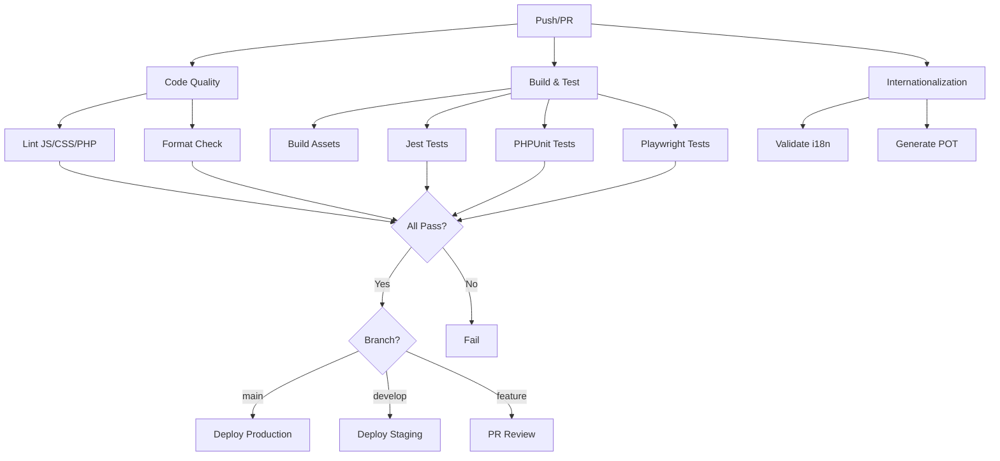

Complete guide to CI/CD workflows for the {{name}} block plugin scaffold.

## Overview

This theme uses GitHub Actions to automate:

- Code quality checks
- Build and deployment
- Testing
- Internationalization
- Performance monitoring
- Security scanning

## Available Workflows

### Code Quality

**File**: `.github/workflows/code-quality.yml`

**Triggers**:

- Pull requests
- Push to `develop` and `main`

**Jobs**:

1. **Lint JavaScript** - ESLint checks
2. **Lint CSS** - Stylelint checks
3. **Lint PHP** - PHPCS checks
4. **Format Check** - Prettier validation

**Configuration**:

```yaml
name: Code Quality

on:
  pull_request:
  push:
    branches: [develop, main]

jobs:
  lint-js:
    runs-on: ubuntu-latest
    steps:
      - uses: actions/checkout@v4
      - uses: actions/setup-node@v4
      - run: npm ci
      - run: npm run lint:js
```

### Build and Test

**File**: `.github/workflows/ci-cd.yml`

**Triggers**:

- Pull requests
- Push to `develop` and `main`
- Scheduled (nightly)

**Jobs**:

1. **Build** - Compile assets
2. **Test JS** - Run Jest tests
3. **Test PHP** - Run PHPUnit tests
4. **Test E2E** - Run Playwright tests

**Configuration**:

```yaml
name: CI/CD

on:
  pull_request:
  push:
    branches: [develop, main]
  schedule:
    - cron: '0 0 * * *'  # Nightly

jobs:
  build:
    runs-on: ubuntu-latest
    steps:
      - uses: actions/checkout@v4
      - uses: actions/setup-node@v4
      - run: npm ci
      - run: npm run build
      - uses: actions/upload-artifact@v4
        with:
          name: build
          path: build/
```

### Internationalization

**File**: `.github/workflows/i18n.yml`

**Triggers**:

- Push to `develop` and `main`
- Manual dispatch

**Jobs**:

1. **Validate i18n** - Check for hardcoded strings
2. **Generate POT** - Create .pot files
3. **Test Translations** - Verify text domain usage
4. **Update POT** - Commit updated .pot files

**Configuration**:

```yaml
name: Internationalization

on:
  push:
    branches: [develop, main]
  workflow_dispatch:

env:
  TEXT_DOMAIN: '{{textdomain}}'
  POT_FILE: 'languages/{{textdomain}}.pot'

jobs:
  validate-i18n:
    runs-on: ubuntu-latest
    steps:
      - uses: actions/checkout@v4
      - name: Check for hardcoded strings
        run: |
          grep -r -E '>[[:space:]]*[A-Z][a-z]+[[:space:]<]' \
            src/ inc/ templates/ parts/ patterns/ \
            --include="*.html" --include="*.php" --include="*.js"
```

### Performance

**File**: `.github/workflows/performance.yml`

**Triggers**:

- Pull requests (comparing against base)
- Push to `main` (benchmarking)

**Jobs**:

1. **Lighthouse CI** - Run Lighthouse audits
2. **Bundle Size** - Check asset sizes
3. **Compare** - Compare with previous results

**Configuration**:

```yaml
name: Performance

on:
  pull_request:
  push:
    branches: [main]

jobs:
  lighthouse:
    runs-on: ubuntu-latest
    steps:
      - uses: actions/checkout@v4
      - run: npm ci
      - run: npm run build
      - uses: treosh/lighthouse-ci-action@v11
        with:
          urls: |
            http://localhost:8080
          budgetPath: .lighthouserc.json
```

### Security

**File**: `.github/workflows/security.yml`

**Triggers**:

- Pull requests
- Push to `main`
- Scheduled (weekly)

**Jobs**:

1. **Dependency Scan** - npm audit
2. **Code Scan** - CodeQL analysis
3. **Secret Scan** - Check for leaked secrets

**Configuration**:

```yaml
name: Security

on:
  pull_request:
  push:
    branches: [main]
  schedule:
    - cron: '0 0 * * 0'  # Weekly

jobs:
  dependency-scan:
    runs-on: ubuntu-latest
    steps:
      - uses: actions/checkout@v4
      - run: npm audit --audit-level=moderate
```

## Workflow Architecture

### Complete CI/CD Pipeline



## Configuration

### Secrets

Required secrets in GitHub repository settings:

| Secret | Purpose |
|--------|---------|
| `GITHUB_TOKEN` | Automatically provided by GitHub Actions |
| `DEPLOY_KEY` | SSH key for deployments (if used) |
| `SLACK_WEBHOOK` | Notifications (optional) |

### Environment Variables

Common variables used across workflows:

```yaml
env:
  NODE_VERSION: '20'
  PHP_VERSION: '8.1'
  TEXT_DOMAIN: '{{textdomain}}'
```

### Branch Protection

Recommended branch protection rules:

**For `main` branch**:

- ✅ Require pull request reviews (1 approver)
- ✅ Require status checks to pass
  - Code Quality
  - Build
  - Tests
- ✅ Require branches to be up to date
- ✅ Require linear history
- ❌ Allow force pushes

**For `develop` branch**:

- ✅ Require status checks to pass
  - Code Quality
  - Build
- ❌ Require pull request reviews (optional)
- ❌ Allow force pushes

## Monitoring Workflows

### Viewing Workflow Runs

1. Go to repository on GitHub
2. Click **Actions** tab
3. Select workflow from left sidebar
4. View run details

### Workflow Badges

Add badges to README.md:

```markdown


```

### Notifications

Configure Slack notifications:

```yaml
- name: Notify Slack
  if: failure()
  uses: 8398a7/action-slack@v3
  with:
    status: ${{ job.status }}
    webhook_url: ${{ secrets.SLACK_WEBHOOK }}
```

## Manual Workflows

### Triggering Manually

Some workflows support manual triggers:

```bash
# Via GitHub UI: Actions tab → Select workflow → Run workflow

# Via GitHub CLI:
gh workflow run i18n.yml
gh workflow run performance.yml --ref develop
```

### Workflow Dispatch

Add manual trigger to any workflow:

```yaml
on:
  workflow_dispatch:
    inputs:
      environment:
        description: 'Environment to deploy to'
        required: true
        default: 'staging'
        type: choice
        options:
          - staging
          - production
```

## Troubleshooting

### Workflow Failing

**Problem**: Tests pass locally but fail on CI

**Common Causes**:

1. **Environment differences**:
   - Check Node/PHP versions match
   - Verify dependencies installed correctly

2. **Timing issues in E2E tests**:
   - Add explicit waits
   - Increase timeouts

3. **Missing secrets/env vars**:
   - Verify all required secrets are set
   - Check environment variable names

**Solution**:

```bash
# Run locally with same conditions as CI:
docker run -it node:20 bash
npm ci  # Same as CI
npm run build
npm run test
```

### Slow Workflows

**Problem**: Workflows take too long

**Solutions**:

1. **Cache dependencies**:

```yaml
- uses: actions/setup-node@v4
  with:
    cache: 'npm'
```

2. **Run jobs in parallel**:

```yaml
jobs:
  test-js:
    runs-on: ubuntu-latest
  test-php:
    runs-on: ubuntu-latest
  # Both run simultaneously
```

3. **Skip unnecessary steps**:

```yaml
- name: Build
  if: github.event_name != 'pull_request'
  run: npm run build
```

### Workflow Not Triggering

**Problem**: Push doesn't trigger workflow

**Checks**:

1. Verify trigger configuration:

```yaml
on:
  push:
    branches: [develop, main]  # Correct branch?
  pull_request:  # Configured?
```

2. Check workflow file location:
   - Must be in `.github/workflows/`
   - Must have `.yml` or `.yaml` extension

3. Validate YAML syntax:

```bash
# Use GitHub CLI:
gh workflow view code-quality.yml
```

## Best Practices

### 1. Fast Feedback

Keep workflows fast for quick feedback:

- Cache dependencies
- Run jobs in parallel
- Skip unnecessary steps

### 2. Consistent Environments

Use same versions locally and in CI:

```json
// package.json
{
  "engines": {
    "node": ">=20.0.0",
    "npm": ">=10.0.0"
  }
}
```

### 3. Fail Fast

Stop workflow on first failure:

```yaml
jobs:
  test:
    strategy:
      fail-fast: true  # Stop all on first failure
```

### 4. Clear Error Messages

Provide helpful output:

```yaml
- name: Test
  run: |
    npm run test || {
      echo "::error::Tests failed. Run 'npm run test' locally."
      exit 1
    }
```

### 5. Secure Secrets

Never log secrets:

```yaml
- name: Deploy
  env:
    API_KEY: ${{ secrets.API_KEY }}
  run: |
    # Don't echo $API_KEY
    deploy.sh
```

## Resources

- [GitHub Actions Documentation](https://docs.github.com/en/actions)
- [Workflow Syntax](https://docs.github.com/en/actions/reference/workflow-syntax-for-github-actions)
- [GitHub CLI](https://cli.github.com/)
- [Actions Marketplace](https://github.com/marketplace?type=actions)

## Summary

✅ **Automated CI/CD** - Every commit is tested
✅ **Multiple Checks** - Quality, build, tests, performance, security
✅ **Branch Protection** - Prevent bad code from merging
✅ **Monitoring** - Track workflow status and history
✅ **Notifications** - Get alerts on failures

For agent documentation, see [AGENTS.md](./AGENTS.md).
For testing documentation, see [TESTING.md](./TESTING.md).
