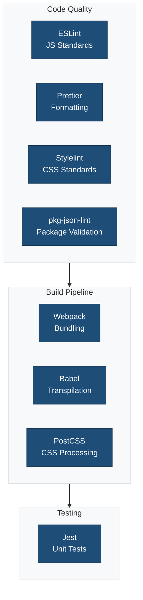

This directory contains comprehensive documentation for all configuration files used in the single block plugin scaffold.

## Overview

The single block plugin scaffold uses multiple configuration tools to maintain code quality, consistency, and compatibility with WordPress block development standards. Each configuration file is documented separately with detailed explanations, usage examples, and best practices.

## Configuration Files

### Code Quality & Linting

1. **[ESLint](./eslint.md)** - JavaScript linting
   - File: `.eslint.config.cjs`
   - Package: `@wordpress/eslint-plugin@^22.21.0`
   - Purpose: Enforces JavaScript coding standards

2. **[Prettier](./prettier.md)** - Code formatting
   - File: `.prettier.config.cjs`
   - Package: `@wordpress/prettier-config@^4.35.0`
   - Purpose: Ensures consistent code formatting with PHP support

3. **[Stylelint](./stylelint.md)** - CSS/SCSS linting
   - File: `.stylelint.config.cjs`
   - Package: `@wordpress/stylelint-config@^23.27.0`
   - Purpose: Enforces CSS/SCSS coding standards with BEM naming

4. **[npm-package-json-lint](./npm-package-json-lint.md)** - package.json validation
   - File: `.npmpackagejsonlintrc.cjs`
   - Purpose: Validates package.json structure and metadata

### Build & Transform

5. **[Webpack](./webpack.md)** - Module bundler
   - File: `webpack.config.cjs`
   - Package: `@wordpress/scripts@^31.0.0`
   - Purpose: Bundles JavaScript, CSS, assets with SVG support

6. **[Babel](./babel.md)** - JavaScript compiler
   - Configuration: Integrated in webpack
   - Package: `@wordpress/babel-preset-default@^8.35.0`
   - Purpose: Transpiles modern JavaScript and JSX to compatible code

7. **[PostCSS](./postcss.md)** - CSS processor
   - File: `.postcss.config.cjs`
   - Plugins: autoprefixer, cssnano
   - Purpose: Adds vendor prefixes and optimizes CSS

### Testing

8. **[Jest](./jest.md)** - Unit testing
   - File: `.jest.config.cjs`
   - Package: `@wordpress/jest-preset-default@^12.35.0`
   - Purpose: JavaScript unit and integration testing for blocks

## Quick Reference

### Available Scripts

```bash
# Development
npm run start                 # Start development mode with watch

# Building
npm run build                 # Production build
npm run plugin-zip            # Create installable plugin ZIP

# Linting
npm run lint:js              # Lint JavaScript
npm run lint:js:fix          # Fix JavaScript issues
npm run lint:css             # Lint CSS/SCSS
npm run lint:css:fix         # Fix CSS issues
npm run lint:php             # Lint PHP
npm run lint:pkg-json        # Lint package.json

# Formatting
npm run format               # Format all files with Prettier

# Testing
npm run test:js              # Run Jest tests
npm run test:js:watch        # Run Jest in watch mode
npm run test:php             # Run PHPUnit tests

# Internationalization
npm run makepot              # Generate .pot translation file

# Environment
npm run env:start            # Start wp-env
npm run env:stop             # Stop wp-env
npm run env:destroy          # Destroy wp-env
npm run env:cli              # Access WP-CLI
```

## Configuration Hierarchy



```
Root
├── Code Quality
│   ├── ESLint          → JavaScript quality (default)
│   ├── Prettier        → Code formatting (PHP + CSS custom)
│   ├── Stylelint       → CSS quality (BEM naming)
│   └── pkg-json-lint   → Package metadata
│
├── Build Pipeline
│   ├── Webpack         → Bundling + SVG handling
│   ├── Babel           → JS/JSX transpilation + i18n
│   └── PostCSS         → CSS processing (default)
│
└── Testing
    └── Jest            → Unit tests
```

## WordPress Packages

All configuration extends WordPress official packages:

- `@wordpress/scripts` - Main tooling package
- `@wordpress/eslint-plugin` - JavaScript standards
- `@wordpress/prettier-config` - Formatting standards
- `@wordpress/stylelint-config` - CSS standards
- `@wordpress/babel-preset-default` - JS transpilation
- `@wordpress/babel-plugin-makepot` - i18n string extraction
- `@wordpress/postcss-plugins-preset` - CSS processing
- `@wordpress/jest-preset-default` - Testing standards
- `@wordpress/browserslist-config` - Browser support targets

## Block Development Focus

This plugin is specifically configured for block development:

### Block Naming Convention

Stylelint enforces BEM naming for blocks:

```css
.wp-block-namespace-slug {}              /* Block */
.wp-block-namespace-slug__element {}     /* Element */
.wp-block-namespace-slug--modifier {}    /* Modifier */
```

### Block Structure

```
src/
├── index.js                    # Plugin registration
└── {{slug}}/
    ├── block.json             # Block metadata
    ├── index.js               # Block registration
    ├── edit.js                # Editor component
    ├── save.js                # Save component
    ├── style.scss             # Frontend styles
    └── editor.scss            # Editor styles
```

### SVG Support

Webpack is configured with `@svgr/webpack`:

```javascript
// Import SVG as React component
import { ReactComponent as Icon } from './icon.svg';

// Use in JSX
<Icon width="24" height="24" />
```

## Browser Support

All tools target the same browsers via `@wordpress/browserslist-config`:

- Last 2 versions of major browsers
- IE 11+ (with polyfills)
- Safari 12+
- iOS 12+
- Android 4.4+

## VS Code Integration

Install these extensions for the best block development experience:

- ESLint
- Prettier - Code formatter
- Stylelint
- Jest
- PHP Intelephense (for plugin PHP)

Add to `.vscode/settings.json`:

```json
{
  "editor.defaultFormatter": "esbenp.prettier-vscode",
  "editor.formatOnSave": true,
  "editor.codeActionsOnSave": {
    "source.fixAll.eslint": "explicit",
    "source.fixAll.stylelint": "explicit"
  },
  "eslint.validate": ["javascript", "javascriptreact"],
  "stylelint.validate": ["css", "scss"],
  "[php]": {
    "editor.defaultFormatter": "esbenp.prettier-vscode"
  }
}
```

## Customization Guidelines

When customizing configurations:

1. **Start with WordPress defaults**: Always extend official WordPress packages
2. **Block-specific rules**: Configure for block development patterns
3. **BEM naming**: Follow BEM methodology for CSS classes
4. **Minimal overrides**: Only change what's necessary
5. **Document changes**: Comment why rules are modified
6. **Test blocks**: Ensure changes work in block editor
7. **Keep updated**: Regularly update WordPress packages

## Common Workflows

### Setting up a new block plugin

```bash
npm install                   # Install dependencies
npm run build                 # Initial build
npm run env:start            # Start WordPress environment
npm run start                # Start development mode
```

### Before committing

```bash
npm run lint:js:fix          # Fix JavaScript issues
npm run lint:css:fix         # Fix CSS issues
npm run format               # Format all files
npm run test:js              # Run unit tests
```

### Creating a plugin release

```bash
npm run lint:js              # Verify JavaScript
npm run lint:css             # Verify CSS
npm run lint:php             # Verify PHP
npm run test:js              # Run unit tests
npm run build                # Build optimized assets
npm run plugin-zip           # Create installable ZIP
```

### Block Development

```bash
# Terminal 1: Development server
npm run start

# Terminal 2: WordPress environment
npm run env:start

# Access site at http://localhost:8888
# Test block in editor
```

## Block Registration

### Using block.json (Recommended)

```json
{
  "apiVersion": 3,
  "name": "namespace/slug",
  "title": "Block Title",
  "category": "widgets",
  "icon": "smiley",
  "description": "Block description",
  "supports": {
    "html": false,
    "align": true
  },
  "editorScript": "file:./index.js",
  "editorStyle": "file:./index.css",
  "style": "file:./style-index.css"
}
```

### PHP Registration

```php
// {{slug}}.php
function plugin_register_block() {
    register_block_type( __DIR__ . '/build/{{slug}}' );
}
add_action( 'init', 'plugin_register_block' );
```

## Testing Blocks

### Unit Tests (Jest)

```javascript
import { render } from '@testing-library/react';
import Edit from './edit';

describe('Block Edit Component', () => {
  it('renders without crashing', () => {
    const { container } = render(
      <Edit attributes={{}} setAttributes={jest.fn()} />
    );
    expect(container).toBeInTheDocument();
  });
});
```

## Troubleshooting

### Block not appearing in editor

1. Check block registration in PHP
2. Verify `block.json` is correct
3. Ensure assets are built: `npm run build`
4. Check browser console for errors

### Style not applying

1. Verify CSS is imported in `index.js`
2. Check BEM class naming matches CSS
3. Ensure styles are in `style.scss` (frontend) or `editor.scss` (editor only)
4. Clear browser cache

### Build errors

1. Check Node version (18+)
2. Clear `node_modules` and reinstall
3. Verify all config files are present
4. Check for syntax errors in source files

## Additional Resources

- [Block Editor Handbook](https://developer.wordpress.org/block-editor/)
- [Block API Reference](https://developer.wordpress.org/block-editor/reference-guides/block-api/)
- [Create Block Tutorial](https://developer.wordpress.org/block-editor/getting-started/create-block/)
- [@wordpress/create-block](https://developer.wordpress.org/block-editor/reference-guides/packages/packages-create-block/)
- [@wordpress/scripts](https://developer.wordpress.org/block-editor/reference-guides/packages/packages-scripts/)
- [BEM Methodology](http://getbem.com/)

## Contributing

When updating configuration:

1. Test with actual block development
2. Update relevant documentation
3. Follow WordPress block standards
4. Test in block editor
5. Document breaking changes
6. Update this README if adding new configs

## Support

For questions or issues:

- Check individual configuration documentation files
- Review Block Editor Handbook
- Consult package-specific documentation
- Check WordPress Block Editor GitHub issues
