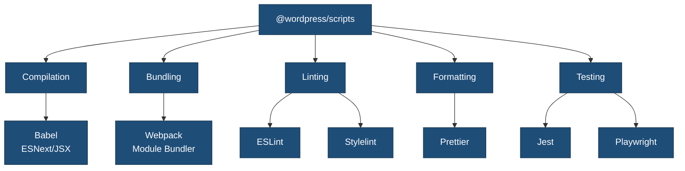
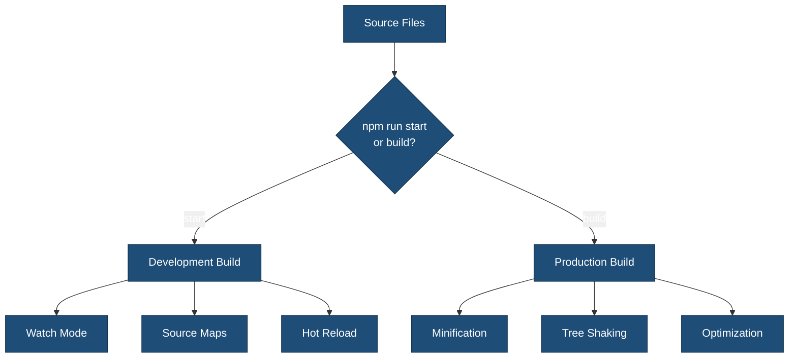
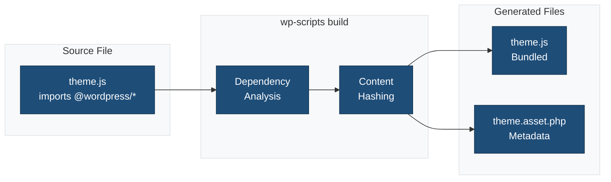

# @wordpress/scripts Configuration

Complete guide to using `@wordpress/scripts` in the {{name}} block plugin scaffold.

## Table of Contents

- [Overview](#overview)
- [Quick Start](#quick-start)
- [What is @wordpress/scripts?](#what-is-wordpressscripts)
- [Installation](#installation)
- [Configuration Files](#configuration-files)
- [Build Commands](#build-commands)
- [Build Process Features](#build-process-features)
- [WordPress Packages](#wordpress-packages)
- [Asset Management](#asset-management)
- [Development Workflow](#development-workflow)
- [Customization](#customization)
- [Troubleshooting](#troubleshooting)
- [Best Practices](#best-practices)
- [Resources](#resources)

## Overview

The theme uses `@wordpress/scripts` v31.0.0+ as its build system, providing a standardized, zero-configuration approach to WordPress block plugin development with full support for:

✅ **Compilation**: Modern JavaScript (ESNext) and JSX to browser-compatible code via Babel  
✅ **Bundling**: Multiple files combined into optimized bundles via webpack  
✅ **Code Linting**: ESLint for JavaScript quality and WordPress coding standards  
✅ **Code Formatting**: Prettier for consistent code styling  
✅ **Sass Compilation**: `.scss` files converted to standard CSS  
✅ **Code Minification**: JavaScript (Terser) and CSS (cssnano) optimization for production

## Quick Start

```bash
# Install dependencies
npm install

# Start development server (watch mode with hot reload)
npm run start

# Build for production (minified and optimized)
npm run build
```

## What is @wordpress/scripts?

`@wordpress/scripts` is an official WordPress package that abstracts away complex build tool configurations. It provides:

- **Pre-configured webpack**: No need to manually set up loaders, plugins, or complex configurations
- **Babel presets**: Automatically transpiles modern JavaScript and JSX
- **Sass support**: Built-in SCSS compilation with PostCSS processing
- **Asset manifests**: Generates `.asset.php` files with dependencies and version hashes
- **Development server**: Hot module replacement for faster development
- **Testing utilities**: Jest and Playwright configurations included
- **Linting tools**: ESLint and Stylelint with WordPress standards

### wp-scripts Ecosystem



## Installation

The package is already included in `package.json`:

```json
{
  "devDependencies": {
    "@wordpress/scripts": "^31.0.0"
  }
}
```

Install all dependencies:

```bash
npm install
```

## Configuration Files

### 1. webpack.config.cjs

**Location**: `/webpack.config.cjs`

**Purpose**: Extends wp-scripts default webpack configuration with theme-specific settings.

```javascript
const defaultConfig = require( '@wordpress/scripts/config/webpack.config' );
const path = require( 'path' );

module.exports = {
	...defaultConfig,

	// Custom entry points
	entry: {
		'js/theme': './src/js/theme.js',
		'js/editor': './src/js/editor.js',
		'css/style': './src/css/style.scss',
		'css/editor-style': './src/css/editor.scss',
	},

	// Output configuration
	output: {
		path: path.resolve( process.cwd(), 'build' ),
		filename: '[name].js',
		clean: true,
	},

	// Path aliases for cleaner imports
	resolve: {
		alias: {
			'@': path.resolve( __dirname, 'src' ),
			'@css': path.resolve( __dirname, 'src/css' ),
			'@js': path.resolve( __dirname, 'src/js' ),
		},
	},
};
```

**Key Features**:

- Extends all wp-scripts defaults (Babel, Sass, PostCSS, etc.)
- Adds custom entry points for theme files
- Configures path aliases for cleaner imports
- Handles additional asset types (images, fonts)
- Sets performance budgets

### 2. .browserslistrc

**Location**: `/.browserslistrc`

**Purpose**: Defines target browsers for Babel transpilation and CSS autoprefixing.

```
>0.5%
last 2 versions
not dead
extends @wordpress/browserslist-config
```

**What it does**:

- Tells Babel which JavaScript features need polyfills
- Tells autoprefixer which vendor prefixes to add
- Uses WordPress recommended browser support
- Targets browsers with >0.5% market share
- Supports last 2 versions of each major browser

### 3. postcss.config.cjs

**Location**: `/postcss.config.cjs`

**Purpose**: Configures PostCSS plugins for CSS processing.

```javascript
module.exports = {
	plugins: [
		require( 'autoprefixer' ),    // Adds vendor prefixes
		require( 'cssnano' )( {        // Minifies CSS
			preset: 'default',
		} ),
	],
};
```

**Plugins**:

- **autoprefixer**: Automatically adds `-webkit-`, `-moz-`, `-ms-` prefixes based on `.browserslistrc`
- **cssnano**: Minifies CSS (removes whitespace, optimizes rules, merges duplicates)

### 4. .eslint.config.cjs

**Location**: `/.eslint.config.cjs`

**Purpose**: Configures ESLint for JavaScript linting.

```javascript
module.exports = {
	extends: [ '@wordpress/eslint-plugin/recommended' ],
	env: {
		browser: true,
		es6: true,
		node: true,
		jquery: true,
	},
	globals: {
		wp: 'readonly',
		wpApiSettings: 'readonly',
	},
};
```

**Features**:

- Extends WordPress ESLint plugin (includes React, JSX, accessibility rules)
- Recognizes WordPress globals (`wp`, `wpApiSettings`)
- Supports modern JavaScript (ES6+)
- Browser and Node.js environments

### 5. .stylelint.config.cjs

**Location**: `/.stylelint.config.cjs`

**Purpose**: Configures Stylelint for CSS/Sass linting.

```javascript
module.exports = {
	extends: [ '@wordpress/stylelint-config' ],
	rules: {
		// Custom rules can be added here
	},
};
```

**Features**:

- Extends WordPress Stylelint configuration
- Enforces WordPress CSS coding standards
- Checks for syntax errors
- Validates property order and usage

## Build Commands

All wp-scripts commands are defined in `package.json`:

```json
{
  "scripts": {
    "start": "wp-scripts start",
    "build": "wp-scripts build",
    "lint:js": "wp-scripts lint-js",
    "lint:js:fix": "wp-scripts lint-js --fix",
    "lint:css": "wp-scripts lint-style",
    "lint:css:fix": "wp-scripts lint-style --fix",
    "format": "wp-scripts format",
    "test:js": "wp-scripts test-unit-js",
    "test:e2e": "wp-scripts test-e2e"
  }
}
```

### Available Commands

| Command | What it Does |
|---------|--------------|
| `npm run start` | Starts development server with watch mode and hot reload |
| `npm run build` | Creates production-optimized bundles |
| `npm run lint:js` | Checks JavaScript files for errors and style issues |
| `npm run lint:js:fix` | Auto-fixes JavaScript linting issues |
| `npm run lint:css` | Checks CSS/Sass files for errors and style issues |
| `npm run lint:css:fix` | Auto-fixes CSS linting issues |
| `npm run format` | Formats all files with Prettier |
| `npm run test:js` | Runs JavaScript unit tests with Jest |
| `npm run test:e2e` | Runs end-to-end tests with Playwright |

## Build Process Features

### Source Files → Build Files

| Source | Output |
|--------|--------|
| `src/js/theme.js` | `build/js/theme.js` + `build/js/theme.asset.php` |
| `src/js/editor.js` | `build/js/editor.js` + `build/js/editor.asset.php` |
| `src/css/style.scss` | `build/css/style.css` + `build/css/style.asset.php` |
| `src/css/editor.scss` | `build/css/editor-style.css` + `build/css/editor-style.asset.php` |

### Build Flow



### 1. Compilation (Babel)

**What happens**: Modern JavaScript → Browser-compatible JavaScript

**Input** (`src/js/theme.js`):

```javascript
import { useState } from '@wordpress/element';

const MyComponent = () => {
	const [count, setCount] = useState(0);
	return <button onClick={() => setCount(count + 1)}>{count}</button>;
};

export default MyComponent;
```

**Output** (`build/js/theme.js`):

```javascript
// Transpiled code with polyfills, no JSX, browser-compatible
var useState = wp.element.useState;
var MyComponent = function() {
	var _useState = useState(0),
		count = _useState[0],
		setCount = _useState[1];
	return wp.element.createElement("button", {
		onClick: function() { return setCount(count + 1); }
	}, count);
};
```

**Configured via**:

- `@wordpress/babel-preset-default` (automatic)
- `.browserslistrc` (browser targets)

### 2. Bundling (webpack)

**What happens**: Multiple files → Single optimized bundle

**Features**:

- **Module resolution**: Handles `import` and `require()` statements
- **Tree shaking**: Removes unused code
- **Code splitting**: Separates vendor code from theme code
- **Dependency management**: Automatically tracks WordPress package dependencies

**Example**:

```
src/js/theme.js (imports from multiple files)
  ├── components/Header.js
  ├── utils/helpers.js
  └── @wordpress/element

                ↓ webpack bundling

build/js/theme.js (single optimized file)
build/js/theme.asset.php (dependency manifest)
```

### 3. Sass Compilation

**What happens**: SCSS → CSS

**Input** (`src/css/style.scss`):

```scss
@import '@wordpress/base-styles';

$primary: #0073aa;

.site-header {
	background: $primary;

	&__logo {
		max-width: 200px;
	}
}
```

**Output** (`build/css/style.css`):

```css
/* WordPress base styles included */

.site-header {
	background: #0073aa;
}

.site-header__logo {
	max-width: 200px;
}
```

**Processing steps**:

1. Sass compiler resolves `@import` and variables
2. PostCSS applies autoprefixer (adds vendor prefixes)
3. cssnano minifies CSS (production only)

### 4. Asset Manifests

**What happens**: Automatic dependency tracking

For each entry point, wp-scripts generates a `.asset.php` file:



**Example** (`build/js/theme.asset.php`):

```php
<?php return array(
	'dependencies' => array(
		'wp-element',
		'wp-i18n',
		'wp-polyfill',
		'react',
		'react-dom',
	),
	'version' => 'a1b2c3d4e5f6'
);
```

**Contents**:

- `dependencies`: Array of script handles that must be loaded first
- `version`: Content hash for cache busting (changes when file changes)

### 5. Code Minification

**Development mode** (`npm run start`):

- No minification
- Includes source maps
- Readable code
- Fast rebuilds

**Production mode** (`npm run build`):

- JavaScript minified with Terser
  - Removes whitespace and comments
  - Shortens variable names
  - Optimizes code structure
- CSS minified with cssnano
  - Removes whitespace
  - Merges duplicate rules
  - Optimizes values

**Size comparison**:

```
Development:
  build/js/theme.js: 150 KB
  build/css/style.css: 50 KB

Production:
  build/js/theme.js: 45 KB (70% smaller)
  build/css/style.css: 15 KB (70% smaller)
```

## WordPress Packages

wp-scripts includes all `@wordpress/*` packages. Import them in your JavaScript:

```javascript
// Element (React)
import { useState, useEffect } from '@wordpress/element';

// Data management
import { useSelect, useDispatch } from '@wordpress/data';

// Components
import { Button, Modal, TextControl } from '@wordpress/components';

// Internationalization
import { __ } from '@wordpress/i18n';
const text = __( 'Hello', '{{textdomain}}' );

// API requests
import apiFetch from '@wordpress/api-fetch';

// Block editor
import { BlockControls, InspectorControls } from '@wordpress/block-editor';

// Utilities
import { dateI18n } from '@wordpress/date';
```

**No manual enqueuing needed** - wp-scripts automatically adds dependencies to `.asset.php`.

## Asset Management

### Using .asset.php Files

Each compiled file gets an `.asset.php` file with dependency information:

```php
// build/js/theme.asset.php
<?php return array(
	'dependencies' => array(
		'wp-element',
		'wp-i18n',
		'wp-polyfill',
	),
	'version' => 'a1b2c3d4e5f6'
);
```

### Enqueuing in Theme

```php
// functions.php
function {{textdomain}}_enqueue_assets() {
	// Load stylesheet
	$asset = include get_theme_file_path( 'build/css/style.asset.php' );
	wp_enqueue_style(
		'{{textdomain}}-style',
		get_theme_file_uri( 'build/css/style.css' ),
		$asset['dependencies'] ?? array(),
		$asset['version'] ?? {{textdomain|upper}}_VERSION
	);

	// Load JavaScript
	$js_asset = include get_theme_file_path( 'build/js/theme.asset.php' );
	wp_enqueue_script(
		'{{textdomain}}-script',
		get_theme_file_uri( 'build/js/theme.js' ),
		$js_asset['dependencies'] ?? array(),  // Auto-includes WordPress deps
		$js_asset['version'] ?? {{textdomain|upper}}_VERSION,  // Auto cache-busting
		true
	);
}
add_action( 'wp_enqueue_scripts', '{{textdomain}}_enqueue_assets' );
```

## Development Workflow

### 1. Start Development Server

```bash
npm run start
```

This starts webpack in watch mode:

- Automatically recompiles when files change
- Hot module replacement (updates without full page reload)
- Fast incremental builds
- Detailed error messages
- Source maps for debugging

### 2. Make Changes

Edit files in `src/`:

```
src/
├── css/
│   ├── style.scss         # Edit this
│   └── editor.scss        # Edit this
└── js/
    ├── theme.js           # Edit this
    └── editor.js          # Edit this
```

### 3. Auto-compile

webpack automatically detects changes and rebuilds:

```
ℹ Compiling...
✔ Compiled successfully in 234ms

assets by path js/*.js 125 KiB
  asset js/theme.js 85.2 KiB [emitted] (name: js/theme)
  asset js/editor.js 39.8 KiB [emitted] (name: js/editor)

assets by path css/*.css 45 KiB
  asset css/style.css 30 KiB [emitted] (name: css/style)
  asset css/editor-style.css 15 KiB [emitted] (name: css/editor-style)
```

### 4. Production Build

When ready to deploy:

```bash
npm run build
```

This creates optimized bundles:

- Minified code
- No source maps (or external maps)
- Tree-shaken (unused code removed)
- Optimized images and assets

### Daily Development Workflow

```bash
# Morning
npm run start              # Start watch mode

# While coding
# Edit src/js/*.js
# Edit src/css/*.scss
# Files auto-rebuild

# Before committing
npm run lint               # Check all code
npm run format             # Format all files
npm run test               # Run tests

# Before deploying
npm run build              # Production build
```

## Customization

### Adding a New Entry Point

**1. Create source file**:

```bash
src/js/admin.js
```

**2. Update `webpack.config.cjs`**:

```javascript
entry: {
	// ... existing entries
	'js/admin': './src/js/admin.js',
}
```

**3. Build**:

```bash
npm run build
```

**4. Enqueue in theme**:

```php
function {{textdomain}}_enqueue_admin_scripts( $hook ) {
	$asset = include get_theme_file_path( 'build/js/admin.asset.php' );

	wp_enqueue_script(
		'{{textdomain}}-admin',
		get_theme_file_uri( 'build/js/admin.js' ),
		$asset['dependencies'],
		$asset['version']
	);
}
add_action( 'admin_enqueue_scripts', '{{textdomain}}_enqueue_admin_scripts' );
```

### Using Path Aliases

Instead of relative imports:

```javascript
import Header from '../../../components/Header';
import { formatDate } from '../../../../utils/date';
```

Use path aliases (configured in `webpack.config.cjs`):

```javascript
import Header from '@js/components/Header';
import { formatDate } from '@js/utils/date';
import '@css/components/header.scss';
```

Pre-configured aliases:

- `@` → `src/`
- `@js` → `src/js/`
- `@css` → `src/css/`

### External Dependencies

To prevent bundling large libraries (e.g., jQuery), mark them as external:

```javascript
// webpack.config.cjs
module.exports = {
	...defaultConfig,
	externals: {
		...defaultConfig.externals,
		jquery: 'jQuery',  // Use WordPress's jQuery
		lodash: 'lodash',  // Use WordPress's Lodash
	},
};
```

### Performance Optimization

#### 1. Code Splitting

Separate entry points for frontend and editor:

```javascript
entry: {
	'js/theme': './src/js/theme.js',    // Frontend only
	'js/editor': './src/js/editor.js',  // Editor only
}
```

#### 2. Dynamic Imports

```javascript
// Instead of:
import HeavyComponent from './HeavyComponent';

// Use:
const HeavyComponent = () => import('./HeavyComponent');
```

#### 3. Tree Shaking

Only import what you need:

```javascript
// ❌ Imports entire library
import _ from 'lodash';

// ✅ Imports only what's needed
import { debounce } from 'lodash';
```

## Troubleshooting

### Build Errors

**Problem**: `Cannot find module '@wordpress/scripts'`

**Solution**:

```bash
npm install
```

---

**Problem**: `Syntax error: Unexpected token`

**Solution**: Check for invalid JavaScript syntax. Run linter:

```bash
npm run lint:js
```

---

**Problem**: `Error: Can't resolve './src/js/theme.js'`

**Solution**: Verify file exists at specified path in `webpack.config.cjs`.

### Watch Mode Issues

**Problem**: Changes not detected

**Solution**:

1. Stop watch mode (Ctrl+C)
2. Clear build directory: `rm -rf build`
3. Restart: `npm run start`

---

**Problem**: Port already in use

**Solution**:

```bash
PORT=3000 npm run start
```

### Asset Loading Issues

**Problem**: `.asset.php` file not found

**Solution**: Run build first:

```bash
npm run build
```

---

**Problem**: Dependencies not loaded

**Solution**: Ensure you're including the `.asset.php` dependencies:

```php
$asset = include get_theme_file_path( 'build/js/theme.asset.php' );
wp_enqueue_script(
	'theme-script',
	get_theme_file_uri( 'build/js/theme.js' ),
	$asset['dependencies'],  // ← Important!
	$asset['version']
);
```

### Linting Errors

**Solution**:

```bash
npm run lint:js:fix
npm run lint:css:fix
npm run format
```

### Complete Reset

If all else fails:

```bash
rm -rf node_modules build
npm install
npm run build
```

## Best Practices

### 1. Always Use Build Process

Never edit files in `build/` directly - they're auto-generated and will be overwritten.

✅ **Correct**:

```
Edit: src/js/theme.js
Build: npm run build
Result: build/js/theme.js (auto-generated)
```

❌ **Incorrect**:

```
Edit: build/js/theme.js (will be lost on next build)
```

### 2. Keep Dependencies Updated

Regularly update wp-scripts:

```bash
npm run packages-update
```

### 3. Use Development Mode While Coding

For faster builds and better debugging:

```bash
npm run start  # Development
# not: npm run build
```

### 4. Lint Before Committing

Set up pre-commit hooks (already configured via Husky):

```json
{
  "lint-staged": {
    "*.js": ["wp-scripts lint-js --fix", "wp-scripts format"],
    "*.scss": ["wp-scripts lint-style --fix"]
  }
}
```

### 5. Test Production Builds

Before deploying:

```bash
npm run build
# Test the production build locally
```

### 6. Use Semantic Commits

Follow conventional commit format:

```bash
git commit -m "feat: add new header component"
git commit -m "fix: resolve navigation menu issue"
git commit -m "refactor: optimize JavaScript bundling"
```

## Browser Support

Based on `.browserslistrc`:

- Chrome (last 2 versions)
- Firefox (last 2 versions)
- Safari (last 2 versions)
- Edge (last 2 versions)
- Browsers with >0.5% market share

Modern features are automatically transpiled/polyfilled.

## Resources

- [@wordpress/scripts Documentation](https://developer.wordpress.org/block-editor/reference-guides/packages/packages-scripts/)
- [webpack Documentation](https://webpack.js.org/)
- [Babel Documentation](https://babeljs.io/docs/)
- [WordPress JavaScript Packages](https://developer.wordpress.org/block-editor/reference-guides/packages/)
- [WordPress Coding Standards](https://developer.wordpress.org/coding-standards/)
- [Plugin Build Process](https://developer.wordpress.org/themes/advanced-topics/build-process/)

## Summary

This theme's build process is powered by `@wordpress/scripts` v31.0.0+, providing:

✅ Zero-configuration setup with sensible defaults  
✅ Full customization when needed via `webpack.config.cjs`  
✅ Automatic dependency management  
✅ Modern JavaScript support (ESNext, JSX, React)  
✅ Sass compilation with PostCSS  
✅ Code minification for production  
✅ Integrated linting and formatting  
✅ Hot module replacement for development  
✅ Testing utilities included

All while following WordPress coding standards and best practices!
