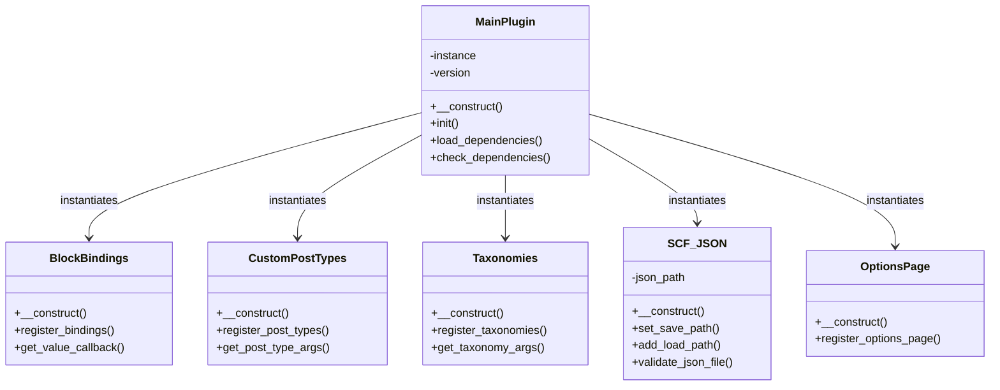

# Plugin Includes

This directory contains the core PHP classes and functions that power the plugin.

## Overview

The `inc/` directory organises plugin functionality into modular, single-responsibility classes following WordPress coding standards and best practices.

## File Structure

```
inc/
├── README.md                       # This file
├── class-block-bindings.php        # Block bindings registration
├── class-custom-post-types.php     # Custom post type registration
├── class-taxonomies.php            # Taxonomy registration
├── class-scf-json.php              # SCF Local JSON configuration
├── class-options-page.php          # Options page registration
└── class-{{slug}}.php              # Main plugin class
```

## Core Classes

### `class-{{slug}}.php`

Main plugin class that orchestrates all plugin functionality.

**Responsibilities:**

- Plugin initialization
- Dependency checking (SCF)
- Hook registration
- Component instantiation
- Version management

**Usage:**

```php
// Automatically instantiated in main plugin file
$plugin = new {{namespace|pascalCase}}();
```

### `class-block-bindings.php`

Registers block bindings for connecting block attributes to dynamic data sources.

**Responsibilities:**

- Register custom block binding sources
- Connect blocks to post meta
- Connect blocks to SCF fields
- Connect blocks to options page values

**Example:**

```php
// Register a binding for post meta
register_block_bindings_source( '{{slug}}/post-meta', array(
    'label'              => __( 'Post Meta', '{{textdomain}}' ),
    'get_value_callback' => array( $this, 'get_post_meta_value' ),
) );
```

**See:** [Block Bindings API](https://make.wordpress.org/core/2024/03/06/new-feature-the-block-bindings-api/)

### `class-custom-post-types.php`

Registers all custom post types for the plugin.

**Responsibilities:**

- Register custom post types
- Configure CPT arguments
- Set up CPT capabilities
- Configure CPT REST API support

**Example:**

```php
register_post_type( '{{cpt_slug}}', array(
    'public'       => true,
    'has_archive'  => true,
    'show_in_rest' => true,
    'supports'     => array( 'title', 'editor', 'thumbnail' ),
) );
```

**See:** [register_post_type()](https://developer.wordpress.org/reference/functions/register_post_type/)

### `class-taxonomies.php`

Registers all custom taxonomies for the plugin.

**Responsibilities:**

- Register custom taxonomies
- Configure taxonomy arguments
- Associate taxonomies with post types
- Configure taxonomy REST API support

**Example:**

```php
register_taxonomy( '{{tax_slug}}', array( '{{cpt_slug}}' ), array(
    'public'       => true,
    'hierarchical' => true,
    'show_in_rest' => true,
) );
```

**See:** [register_taxonomy()](https://developer.wordpress.org/reference/functions/register_taxonomy/)

### `class-scf-json.php`

Configures Secure Custom Fields to use Local JSON for field group storage.

**Responsibilities:**

- Set JSON save path
- Add JSON load paths
- Validate JSON files
- Directory management

**Features:**

- Automatic JSON export when field groups are saved
- Version control for field groups
- Performance improvement (reduces database queries)
- Team collaboration support

**See:** [SCF Local JSON](https://github.com/WordPress/secure-custom-fields/blob/trunk/docs/tutorials/local-json.md)

### `class-options-page.php`

Registers options pages for plugin settings.

**Responsibilities:**

- Register options pages
- Configure page settings
- Set up capability checks
- Configure menu hierarchy

**Example:**

```php
acf_add_options_page( array(
    'page_title' => __( 'Plugin Settings', '{{textdomain}}' ),
    'menu_slug'  => '{{slug}}-settings',
    'capability' => 'manage_options',
) );
```

**See:** [acf_add_options_page()](https://www.advancedcustomfields.com/resources/acf_add_options_page/)

## Class Architecture



## Naming Conventions

### Classes

- **Format:** `class-{name}.php`
- **Class name:** `{{namespace|pascalCase}}_{Name}`
- **Example:** `class-custom-post-types.php` → `My_Plugin_Custom_Post_Types`

### Methods

- **Public methods:** `snake_case`
- **Private methods:** `snake_case` (prefixed with `_` if truly private)
- **Hook callbacks:** descriptive names (e.g., `register_post_types`)

### Properties

- **Public properties:** `$snake_case`
- **Private properties:** `$snake_case`
- **Constants:** `UPPER_CASE`

## Best Practices

### Class Design

1. **Single Responsibility** - Each class should have one clear purpose
2. **Dependency Injection** - Pass dependencies through constructor when possible
3. **Late Static Binding** - Use `static::` for singleton patterns
4. **Namespaces** - Consider using PHP namespaces for better organisation

### Hook Registration

1. **Use class methods** - Register hooks in constructor
2. **Priority management** - Use appropriate priorities (default 10)
3. **Argument count** - Always specify accepted args count
4. **Unhook support** - Make hooks removable for extensibility

```php
add_action( 'init', array( $this, 'register_post_types' ), 10, 0 );
```

### Performance

1. **Lazy loading** - Load classes only when needed
2. **Caching** - Cache expensive operations (transients, object cache)
3. **Database queries** - Minimise queries, use indexes
4. **Autoloading** - Consider PSR-4 autoloading for larger plugins

### Security

1. **Capability checks** - Always check user capabilities
2. **Nonce verification** - Verify nonces for form submissions
3. **Data sanitization** - Sanitise all input data
4. **Data escaping** - Escape all output data

```php
// Capability check
if ( ! current_user_can( 'manage_options' ) ) {
    return;
}

// Nonce verification
check_admin_referer( 'action_name', 'nonce_field' );

// Sanitization
$value = sanitize_text_field( $_POST['field'] );

// Escaping
echo esc_html( $value );
```

## Testing

Each class should have corresponding PHPUnit tests in `tests/php/inc/`.

**Example test structure:**

```
tests/php/inc/
├── test-class-block-bindings.php
├── test-class-custom-post-types.php
├── test-class-taxonomies.php
└── test-class-scf-json.php
```

**See:** [TESTING.md](../docs/TESTING.md)

## Extending

### Adding New Classes

1. Create new file: `inc/class-{feature}.php`
2. Follow class template and naming conventions
3. Instantiate in main plugin class
4. Add corresponding tests
5. Document in this README

### Modifying Existing Classes

1. Follow WordPress Coding Standards
2. Update PHPDoc blocks
3. Add/update tests
4. Update documentation
5. Maintain backward compatibility

## References

- [WordPress Coding Standards](https://developer.wordpress.org/coding-standards/wordpress-coding-standards/php/)
- [WordPress Plugin Handbook](https://developer.wordpress.org/plugins/)
- [PHP The Right Way](https://phptherightway.com/)
- [PHPDoc Documentation](https://docs.phpdoc.org/)
