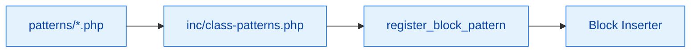

# Block Patterns for Multi-Block Plugin Scaffold

Reusable block layouts registered by the plugin (not theme file headers). Patterns live as PHP arrays and are wired up through `inc/class-patterns.php`.

## Flow

## Current patterns

- `example-card.php` (reference pattern)
- `{{slug}}-archive.php`
- `{{slug}}-card.php`
- `{{slug}}-featured.php`
- `{{slug}}-grid.php`
- `{{slug}}-meta.php`
- `{{slug}}-single.php`
- `{{slug}}-slider.php`

## Creating a pattern

1. Add a PHP file that returns an array with `title`, `categories`, and `content` keys. Keep strings translatable with `{{textdomain}}`.
2. Names must be namespaced (`{{slug}}/<name>`).
3. Register the pattern in `inc/class-patterns.php` (the loader already scans the directory; ensure file naming matches expectations).
4. Add E2E coverage if the pattern is critical to user flows.

## Tips

- Prefer block bindings over hard-coded values so patterns adapt to site data.
- Keep markup accessible (proper headings, alt text, readable contrast).
- Avoid theme-dependent styles; lean on block styles and theme.json tokens where possible.
