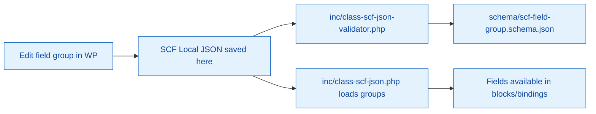

# SCF JSON Field Groups

Secure Custom Fields (SCF) Local JSON exports used by the plugin, plus schema validation to keep field groups consistent.

## Lifecycle

## Current files

- `group_example_basic_fields.json`
- `group_example_advanced_fields.json`
- `group_example_choice_fields.json`
- `group_example_content_fields.json`
- `group_example_date_time_fields.json`
- `group_example_relational_fields.json`
- `group_{{slug}}_example.json`
- `schema/scf-field-group.schema.json`

## Usage

- SCF saves updates to this directory when Local JSON is enabled by `inc/class-scf-json.php`.
- Schema validation runs in PHPUnit tests (`tests/php/test-scf-json-schema-validation.php`).
- Use `npm run test:scf` for quick validation of SCF fixtures.

## Adding new field groups

1. Create/update the field group in WordPress with SCF enabled.
2. Commit the generated JSON file here (keep filenames descriptive and namespaced).
3. Run SCF tests (`npm run test:scf`) to ensure the schema passes.
4. Document the purpose of the new field group here if it is permanent.
