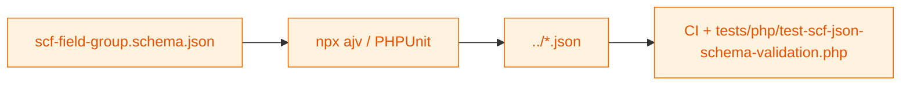

# JSON Schema Files

JSON Schema definitions used to validate SCF field group exports before they are consumed by the plugin or committed.

## Validation flow



## Current schema

- `scf-field-group.schema.json` – Draft-07 schema describing SCF field group exports (structure, field definitions, location rules).

## Usage

```bash
npx ajv-cli validate -s schema/scf-field-group.schema.json -d ../group_example_basic_fields.json
```

Run `npm run test:scf` to execute the bundled PHPUnit schema checks.

## Guidelines

- Keep the schema aligned with SCF export format changes.
- Treat schema updates as breaking changes; update fixtures and tests together.
