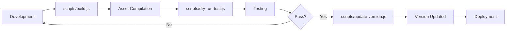

# JavaScript Build Scripts & Utilities

This directory contains all **JavaScript/Node.js scripts** for plugin development, building, testing, and automation.

## Directory Purpose

**`scripts/`** - JavaScript files (`.js`) for:

- Build automation and asset compilation
- Development utilities and helpers
- Testing and validation tools
- Version management
- Code quality checks

**Contrast with `bin/`**:

- **`scripts/`** → JavaScript files (`.js`) - Node.js scripts
- **`bin/`** → Shell scripts (`.sh`) - Bash/shell scripts

## Scripts Overview

### Build & Development

#### `build.js`

Main build automation script for plugin compilation.

**Usage:**

```bash
node scripts/build.js
# or via npm
npm run build
```

**Features:**

- Installs npm and Composer dependencies
- Compiles JavaScript and CSS assets via webpack
- Runs linting and code quality checks
- Executes test suite
- Generates build summary with metrics

**Test File:** `scripts/__tests__/build.test.js`

---

### Dry Run Testing

#### `dry-run-config.js`

Configuration provider for dry-run testing with mustache variable substitution.

**Usage:**

```bash
# Get full configuration
node scripts/dry-run-config.js config

# Get specific value
node scripts/dry-run-config.js value slug

# List files with mustache variables
node scripts/dry-run-config.js files

# Replace variables in a file
node scripts/dry-run-config.js replace src/index.js
```

**Features:**

- Provides test values for all mustache variables
- Replaces `{{slug}}`, `{{namespace}}`, etc. with valid values
- Finds files containing mustache variables
- Enables testing on scaffold templates without generation

**Test File:** `scripts/__tests__/dry-run-config.test.js`

**See also:** [DRY-RUN-TESTING.md](../docs/DRY-RUN-TESTING.md)

---

#### `dry-run-test.js`

Test runner that temporarily substitutes mustache variables for linting/testing.

**Usage:**

```bash
# Run with default commands (lint:js, lint:css, test:unit)
node scripts/dry-run-test.js

# Run specific commands
node scripts/dry-run-test.js lint:js test:unit

# Via npm scripts
npm run dry-run:lint
npm run dry-run:test
npm run dry-run:all
```

**Features:**

- Automatic backup and restore of template files
- Replaces mustache variables with test values
- Runs linting and tests on substituted files
- Safe cleanup on interrupt (Ctrl+C)
- Colored console output for debugging
- Comprehensive logging to `logs/`

**Test File:** `scripts/__tests__/dry-run-test.test.js`

**See also:** [DRY-RUN-TESTING.md](../docs/DRY-RUN-TESTING.md)

---

### Version Management

#### `update-version.js`

Updates plugin version across all relevant files atomically.

**Usage:**

```bash
node scripts/update-version.js <version>
# or via npm
npm run update-version 1.2.0
```

**Example:**

```bash
node scripts/update-version.js 1.2.0
```

**Updates:**

- `package.json` - npm version
- `composer.json` - Composer version
- `{{slug}}.php` - Plugin header version
- All `block.json` files - Block versions
- `README.md` - Stable tag
- `VERSION` file - Plain text version

**Validation:**

- Ensures semantic versioning format (MAJOR.MINOR.PATCH)
- Validates all target files exist
- Atomic updates (all or nothing)
- Git-friendly (single commit point)

**Test File:** `scripts/__tests__/update-version.test.js`

---

### Plugin Generation

#### `generate-plugin.js`

Core plugin generator with Ajv2020 schema validation and mustache template processing.

**Usage:**

```bash
# Interactive mode
node scripts/generate-plugin.js

# With configuration file
node scripts/generate-plugin.js --config plugin-config.json

# Direct arguments
node scripts/generate-plugin.js --slug my-plugin --name "My Plugin" --author "Author Name"
```

**Features:**

- Ajv2020 JSON Schema validation
- Mustache variable substitution (`{{slug}}`, `{{namespace}}`, etc.)
- Custom post type and taxonomy generation
- SCF field group creation
- Block scaffolding
- Template and pattern generation
- Comprehensive input sanitization
- Filter application (upper, lower, pascalCase, camelCase, kebabCase, snakeCase)

**Exports:**

- `loadSchema()` - Loads and returns JSON schema
- `validateConfig(config)` - Validates configuration against schema
- `sanitizeInput(value, type)` - Sanitizes input values
- `applyFilter(value, filter)` - Applies transformation filters
- `replaceMustacheVars(template, values)` - Replaces mustache variables
- `applyDefaults(config)` - Applies default values to configuration

**Test File:** `scripts/__tests__/generate-plugin.test.js` (72 tests, 100% passing)

**Schema:** `.github/schemas/plugin-config.schema.json`

**See also:** [GENERATE-PLUGIN.md](../docs/GENERATE-PLUGIN.md)

---

#### `generate-plugin.agent.js`

CLI agent wrapper for generate-plugin.js with multiple operation modes.

**Usage:**

```bash
# Display help
node scripts/generate-plugin.agent.js --help

# Output JSON schema
node scripts/generate-plugin.agent.js --schema

# Accept JSON via stdin
echo '{"slug":"my-plugin","name":"My Plugin","author":"Author"}' | node scripts/generate-plugin.agent.js --json

# Validate configuration
node scripts/generate-plugin.agent.js --validate '{"slug":"test","name":"Test","author":"Author"}'
```

**Features:**

- Uses shared schema validation from generate-plugin.js
- Four operation modes: help, schema, json, validate
- Stdin input support for JSON mode
- Configuration validation with detailed error messages
- Exit codes for CI/CD integration
- No circular dependencies

**Test File:** `scripts/__tests__/generate-plugin.agent.test.js` (32 tests, 100% passing)

**See also:** [.github/agents/generate-plugin.agent.md](../.github/agents/generate-plugin.agent.md)

---

### Quality Assurance

#### `audit-frontmatter.js`

Audits and validates YAML frontmatter in all markdown files.

**Usage:**

```bash
node scripts/audit-frontmatter.js

# Audit specific directory
node scripts/audit-frontmatter.js docs/

# Fix issues automatically
node scripts/audit-frontmatter.js --fix
```

**Checks:**

- Required frontmatter fields (title, description, category, type, audience, date)
- Valid date formats (YYYY-MM-DD)
- Category/type enum validation
- Missing frontmatter detection
- Malformed YAML syntax

**Reports:**

- Missing frontmatter
- Invalid field values
- Formatting issues
- Recommendations for fixes

**Test File:** `scripts/__tests__/audit-frontmatter.test.js`

---

#### `validate-plugin-config.js`

Validates plugin configuration files against JSON schemas.

**Usage:**

```bash
# Validate a configuration file
node scripts/validate-plugin-config.js config.json

# Validate schema only
node scripts/validate-plugin-config.js --schema-only

# Verbose output
node scripts/validate-plugin-config.js config.json --verbose
```

**Validates:**

- Plugin metadata (slug, name, version, etc.)
- Custom post type configuration
- Taxonomy definitions
- SCF field group structure
- Block configuration
- WordPress compatibility settings

**Features:**

- JSON Schema validation
- Detailed error messages
- Suggestions for fixes
- Exit codes for CI/CD integration

**Test File:** `scripts/__tests__/validate-plugin-config.test.js`

**See also:** [.github/schemas/plugin-config.schema.json](../.github/schemas/plugin-config.schema.json)

---

#### `count-tokens.js`

Counts tokens in markdown files for context management.

**Usage:**

```bash
# Count all markdown files
node scripts/count-tokens.js

# Count specific directory
node scripts/count-tokens.js docs/

# Output as JSON
node scripts/count-tokens.js --json

# Include token breakdown
node scripts/count-tokens.js --detailed
```

**Features:**

- Recursive directory scanning
- Token counting per file
- Total token calculation
- Category breakdown
- Excludes node_modules, vendor, build directories
- JSON output for CI/CD integration

**Test File:** `scripts/__tests__/count-tokens.test.js`

---

## Testing Requirements

**IMPORTANT**: Every JavaScript file in `scripts/` MUST have a corresponding test file.

### Test File Locations

**Option 1: Jest Convention** (Recommended)

```
scripts/
├── build.js
├── __tests__/
│   ├── build.test.js
│   ├── dry-run-config.test.js
│   ├── dry-run-test.test.js
│   └── update-version.test.js
```

**Option 2: Tests Directory**

```
tests/
└── scripts/
    ├── build.test.js
    ├── dry-run-config.test.js
    └── ...
```

### Test Standards

All script tests MUST:

- ✅ Use Jest testing framework
- ✅ Include unit tests for all exported functions
- ✅ Mock file system operations where appropriate
- ✅ Test error handling and edge cases
- ✅ Achieve minimum 80% code coverage
- ✅ Run in CI/CD pipeline
- ✅ Log test execution to `logs/test-scripts-*.log`

### Running Tests

```bash
# Test all scripts
npm run test:scripts

# Test specific script
npm run test scripts/__tests__/build.test.js

# Watch mode
npm run test:watch -- scripts/__tests__/

# Coverage report
npm run test:coverage
```

---

## Script Development Guidelines

### Creating New Scripts

1. **Create script file** in `scripts/`
2. **Add shebang** if executable: `#!/usr/bin/env node`
3. **Include JSDoc comments** for all functions
4. **Add error handling** for all operations
5. **Log to `logs/` directory** with proper naming
6. **Create test file** in `scripts/__tests__/`
7. **Update this README** with script documentation
8. **Add npm script** in `package.json` if user-facing

### Script Standards

```javascript
#!/usr/bin/env node

/**
 * Script Name and Description
 *
 * @usage node scripts/script-name.js [options]
 * @example node scripts/script-name.js --verbose
 */

const fs = require('fs');
const path = require('path');

// Create logs directory
const logsDir = path.join(__dirname, '../logs');
if (!fs.existsSync(logsDir)) {
 fs.mkdirSync(logsDir, { recursive: true });
}

// Create log file with timestamp
const timestamp = new Date().toISOString().replace(/:/g, '-').split('.')[0];
const logFile = path.join(logsDir, `script-name-${timestamp}.log`);
const logStream = fs.createWriteStream(logFile, { flags: 'a' });

/**
 * Log function
 * @param {string} level - ERROR, WARN, INFO, DEBUG
 * @param {string} message - Log message
 */
function log(level, message) {
 const entry = `[${new Date().toISOString()}] [${level}] ${message}\n`;
 logStream.write(entry);
 console.log(entry.trim());
}

// Main script logic
async function main() {
 try {
  log('INFO', 'Script starting');
  // Script logic here
  log('INFO', 'Script completed successfully');
 } catch (error) {
  log('ERROR', `Script failed: ${error.message}`);
  process.exit(1);
 } finally {
  logStream.end();
 }
}

// Run if executed directly
if (require.main === module) {
 main().catch(error => {
  console.error(error);
  process.exit(1);
 });
}

// Export for testing
module.exports = { main };
```

### Testing Standards

```javascript
/**
 * Tests for script-name.js
 */

const { main } = require('../script-name');
const fs = require('fs');
const path = require('path');

// Mock file system
jest.mock('fs');

describe('script-name', () => {
 beforeEach(() => {
  jest.clearAllMocks();
 });

 afterEach(() => {
  jest.restoreAllMocks();
 });

 test('should execute successfully', async () => {
  // Test implementation
  await expect(main()).resolves.not.toThrow();
 });

 test('should handle errors gracefully', async () => {
  // Test error handling
 });

 test('should log to logs directory', async () => {
  // Test logging
 });
});
```

---

## Contrast: scripts/ vs bin/

### `scripts/` Directory (This Directory)

**Contains:** JavaScript/Node.js files (`.js`)

**Purpose:**

- Build automation
- Development utilities
- Testing tools
- Version management
- Code generation

**Technology:** Node.js, JavaScript

**Testing:** Jest unit tests in `scripts/__tests__/`

**Examples:**

- `build.js` - Webpack build automation
- `update-version.js` - Version management
- `dry-run-test.js` - Template testing

### `bin/` Directory

**Contains:** Shell scripts (`.sh`)

**Purpose:**

- System-level operations
- Environment setup
- Package installation
- Database operations
- CI/CD integration

**Technology:** Bash, Shell

**Testing:** Manual testing or shell test frameworks

**Examples:**

- `install-wp-tests.sh` - WordPress test environment setup
- `deploy.sh` - Deployment automation
- `backup.sh` - Database backup

**See:** [bin/README.md](../bin/README.md)

---

## AI Agent Guidelines

### When Creating Scripts

**JavaScript Files (.js)**:

- ✅ **DO**: Create in `scripts/` directory
- ✅ **DO**: Include `#!/usr/bin/env node` shebang if executable
- ✅ **DO**: Add JSDoc comments
- ✅ **DO**: Implement error handling
- ✅ **DO**: Log to `logs/` directory
- ✅ **DO**: Create corresponding test file in `scripts/__tests__/`
- ✅ **DO**: Update this README with usage documentation
- ✅ **DO**: Add npm script if user-facing

**Shell Scripts (.sh)**:

- ✅ **DO**: Create in `bin/` directory
- ✅ **DO**: Include `#!/usr/bin/env bash` shebang
- ✅ **DO**: Add usage comments
- ✅ **DO**: Implement error handling
- ✅ **DO**: Make executable: `chmod +x bin/script-name.sh`
- ✅ **DO**: Update `bin/README.md` with documentation

### Never Do This

- ❌ Create `.js` files in `bin/` directory
- ❌ Create `.sh` files in `scripts/` directory
- ❌ Skip creating test files for JavaScript scripts
- ❌ Forget to update README documentation
- ❌ Skip logging implementation
- ❌ Omit error handling

---

## Workflow Integration



---

## Package.json Scripts

Key npm scripts that use scripts in this directory:

```json
{
  "scripts": {
    "build": "node scripts/build.js",
    "dry-run:lint": "node scripts/dry-run-test.js lint:js lint:css",
    "dry-run:test": "node scripts/dry-run-test.js test:unit",
    "dry-run:all": "node scripts/dry-run-test.js lint:js lint:css test:unit",
    "update-version": "node scripts/update-version.js",
    "audit:frontmatter": "node scripts/audit-frontmatter.js",
    "validate:config": "node scripts/validate-plugin-config.js",
    "count:tokens": "node scripts/count-tokens.js"
  }
}
```

---

## Related Documentation

- **[bin/README.md](../bin/README.md)** - Shell scripts directory
- **[docs/BUILD-PROCESS.md](../docs/BUILD-PROCESS.md)** - Build system documentation
- **[docs/TESTING.md](../docs/TESTING.md)** - Testing guidelines
- **[docs/DRY-RUN-TESTING.md](../docs/DRY-RUN-TESTING.md)** - Dry run system
- **[.github/instructions/folder-structure.instructions.md](../.github/instructions/folder-structure.instructions.md)** - Repository organization

---

## Summary

✅ **JavaScript files** → `scripts/` directory
✅ **Shell scripts** → `bin/` directory
✅ **All scripts** → Must have tests
✅ **Test files** → `scripts/__tests__/` or `tests/scripts/`
✅ **Logging** → All scripts log to `logs/`
✅ **Documentation** → Keep this README updated

**Last Updated:** 2025-12-10
**Scripts Count:** 9 JavaScript files
**Test Coverage Required:** 80% minimum
**Test Pass Rate:** 100% (130/130 tests passing)
