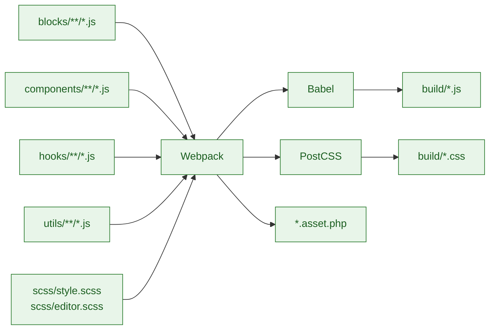

# Source Files

Authoring area for all JavaScript and SCSS that powers the blocks and editor UI. Bundling is handled by `@wordpress/scripts` (webpack + Babel + PostCSS) and outputs to `build/`.

## Build pipeline



## Structure (current)

```
src/
├── blocks/                 # Individual block implementations
│   ├── {{slug}}-card/
│   ├── {{slug}}-collection/
│   ├── {{slug}}-featured/
│   └── {{slug}}-slider/
├── components/             # Shared React components (exported via index.js)
├── hooks/                  # Custom hooks for data fetching and UI state
├── scss/                   # Global/editor styles (style.scss, editor.scss, _slider.scss)
└── utils/                  # Shared utilities (fields.js, query.js)
```

### Blocks

Each block folder contains `block.json`, `index.js`, `edit.js`, `save.js`, and SCSS files scoped to the block. Registration happens in `index.js` and uses the metadata from `block.json`.

### Components

Shared UI primitives and controls (e.g. `Slider`, `PostSelector`, `Gallery`, `TaxonomyFilter`, `FieldDisplay`, `RepeaterField`, `QueryControls`, `ScrollToTop`, `ScrollDownArrow`). Imported via `src/components/index.js`.

### Hooks

Data and behaviour hooks exported via `src/hooks/index.js`, including `usePostType`, `useTaxonomies`, `useFields`, `useRepeater`, `useSlider`, and `useCollection`.

### SCSS

- `style.scss` – Frontend + shared styles
- `editor.scss` – Editor-only styles
- `_slider.scss` – Slider-specific shared styles for reuse

### Utilities

`fields.js` and `query.js` provide helpers for SCF field access and WordPress data queries. Exported through `src/utils/index.js`.

## Commands

```bash
npm start          # Watch mode for JS/CSS
npm run build      # Production build
npm run lint:js    # JS linting
npm run lint:css   # CSS linting
```

## Guidelines

- Keep blocks, components, and hooks self-contained and reusable.
- Prefer composition over inheritance; lift shared behaviour into hooks or utilities.
- Keep SCSS mobile-first and use shared partials rather than duplicating styles.
- Add unit tests for new utilities/components where practical.
