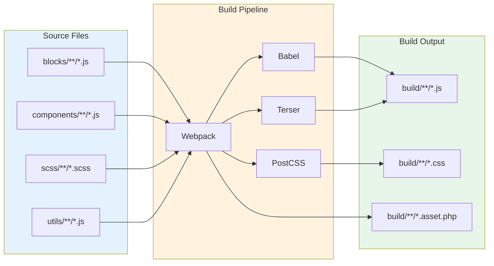

# Source Files

This directory contains all source JavaScript, CSS, and SCSS files that are compiled into the plugin's frontend and editor assets.

## Overview

The `src/` directory organises source code by blocks, components, utilities, and styles. Files are compiled using [@wordpress/scripts](https://developer.wordpress.org/block-editor/reference-guides/packages/packages-scripts/).

## Directory Structure

```
src/
├── README.md              # This file
├── blocks/                # Block-specific code
│   └── {block-name}/     # Individual block files
├── components/            # Shared React components
├── hooks/                 # Custom React hooks
├── scss/                  # Global SCSS styles
└── utils/                 # Utility functions
```

## Sub-directories

### `blocks/`

Each block has its own directory with editor and frontend files:

```
blocks/
└── example-block/
    ├── index.js          # Block registration
    ├── edit.js           # Editor component
    ├── save.js           # Save component
    ├── style.scss        # Frontend & editor styles
    └── editor.scss       # Editor-only styles
```

### `components/`

Shared React components used across multiple blocks:

```javascript
import { MyComponent } from '../../components/MyComponent';
```

### `hooks/`

Custom React hooks for reusable logic:

```javascript
import { useCustomHook } from '../../hooks/useCustomHook';
```

### `scss/`

Global SCSS files for theme-wide styles:

- `_variables.scss` - SCSS variables
- `_mixins.scss` - Reusable mixins
- `_functions.scss` - SCSS functions

### `utils/`

JavaScript utility functions:

```javascript
import { formatDate } from '../../utils/formatters';
```

## Build Process



Source files are compiled using webpack via @wordpress/scripts:

```bash
# Development (watch mode)
npm run start

# Production build
npm run build
```

**Output:** Compiled files go to `build/` directory

## Best Practices

1. **Modular code** - Keep files small and focused
2. **Component reuse** - Extract shared components
3. **Proper imports** - Use ES6 modules
4. **Type safety** - Add JSDoc comments or TypeScript
5. **Code splitting** - Lazy load heavy components

## References

- [@wordpress/scripts Documentation](https://developer.wordpress.org/block-editor/reference-guides/packages/packages-scripts/)
- [Block Editor Handbook](https://developer.wordpress.org/block-editor/)
