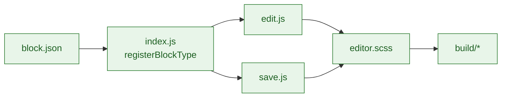

# Block Modules

Self-contained block implementations for the scaffold. Each block ships with metadata, editor UI, save output, and styles.

## Block lifecycle



## Current blocks

- `{{slug}}-card` – Renders a single post card
- `{{slug}}-collection` – Queryable collection with filters/pagination
- `{{slug}}-featured` – Highlights featured entries
- `{{slug}}-slider` – Carousel/slideshow presentation

## File layout

```
blocks/
└── {{slug}}-block-name/
    ├── block.json      # Metadata
    ├── index.js        # Registration and settings
    ├── edit.js         # Editor component
    ├── save.js         # Frontend markup
    ├── style.scss      # Frontend + shared styles
    └── editor.scss     # Editor-only styles
```

## Guidelines

- Keep `block.json` authoritative for titles, category, and supports.
- Use shared hooks/components where possible; avoid duplicate logic between blocks.
- Bind dynamic data via `{{namespace}}/fields` where appropriate instead of ad-hoc fetches.
- Add tests to `tests/js/blocks.test.js` and E2E coverage in `tests/e2e/*.spec.js` when altering block behaviour.
