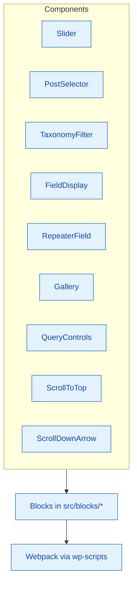

# React Components

Reusable React components shared across the scaffolded blocks. Exported via `src/components/index.js` for consistent imports.

## Component map



## Current components

- `Slider` – Carousel UI used by the slider block
- `PostSelector` – Post picker for editor controls
- `TaxonomyFilter` – Taxonomy filtering UI
- `FieldDisplay` – Renders SCF/meta fields safely
- `RepeaterField` – Handles repeater inputs
- `Gallery` – Light gallery component for images
- `QueryControls` – Shared query controls (ordering, pagination)
- `ScrollToTop` / `ScrollDownArrow` – Scroll helpers

## Usage

```javascript
import { Slider, QueryControls } from '../../components';

export default function Edit() {
    return (
        <>
            <QueryControls />
            <Slider />
        </>
    );
}
```

## Guidelines

- Keep components focused and prop-driven; avoid global state.
- Document expected props via JSDoc/PropTypes where helpful.
- Co-locate component-specific styles and tests when adding new components.
- Update this README when adding or removing shared components.
