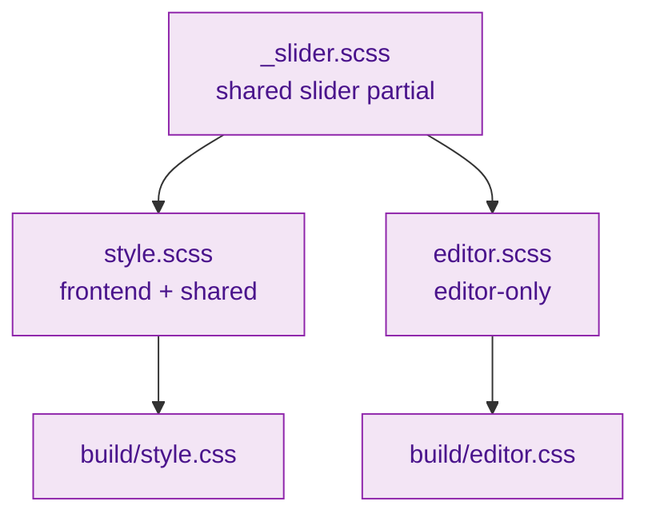

# SCSS Styles

Global and shared SCSS used by all blocks. Entry points are compiled by `@wordpress/scripts` into frontend and editor bundles.

## Style layers



## Files (current)

- `style.scss` – Frontend and shared styles across blocks
- `editor.scss` – Block editor-only styles
- `_slider.scss` – Shared slider helpers imported where needed

## Usage

Import the partials from block styles as needed:

```scss
@import '../../scss/slider';

.{{slug}}-slider {
    @include slider-wrapper;
}
```

## Guidelines

- Keep variables and mixins within partials to avoid repetition in blocks.
- Use BEM-inspired class naming and mobile-first breakpoints.
- Scope editor-only styles to block selectors to avoid bleeding into wp-admin.
- Update this README when adding new shared partials.
