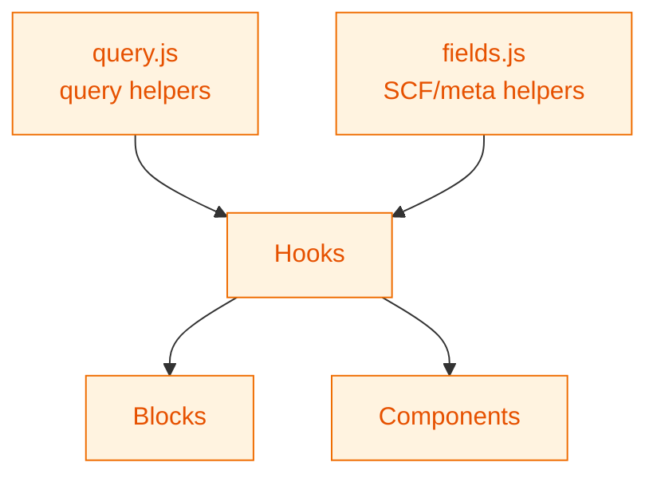

# Utility Functions

Shared utilities that support blocks, hooks, and components. Exported via `src/utils/index.js`.

## Helper map



## Current files

- `query.js` – Helpers for WP data queries (ordering, pagination, filtering)
- `fields.js` – Helpers for safely reading SCF/meta fields
- `index.js` – Barrel export for all utilities

## Usage

```javascript
import { buildQueryArgs } from '../../utils/query';
import { getFieldValue } from '../../utils/fields';

const args = buildQueryArgs( { perPage: 6 } );
const subtitle = getFieldValue( fields, 'subtitle' );
```

## Guidelines

- Keep helpers pure and side-effect free.
- Prefer small, testable functions; add coverage in `tests/js/` when introducing new helpers.
- Avoid duplicating logic already available in WordPress data utilities.
