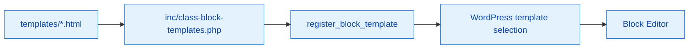

# Plugin Block Templates

Plugin-registered block templates (HTML with block markup) loaded via PHP, not a block theme. Templates here are wired through `inc/class-block-templates.php` using `register_block_template()`.

## Flow

## Current files

- `archive-{{slug}}.html`
- `single-{{slug}}.html`
- `example-archive.html`

Each file is pure block HTML. Content is read and registered at runtime; file names become the template slug.

## Creating a new template

1. Add an `.html` file with block markup in this directory.
2. Register it in `inc/class-block-templates.php` with a unique slug, title, description, and post type mapping.
3. Keep all strings translatable with `{{textdomain}}`.

## Tips

- Treat templates as opinionated defaults; users can override via the editor.
- Avoid hard-coded IDs or URLs; prefer dynamic blocks and query loops.
- Keep accessibility in mind (headings, landmarks, meaningful alt text on media blocks).
