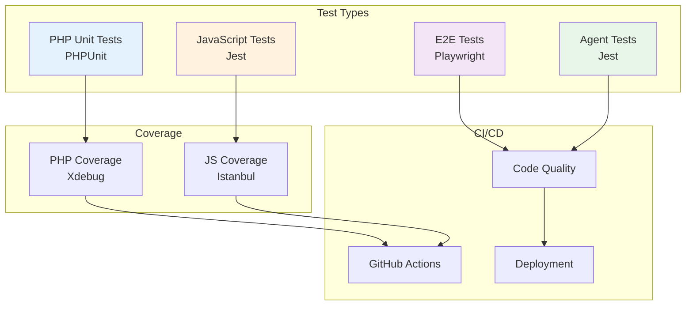

# Plugin Tests

Comprehensive test suites covering PHP unit tests, JavaScript tests, end-to-end tests, and agent validation.

## Overview

This directory contains all automated tests for the plugin, organised by test type and language.

## Directory Structure

```
tests/
├── README.md           # This file
├── __mocks__/          # Jest mock files
├── agents/             # Agent validation tests
├── e2e/                # End-to-end tests (Playwright)
├── js/                 # JavaScript unit tests (Jest)
└── php/                # PHP unit tests (PHPUnit)
```

## Test Architecture



## Test Types

### PHP Unit Tests (`php/`)

PHPUnit tests for PHP classes and functions.

**Run tests:**

```bash
composer test
```

**Location:** `tests/php/`

**See:** [PHPUnit Documentation](https://phpunit.de/)

### JavaScript Tests (`js/`)

Jest tests for React components, hooks, and utilities.

**Run tests:**

```bash
npm test
```

**Location:** `tests/js/`

**See:** [Jest Documentation](https://jestjs.io/)

### E2E Tests (`e2e/`)

End-to-end tests using Playwright for browser automation.

**Run tests:**

```bash
npm run test:e2e
```

**Location:** `tests/e2e/`

**See:** [Playwright Documentation](https://playwright.dev/)

### Agent Tests (`agents/`)

Validation tests for AI agents and generator scripts.

**Run tests:**

```bash
npm run test:agents
```

**Location:** `tests/agents/`

## Test Coverage

View coverage reports:

```bash
# PHP coverage
composer test -- --coverage-html coverage/php

# JavaScript coverage
npm test -- --coverage

# Open coverage report
open coverage/index.html
```

## CI/CD Integration

Tests run automatically on:

- Pull requests
- Commits to main/develop
- Release tags

**See:** [.github/workflows/code-quality.yml](../.github/workflows/code-quality.yml)

## Writing Tests

### PHP Test Example

```php
class Test_My_Class extends WP_UnitTestCase {
    public function test_my_function() {
        $result = my_function( 'input' );
        $this->assertEquals( 'expected', $result );
    }
}
```

### JavaScript Test Example

```javascript
import { render } from '@testing-library/react';
import MyComponent from '../MyComponent';

describe( 'MyComponent', () => {
    test( 'renders correctly', () => {
        const { container } = render( <MyComponent /> );
        expect( container ).toMatchSnapshot();
    } );
} );
```

## Best Practices

1. **Test coverage** - Aim for 80%+ coverage
2. **Descriptive names** - Use clear test names
3. **Arrange-Act-Assert** - Structure tests clearly
4. **Mock dependencies** - Isolate units under test
5. **Test edge cases** - Cover error conditions

## References

- [TESTING.md](../docs/TESTING.md) - Complete testing guide
- [WordPress Unit Tests](https://make.wordpress.org/core/handbook/testing/automated-testing/phpunit/)
- [Testing Library](https://testing-library.com/)
