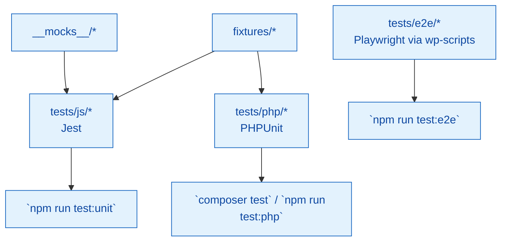

# Plugin Tests

Full test suite covering JavaScript, PHP, and end-to-end behaviour. Bootstrap files and fixtures live here alongside the tests.

## Test matrix



## Structure (current)

```
tests/
├── __mocks__/            # Jest mocks
├── agents/               # Agent validation placeholder
├── e2e/                  # Playwright specs + setup
├── fixtures/             # Shared fixtures
├── js/                   # JS unit tests
├── php/                  # PHPUnit tests
├── bootstrap.php         # PHPUnit bootstrap
├── phpstan-bootstrap.php # PHPStan bootstrap
└── setup-tests.js        # Jest setup
```

## Commands

```bash
npm run test:unit    # JS unit tests (Jest)
npm run test:e2e     # Playwright E2E suite
npm run test         # JS unit + E2E
composer test        # PHPUnit suite
npm run test:php     # PHPUnit via npm script
npm run test:scf     # SCF-focused PHPUnit tests
```

## Notes

- Use fixtures for repeatable data; avoid hitting external services.
- Keep selectors stable in E2E tests (`data-testid` over class names).
- Update this README and subdirectory READMEs when adding new test types or tooling.
