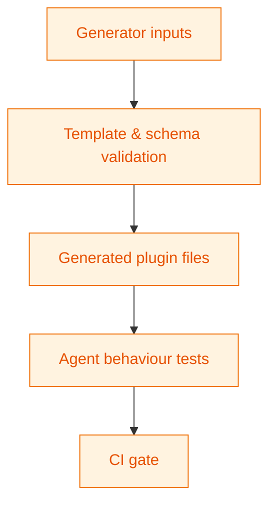

# Agent Validation Tests

Reserved for tests that exercise the generator agents and scaffold integrity. The directory currently contains only this README; add tests as agents mature.

## Intended coverage

## When adding tests

- Cover generator input validation (slugs, namespaces, required fields).
- Assert mustache replacement and file renaming behave as expected.
- Validate JSON schema outputs (SCF field groups, block.json files).
- Keep tests idempotent so they can run safely in CI.
- Update this README with new test files and commands once added.
