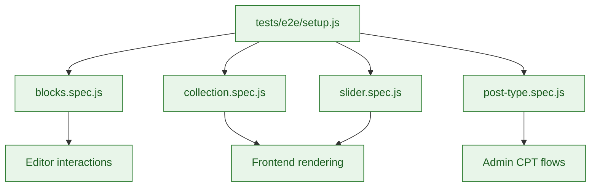

# End-to-End Tests

Playwright-based browser tests that exercise full user workflows across editor and frontend.

## Coverage map



## Running tests

```bash
npm run test:e2e           # Full suite via wp-scripts test-e2e
npm run test:e2e:a11y      # Accessibility-focused spec (see package.json)
```

Use `-- --grep "text"` to target a single scenario, or append `-- --headed`/`-- --debug` for interactive debugging.

## Writing tests

- Use stable selectors (data attributes) instead of class names.
- Keep tests isolated; create and clean up data per spec.
- Prefer the helpers provided by `@wordpress/e2e-test-utils-playwright`.
- Mirror new block behaviours with matching E2E assertions.
