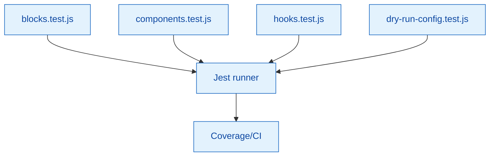

# JavaScript Unit Tests

Jest-based unit tests covering block logic, shared components/hooks, utilities, and generator helpers.

## Coverage map



## Current files

- `blocks.test.js` – Block registration and helpers
- `components.test.js` – Shared component behaviour
- `hooks.test.js` – Custom hook logic
- `dry-run-config.test.js` – Dry-run configuration helper validation

## Running tests

```bash
npm run test:unit     # Runs Jest via wp-scripts
npm run test          # Unit + E2E
npm test -- --watch   # Watch mode
npm test -- --coverage
```

## Guidelines

- Test behaviour, not implementation details; prefer DOM queries over snapshots.
- Use mocks from `tests/__mocks__/` where external dependencies are needed.
- Add new test files alongside the feature (or extend existing suites) and update this README when coverage changes.
