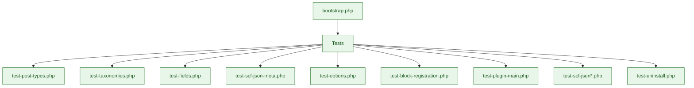

# PHP Unit Tests

PHPUnit suite validating PHP services, SCF integration, and uninstall behaviour using the WordPress test framework.

## Suite map



## Current files

- `test-post-types.php`, `test-taxonomies.php` – Registration assertions
- `test-fields.php`, `test-scf-json-meta.php`, `test-scf-json.php` – Field group/meta handling
- `test-scf-json-save-load.php`, `test-scf-json-schema-validation.php`, `test-scf-json-fixtures.php` – SCF JSON lifecycle and schema checks
- `test-options.php` – Options page registration
- `test-block-registration.php` – Block registration and bindings
- `test-plugin-main.php` – Core bootstrap
- `test-uninstall.php` – Uninstall cleanup

## Running tests

```bash
composer test             # Full PHPUnit suite
npm run test:php          # Same via npm script
npm run test:scf          # SCF-focused subset
npm run test:scf:verbose  # Verbose SCF tests
```

## Guidelines

- Extend `WP_UnitTestCase` and clean up created data in `tearDown()`.
- Use factories for posts/users rather than manual inserts.
- Keep assertions aligned with `inc/` services; update fixtures when field groups change.
